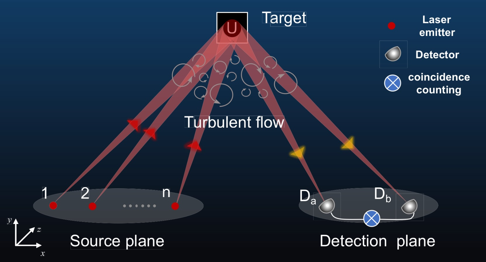
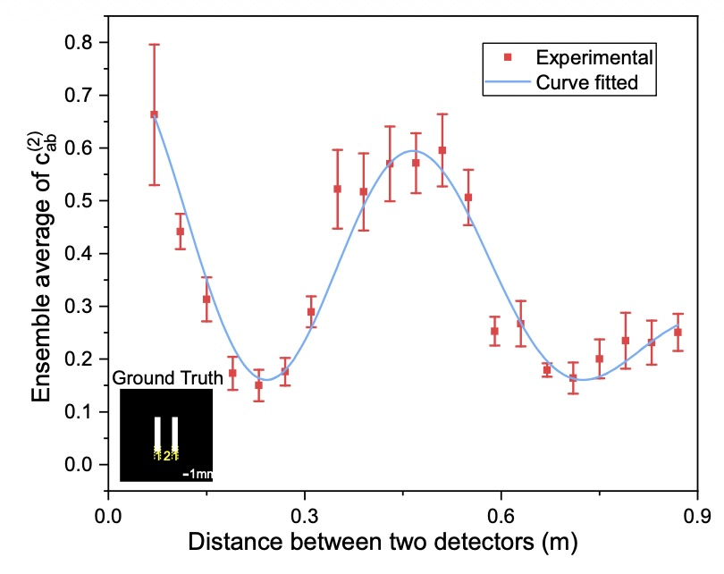
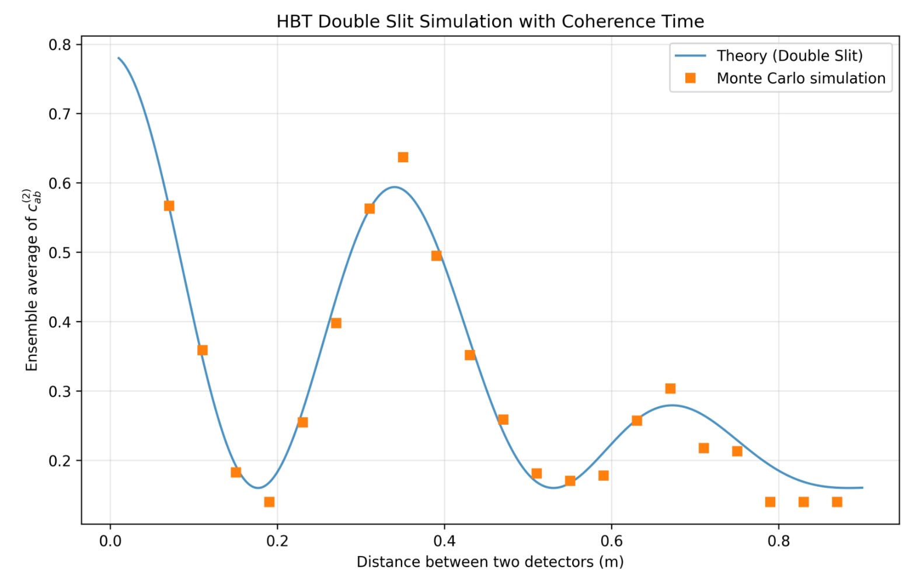
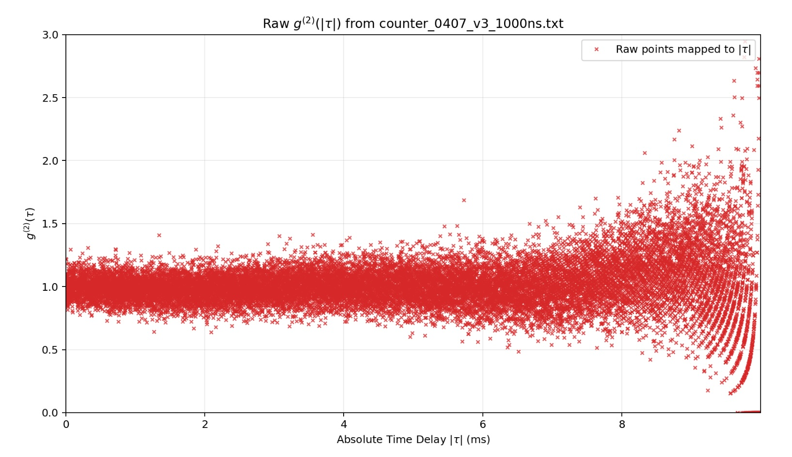

이 글은 2026년 5월 연세대학교 홍성진 교수님 연구실 lab meeting에서 발표한 **Active Optical Intensity Interferometry** 연구를 정리한 것입니다. 기반 논문은 중국과학기술대학교(USTC) 연구팀이 발표한 *"Active Optical Intensity Interferometry"* (Phys. Rev. Lett. 134, 180201, 2025)입니다.

---

### 배경 (Background): 두 가지 간섭법

빛을 이용한 장거리 고해상도 이미징의 핵심 기술은 **개구 합성(aperture synthesis)** 간섭법입니다. 1956년 Hanbury Brown & Twiss가 별의 각지름을 측정하기 위해 제안한 HBT 간섭법 이후, 두 가지 방식이 주로 활용됩니다.

|  | **Amplitude (Phase) Interferometry** | **Intensity Interferometry (HBT)** |
|--|--|--|
| 측정 대상 | 위상(Phase) 직접 측정 | 세기 요동의 상관관계 |
| 결맞음 차수 | 1차 결맞음 $g^{(1)}$ | 2차 결맞음 $g^{(2)}$ |
| 장점 | 높은 감도 | 대기난류·광학 결함에 강인 |
| 단점 | 정밀한 위상 안정화 필요 | Thermal light 필요, 장거리 능동 이미징에 부적합 |

Amplitude Interferometry는 감도가 높지만 대기난류에 매우 취약합니다. 반면 **HBT 간섭법**은 세기 요동의 상관관계를 측정하기 때문에 대기난류와 광학 결함의 영향을 받지 않으며, 위상 안정화 장치가 불필요합니다. 현재 천문학에서는 약 100개의 망원경으로 구성된 Cherenkov Telescope Array(CTA)가 최대 규모의 광학 세기 간섭 프로젝트로 운용 중입니다.

---

### 문제 (Problem): 장거리 + 능동 이미징의 벽

HBT 간섭법이 passive 천문 관측에는 효과적이지만, LiDAR와 같은 **능동(active) 이미징**에는 적용하기 어렵습니다.

- **Thermal light**의 문제점: 광대역 스펙트럼(broadband spectrum), 모드당 낮은 평균 광자 수, 큰 발산각(divergence angle, 일반적으로 >100 mrad). 장거리 전파에 근본적으로 불리합니다.
- **Laser**의 문제점: 결맞음(coherence)이 너무 높아 세기 요동이 shot noise뿐이므로, 두 검출기 사이의 상관관계가 나타나지 않습니다.

기존의 대안으로 rotating ground glass, spatial light modulator 등을 이용한 pseudothermal light 합성이 시도되었지만, 발산각이 여전히 100 mrad 이상으로 장거리 조명에는 부적합합니다.

$$\text{active} + \text{long-distance} + \text{intensity interferometry} = ?$$

---

### 아이디어 (Idea): 여러 레이저 → Pseudothermal Light

이 연구의 핵심 아이디어는 간단합니다.

$$\text{위상 독립적인 여러 레이저} + \text{대기난류} \;\Longrightarrow\; \text{Pseudothermal light (발산각 <1\,mrad)}$$

서로 독립적인 위상(independent phases)을 가진 다수의 레이저 빔이 대기난류를 통과하면, 각 빔의 위상이 무작위로 변조되어 **thermal light와 유사한 통계적 특성**을 갖는 pseudothermal 조명이 만들어집니다. 인접한 레이저 빔 사이의 간격을 대기 결맞음 길이(atmospheric coherence length, 0.02–0.05 m)보다 크게 설정하면 각 빔은 서로 독립적인 위상 변화를 겪습니다. 이 방식은 레이저의 낮은 발산각(<1 mrad)을 유지하면서 HBT 간섭법을 적용할 수 있게 합니다.

---

### 이론 (Theory)

#### 세기 상관관계와 이미징

두 검출기 $D_a$, $D_b$에서 측정한 정규화된 세기 상관함수는 다음과 같이 물체의 공간 정보를 담고 있습니다.

$$c_{ab}^{(2)} = \frac{\langle \Delta I_a(t)\, \Delta I_b(t) \rangle}{\langle I_a(t) \rangle \langle I_b(t) \rangle} = \left|f(k_a - k_b)\right|^2$$

여기서 $f(\Delta k)$는 표적 표면 세기 분포 $\rho(\mathbf{r})$의 정규화된 Fourier 변환입니다.

$$f(\Delta k) = \frac{\int \rho(\mathbf{r})\, e^{-i\Delta k \cdot \mathbf{r}}\, d\mathbf{r}}{\int \rho(\mathbf{r})\, d\mathbf{r}}$$

즉, **측정값 $c_{ab}^{(2)}$는 물체 형상의 Fourier Transform 크기의 제곱**입니다. Baseline $B$와 파수 차 $\Delta k$ 사이의 관계 $\Delta k = 2\pi B / (\lambda L)$를 이용해, $B$를 변화시키며 u-v 평면을 채워 나가는 방식으로 **개구 합성(aperture synthesis)**을 구현합니다. 이때 간섭계의 각 분해능은 단일 망원경보다 크게 향상되어 $\lambda / B_\text{max}$에 도달합니다.

#### 비이상적 Pseudothermal 조명에서의 수정 이론

실제 실험에서는 대기 speckle 노이즈로 인해 단일 측정 $c_{ab}^{(2)}$에 잡음 항 $\epsilon$이 포함됩니다. 이를 ensemble average로 표현하면:

$$\langle c_{ab}^{(2)} \rangle_e = c_0 + c_1 \left|f(k_a - k_b)\right|^2$$

$c_0$와 $c_1$은 빛의 세기, 레이저 간 자기상관계수, 그리고 대기의 optical memory effect에 의해 공동으로 결정되는 계수입니다. 레이저 $n$개가 모두 대칭적으로 동등할 때 다음과 같이 단순화됩니다.

$$c_0 = \frac{c}{n}, \qquad c_1 = \frac{n - 1 + c}{n}$$

여기서 $c$는 단일 레이저 빔의 자기상관계수입니다. 또한 노이즈의 크기(표준편차)는 레이저 수 $n$이 늘어날수록 $O(1/\sqrt{n})$으로 감소합니다. 즉, **레이저 수를 늘릴수록 이상적인 thermal light에 가까워집니다.**

#### Aperture Synthesis와 분해능

Baseline $B$를 $B_\text{max}$까지 변화시키며 u-v 평면을 충분히 채우면, Rayleigh 기준 이론 분해능은 다음과 같습니다.

$$\delta x \approx \frac{1.22\,\lambda L}{B_\text{max}}$$

단일 망원경의 분해능은 구경 $D$에 의해 제한되는 반면, 간섭계의 분해능은 $B_\text{max}$에 의해 결정되어 훨씬 높은 분해능을 달성할 수 있습니다.

---

### 실험 장치

실험은 1.36 km 도심 야외 환경에서 수행되었습니다.

**레이저 방출 어레이 (Source plane)**
- 1064 nm CW 레이저 (~100 mW), 단일모드 광섬유 편광소거기(depolarizer)로 무편광화
- Beam splitter와 반사경으로 **8개 빔**으로 균등 분할
- 인접 빔 간격: **0.15 m** (대기 결맞음 길이 0.02–0.05 m보다 크게 설정 → 빔 간 위상 독립성 보장)
- 빔 반경: 1.36 km 전파 후 ~0.2 m (표적보다 큼)

**수신 시스템 (Detection plane)**
- 동일한 수신 시스템 2개 ($D_a$, $D_b$), 선형 이동 스테이지에 탑재
- Baseline: 0.07 m ~ 0.87 m (0.04 m 간격, 총 21단계)
- 표적을 6° 간격으로 0–360° 회전 → 2D u-v 평면 커버리지 확보 (총 **1260개 $c_{ab}^{(2)}$ 데이터 포인트**)
- 망원경 구경: **42.5 mm**, 초점거리 80 mm
- 1064 nm 신호광 → 62.5 μm 다중모드 광섬유 → **실리콘 SPAD**
- 광자 도달 시각: **TDC(Time-to-Digital Converter)** 기록
- Count rate: 각 SPAD당 ~$10^4$ Hz, 동시 계수 SNR ~10
- Time bin: 2 ms, 적분 시간: 2 s

---

### 이중 슬릿 검증 실험

이론을 검증하기 위해 이중 슬릿을 표적으로 사용했습니다.

- **Slit width**: 1 mm
- **Slit separation**: 3 mm
- **거리**: 1.36 km
- **Fitting parameters**: $c_0 = 0.160$, $c_1 = 0.625$

100회의 무작위 표적 자세 변화에 대한 $c_{ab}^{(2)}$ 측정값의 평균을 ensemble average로 사용해 speckle 노이즈를 억제했습니다. 결과는 이론 곡선과 잘 일치하며, **1.36 km 거리에서 3 mm cross-range 분해능**을 달성했습니다. 이론적 Rayleigh 한계는 $1.22\lambda L / B_\text{max} \approx 2.03$ mm로, 실험 결과와 잘 맞습니다.

---

### Monte Carlo 시뮬레이션

위상 독립적인 다수 레이저의 중첩이 실제로 pseudothermal 통계를 만들어내는지 수치적으로 검증하기 위해 **Monte Carlo 시뮬레이션**을 수행했습니다. 레이저 수 $n$이 증가할수록 $g^{(2)}(0)$이 thermal light의 값($>1$)에 수렴하고, 노이즈가 $O(1/\sqrt{n})$으로 감소하는 것을 확인했습니다.

---

### 관측 가능한 Bunching 신호 (Observable Bunching Signal)

실험에서 bunching 신호를 측정하려면 적절한 **time bin width** $\Delta t$를 선택해야 합니다. Bunching 신호의 크기는 다음과 같이 coherence time $\tau_c$와 bin width의 비로 결정됩니다.

$$g^{(2)}(\tau) = 1 + e^{-2|\tau|/\tau_c}$$

$$g^{(2)}(0) - 1 \propto \frac{\tau_c}{\Delta t}$$

Bin width를 1000 ns, 100 ns, 10 ns로 변화시키며 time delay에 따른 bunching 신호 크기 변화를 측정했습니다.

그러나 현재 실험에서는 의미 있는 bunching 신호를 검출하기 어려운 근본적인 한계가 존재합니다. 실험에 사용한 빛의 coherence time $\tau_c$가 사용 가능한 가장 작은 bin width ($\Delta t = 0.5$ ns)보다도 훨씬 짧기 때문에, bin 내에서 bunching 신호가 완전히 평균화됩니다. 이 문제를 해결하려면 더 좁은 linewidth를 가진 광원을 사용하거나, 더 빠른 시간 분해능의 검출기를 도입해야 합니다.

---

### 이미지 복원: 문자 표적 실험

논문에서는 이중 슬릿을 넘어 실제 형상을 가진 **문자 표적(U, S, T, C)**을 대상으로 이미지 복원을 수행했습니다. 각 문자는 8 mm × 9 mm 크기, 두께 1.5 mm의 역반사 시트로 제작되었습니다.

**이미지 복원 과정**

$$\text{raw } c_{ab}^{(2)} \;\xrightarrow{\text{전처리}}\; \text{Fourier magnitude} \;\xrightarrow{\text{phase retrieval}}\; \text{2D image}$$

1. 1260개 데이터 포인트를 512 × 512 frequel grid로 리빈
2. 전처리 파이프라인으로 Fourier magnitude 복원
3. 수정된 phase retrieval 알고리즘으로 2D 이미지 재구성
4. 1000회 독립 phase retrieval의 probability map으로 안정성 검증

**결과**: PSNR 14–19 dB 수준으로 문자 형상 복원에 성공했습니다. 단일 42.5 mm 구경 망원경의 이론 분해능 41.5 mm 대비 **약 14배의 분해능 향상**을 실현했습니다.

---

### 요약 및 향후 방향

이 연구는 레이저 기반의 능동 광원으로도 Intensity Interferometry를 1 km 이상 장거리에서 적용할 수 있음을 이론과 실험으로 입증했습니다.

| 항목 | 내용 |
|--|--|
| 핵심 아이디어 | 위상 독립 레이저 어레이 + 대기난류 → pseudothermal light (<1 mrad) |
| 핵심 측정량 | $c_{ab}^{(2)}$ → 물체 형상의 Fourier 정보 |
| 실험 거리 | 1.36 km 야외 도심 |
| 분해능 | 3 mm (단일 망원경 대비 14× 향상) |
| 복원 표적 | 이중 슬릿, 문자(U/S/T/C), PSNR 14–19 dB |

논문에서 제시하는 향후 연구 방향은 다음과 같습니다.

- **능동 위상 변조** 도입으로 대기 coherence time에 제한받지 않는 고속 이미징
- **딥러닝 모듈** 적용을 통한 더 높은 충실도의 이미지 복원
- 1차($g^{(1)}$)와 2차($g^{(2)}$) 결맞음의 **동시 측정**으로 분해능 향상 탐색
- 심우주 탐사 및 현미경 분야로의 확장
