This post summarizes **Chapter 2. Machine Learning** of the book *"Machine Learning with Quantum Computers"* (2nd Edition) by Maria Schuld and Francesco Petruccione.

---

### 1. Introduction

Chapter 2 provides a comprehensive overview of machine learning concepts that form the basis for understanding Quantum Machine Learning. It covers the types of learning problems, the essential ingredients of learning, and various methods used in the field.

---

### 2. Contents

The chapter is structured into several key sections:
1.  **Examples of Typical Machine Learning Problems**: Understanding different problem types.
2.  **The Three Ingredients of a Learning Problem**: Process, Data, Model, and Loss.
3.  **Risk Minimization in Supervised Learning**: Cost functions and optimization.
4.  **Training in Unsupervised Learning**: Maximum likelihood estimation.
5.  **Methods in Machine Learning**: Linear models, Neural Networks, Graphical models, Kernel Methods.

---

### 3. Examples of Typical Machine Learning Problems

The field of machine learning can be broadly categorized based on the nature of the data and the learning objective.

---

### 4. Machine Learning Types

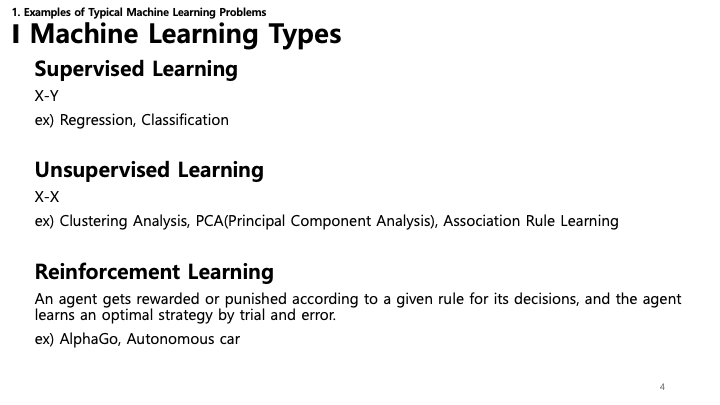

*   **Supervised Learning (X-Y)**: The algorithm learns from labeled data (input X, output Y). Examples include Regression and Classification.
*   **Unsupervised Learning (X-X)**: The algorithm finds patterns in unlabeled data. Examples include Clustering Analysis, Principal Component Analysis (PCA), and Association Rule Learning.
*   **Reinforcement Learning**: An agent learns an optimal strategy through trial and error by receiving rewards or punishments based on its decisions. Examples are AlphaGo and autonomous cars.

---

### 5. The Three Ingredients of a Learning Problem

Any machine learning problem can be described using these core components:
*   **Process**: The data-generating process or the underlying phenomenon we want to model.
*   **Data**: The observations we have collected from the process.
*   **Model**: The mathematical structure we use to approximate the process.
*   **Loss**: A function that measures how well the model predicts or fits the data.

---

### 6. Process

The machine learning process involves a series of steps:
1.  **Data Collection**: Gathering raw data.
2.  **Data Preprocessing**: Cleaning and formatting the data.
3.  **Feature Selection and Extraction**: Identifying the most relevant variables.
4.  **Data Splitting**: Dividing data into training and testing sets.
5.  **Model Selection**: Choosing the appropriate algorithm.
6.  **Model Training & Hyperparameter Tuning**: Teaching the model and optimizing its settings.
7.  **Model Deployment and Prediction**: Using the model in a real-world environment.

---

### 7. Data: Preprocessing - Feature Scaling

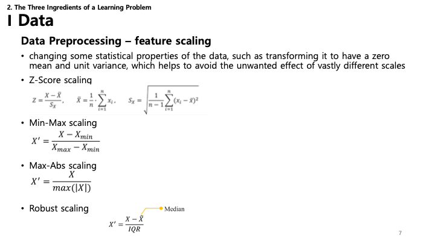

Scaling ensures that all features contribute equally to the result.
*   **Z-Score scaling (Standardization)**: Transforms data to have a mean of 0 and a variance of 1.
*   **Min-Max scaling (Normalization)**: Scales data to a fixed range, typically [0, 1].
*   **Max-Abs scaling**: Scales data based on the absolute maximum value.
*   **Robust scaling**: Uses the median and interquartile range (IQR) to be robust against outliers.

---

### 8. Data: Preprocessing - Dimensionality Reduction

Reducing the number of input variables can improve model performance and reduce computation.
*   **Feature Selection**: Selecting a subset of relevant features (e.g., mRMR, SVM-RFE).
*   **Feature Extraction**: Creating new features from existing ones (e.g., PCA, Autoencoder).
*   **Feature Engineering**: Using domain knowledge to create features that make machine learning algorithms work better.

---

### 9. Data: Preprocessing - One-Hot Encoding

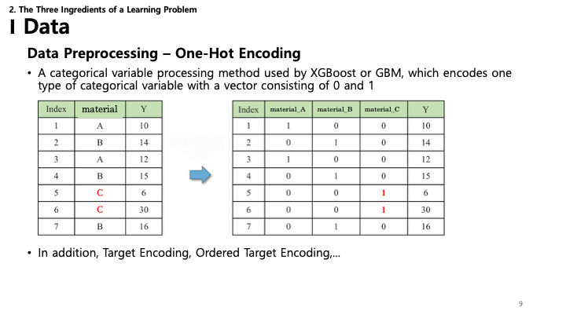

*   **One-Hot Encoding**: Converts categorical variables into a binary matrix format (0s and 1s), making them suitable for machine learning algorithms.
*   Other methods include Target Encoding and Ordered Target Encoding.

---

### 10. Model: Deterministic vs. Probabilistic

Models can be categorized by how they handle uncertainty:
*   **Deterministic Model**: The output is fully determined by the initial conditions and parameters. No randomness is involved (e.g., physical laws like $F=ma$).
*   **Probabilistic Model**: Incorporates randomness. Instead of a single output, it provides a probability distribution over possible outcomes. This is crucial when dealing with noisy data or inherent uncertainty.

---

### 11. Model: Deterministic vs. Statistical

While the previous slide introduced the concept, this slide formally contrasts two types of models:
*   **Deterministic Model**: Assumes a precise relationship where $Y = X\beta$ . It essentially states that if you know the input $X$ and the parameters $\beta$, you can determine $Y$ exactly.
*   **Statistical Model**: Acknowledges that the world is noisy. It models the relationship as $Y = X\beta + \epsilon$ , where $\epsilon$ represents the error term (often assumed to be normally distributed, $\epsilon \sim N(0, \sigma^2)$ ). This accounts for the variability we see in real-world data.

---

### 12. Loss: Classification

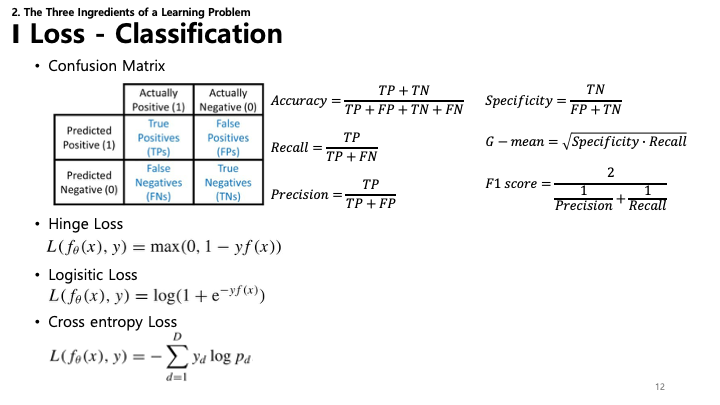

For classification problems (where the output is a category), we evaluate performance differently:
*   **Confusion Matrix**: A table that describes the performance of a classification model (True Positives, False Positives, etc.).
*   **Metrics**: Derived from the confusion matrix, including **Accuracy**, **Specificity**, **Recall**, **Precision**, and **F1 score**.
*   **Loss Functions**:
    *   **Hinge Loss**: Often used for "maximum-margin" classification, most notably for support vector machines (SVMs).
    *   **Logistic Loss**: Used in logistic regression.
    *   **Cross-entropy Loss**: Measures the performance of a classification model whose output is a probability value between 0 and 1.

---

### 13. Loss: Regression

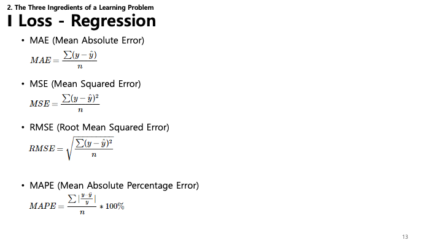

For regression problems (predicting a continuous value), common loss functions include:
*   **MAE (Mean Absolute Error)**: The average of the absolute differences between predictions and actual values.
*   **MSE (Mean Squared Error)**: The average of the squared differences. Penalizes larger errors more heavily.
*   **RMSE (Root Mean Squared Error)**: Square root of MSE, which makes the scale of errors the same as the target variable.
*   **MAPE (Mean Absolute Percentage Error)**: Measures prediction accuracy as a percentage.

---

### 14. Risk Minimization in Supervised Learning

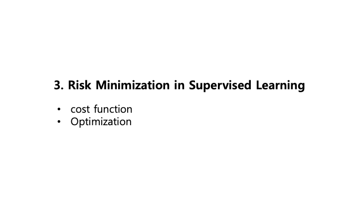

The core goal of supervised learning is **Risk Minimization**. This involves two key concepts:
*   **Cost Function**: A mathematical formula that quantifies the error between predicted and actual values.
*   **Optimization**: The process of adjusting the model parameters to minimize the cost function.

---

### 15. Cost Function & Regularization

*   **Risk Minimization Problem**: We want to find the optimal parameters $\theta^*$ that minimize the empirical risk $\hat{R}_{f_\theta}$.
*   **Overfitting**: This occurs when a model learns the training data *too* well, including its noise and outliers, resulting in poor performance on new, unseen data.
*   **Regularization**: Techniques used to prevent overfitting.
    *   Choosing a less flexible model.
    *   Stopping training early.
    *   Pruning parameters (setting them to zero).
    *   Adding a **regularization term** to the **cost function**.
*   **Final Cost Function**: $C(\theta) = \hat{R}_{f_\theta} + g(f_\theta)$ , where $\hat{R}$ is the risk (error) and $g$ is the regularization term.

---

### 16. Overfitting vs. Underfitting

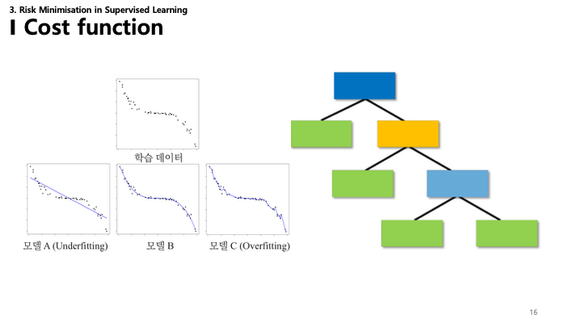

This slide visualizes the concepts of underfitting and overfitting using a regression example and a decision tree:
*   **Model A (Underfitting)**: The model is too simple (a straight line) to capture the underlying pattern of the data. It has high correlation bias.
*   **Model B**: The model fits the data well, capturing the trend without chasing every noise point.
*   **Model C (Overfitting)**: The model is too complex and fits the noise in the training data, leading to poor generalization.

---

### 17. Cost Function Examples: Regularization

Common regularization techniques involve adding a penalty term to the cost function:
*   **Ridge Regression ($\ell_2$)**: Adds the sum of squared coefficients.
    *   $g_{\ell_2}(\theta) = \sum \theta_i^2$
*   **Lasso Regression ($\ell_1$)**: Adds the sum of the absolute values of coefficients. This can drive some coefficients to exactly zero, performing feature selection.
    *   $g_{\ell_1}(\theta) = \sum |\theta_i|$
*   **Elastic-Net**: Combines both $\ell_1$ and $\ell_2$ penalties.
    *   Adds $\lambda_1 \sum |\theta_i| + \lambda_2 \sum \theta_i^2$

---

### 18. VC (Vapnik-Chervonenkis) Dimension

The **VC Dimension** measures the capacity (complexity) of a statistical classification algorithm.
*   **Concept**: It answers "How complex a dataset can this model classify?"
*   **Risk Bound**: It provides a theoretical upper bound on the test error (risk).
    *   $\mathcal{R}_{f_\theta} \leq \hat{\mathcal{R}}_{f_\theta} + \sqrt{\frac{1}{M} \left( d_{VC} \left( \log \left( \frac{2M}{d} \right) + 1 \right) + \log \left( \frac{4}{\delta} \right) \right)}$
    *   This formula shows that as the VC dimension ($d_{VC}$) increases (model becomes more complex), the gap between training error ($\hat{\mathcal{R}}$) and true risk ($\mathcal{R}$) can widen, increasing the chance of overfitting.

---

### 19. Optimization: Gradient Descent

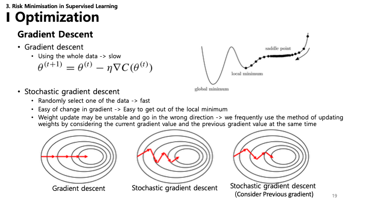

Optimization algorithms are used to find the parameters that minimize the cost function.
*   **Gradient Descent (GD)**: Uses the entire dataset to calculate the gradient and update parameters.
    *   $\theta^{(t+1)} = \theta^{(t)} - \eta \nabla C(\theta^{(t)})$
    *   **Pros**: Stable convergence.
    *   **Cons**: Slow on large datasets; can get stuck in local minima.
*   **Stochastic Gradient Descent (SGD)**: Updates parameters using a single random data point at a time.
    *   **Pros**: Faster; improved ability to escape local minima.
    *   **Cons**: Noisier convergence path (variable updates).

---

### 20. Mini-batch Gradient Descent

*   **Mini-batch Gradient Descent**: A compromise between Batch GD and SGD.
    *   It processes data in small groups (batches) of size $n$.
    *   It offers more stable convergence than SGD and is more computationally efficient than Batch GD, effectively utilizing matrix operations.

---

### 21. Training in Unsupervised Learning

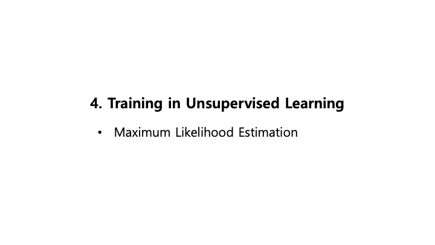

*   **Maximum Likelihood Estimation (MLE)**: A common method used in training unsupervised learning models.

---

### 22. Maximum Likelihood Estimation (Math)

**Likelihood** refers to the probability of observing a given set of data under a specific model.
*   **Likelihood Function**: $L(\Theta|x_1, ..., x_n)$
*   **Joint Probability Density**: $f(x_1, ..., x_n|\Theta) = f(x_1|\Theta)...f(x_n|\Theta)$ (assuming independence)
*   **MLE Goal**: Find the parameter values $\hat{\Theta}$ that maximize this likelihood function, making the observed data most probable.
    *   $\hat{\Theta} = argmax_\Theta L(\Theta)$
    *   In practice, we often maximize the **log-likelihood** because it turns products into sums, making derivatives easier to compute:
    *   $L^*(\Theta) = \log(L(\Theta)) = \sum \log f(x_i)$

---

### 23. Maximum Likelihood Estimation (Visual)

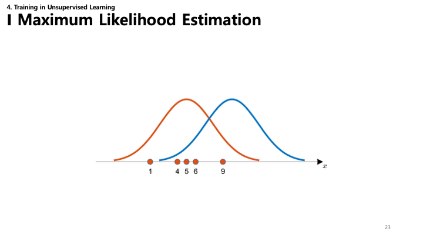

This graph visualizes MLE. We try to fit a distribution (like a Gaussian) to the data points (orange dots).
*   The blue curve represents a model with parameters that don't fit well (low likelihood).
*   The orange curve fits the data better (higher likelihood). MLE searches for the curve that fits the data "best".

---

### 24. Methods in Machine Learning

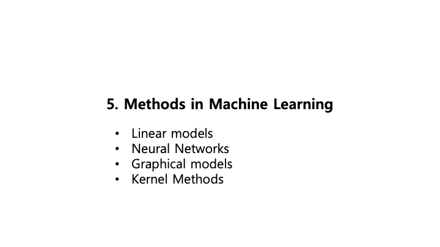

Common methods include:
*   **Linear Models**: Simple, interpretable models (e.g., Linear Regression, Logistic Regression).
*   **Neural Networks**: Powerful models inspired by biological neurons, capable of learning complex patterns.
*   **Graphical Models**: Models that express the conditional dependence structure between random variables (e.g., Bayesian Networks).
*   **Kernel Methods**: Algorithms that use kernel functions to operate in a high-dimensional feature space (e.g., SVM).

---

### 25. Linear Models

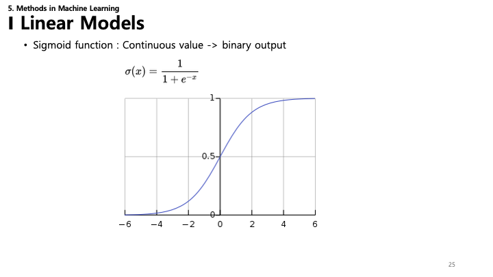

*   **Sigmoid Function**: A key component in linear classification (like Logistic Regression) and neural networks.
    *   $\sigma(x) = \frac{1}{1 + e^{-x}}$
    *   It maps any real-valued input number into a value between 0 and 1, essentially converting a continuous value into a probability (binary output).

---

### 26. Linear Models: Least Squares & SVD

*   **Linear Regression Model**: $f_w(x) = w^Tx$
*   **Least-squares Estimation**: Finds the optimal weights $w$ by minimizing the sum of squared differences between predictions and actual values.
    *   $C(w) = \frac{1}{M} \sum (w^Tx^m - y^m)^2$
    *   **Analytical Solution**: The optimal weights can be calculated directly using the formula $w_{opt} = (X^TX)^{-1}X^Ty$.
*   **Singular Value Decomposition (SVD)**: A method to decompose a matrix, often used to calculate the pseudo-inverse ($X^+$) when solving linear least squares problems, providing a numerically stable solution.

---

### 27. Linear Models: MSE

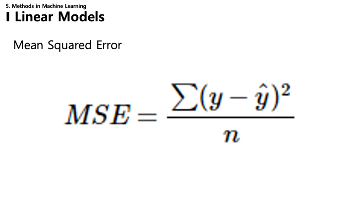

*   **Mean Squared Error (MSE)**: The standard cost function for regression problems.
    *   $MSE = \frac{1}{n} \sum (y - \hat{y})^2$
    *   It measures the average squared difference between the estimated values ($\hat{y}$) and the actual value ($y$).

---

### 28. Neural Networks: Perceptron & MLP

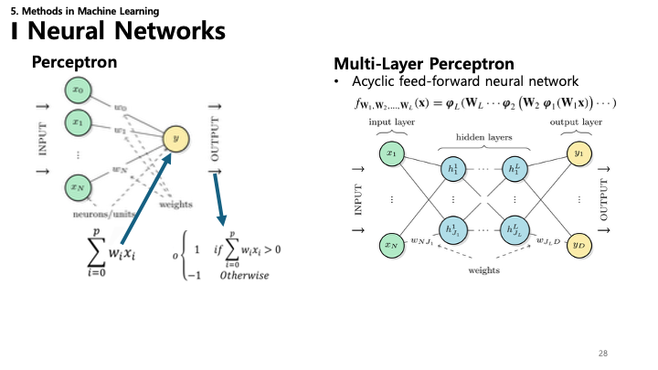

*   **Perceptron**: The simplest artificial neuron. It takes multiple inputs ($x$), multiplies them by weights ($w$), sums them up, and passes the result through an activation function to produce an output.
*   **Multi-Layer Perceptron (MLP)**: An acyclic feed-forward neural network composed of multiple layers of perceptrons (input, hidden, and output layers).
    *   $f(x) = \phi_L(W_L ... \phi_2(W_2 \phi_1(W_1 x))...)$
    *   It can learn non-linear relationships thanks to the activation functions and multiple layers.

---

### 29. Neural Networks: Activation Functions

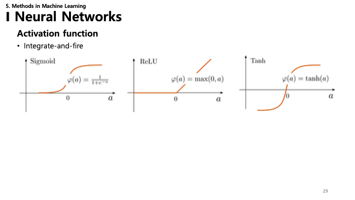

Activation functions introduce non-linearity into the network, allowing it to learn complex patterns.
*   **Sigmoid**: $\sigma(x) = \frac{1}{1+e^{-x}}$. Output range (0, 1). Smoothes the step function.
*   **ReLU (Rectified Linear Unit)**: $\phi(a) = \max(0, a)$. Output range [0, $\infty$). Solves the vanishing gradient problem and is computationally efficient.
*   **Tanh (Hyperbolic Tangent)**: $\phi(a) = \tanh(a)$. Output range (-1, 1). Zero-centered.

---

### 30. Neural Networks: Backpropagation

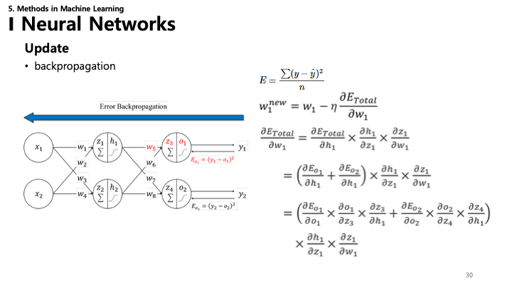

*   **Backpropagation**: The algorithm used to train neural networks.
    *   It efficiently calculates the gradient of the loss function ($E$) with respect to each weight ($w$) in the network.
    *   **Chain Rule**: The core mathematical principle behind backpropagation. It allows us to compute the derivative of a composite function by multiplying the derivatives of its constituent functions.
    *   $\frac{\partial E}{\partial w} = \frac{\partial E}{\partial y} \cdot \frac{\partial y}{\partial h} \cdot \frac{\partial h}{\partial w}$
    *   Weights are updated to minimize the error: $w^{new} = w - \eta \frac{\partial E}{\partial w}$

### 31. Recurrent Neural Networks (RNN)

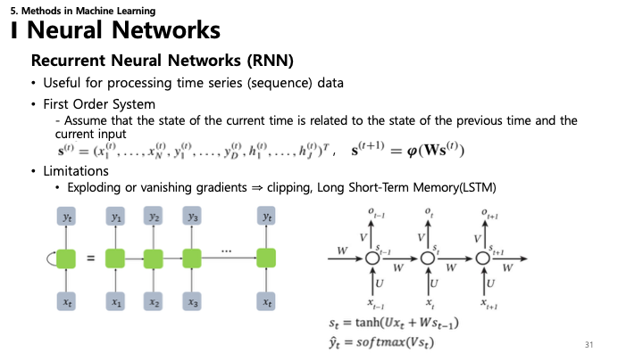

*   **RNN**: Combining the advantages of Perceptron and Logic Gates.
    *   Useful for processing processing time series (sequence) data.
*   **First Order System**:
    *   Assume that the state of the current time is related to the state of the previous time and the current input.
    *   $s^{(t)} = (x^{(t)}_1, ..., x^{(t)}_N, y^{(t)}_1, ..., y^{(t)}_D, h^{(t)}_1, ..., h^{(t)}_J)^T$
    *   $s^{(t+1)} = \varphi(Ws^{(t)})$
*   **Limitations**:
    *   Exploding or vanishing gradients.
    *   Solutions include Gradient Clipping and **Long Short-Term Memory (LSTM)**.

---

### 32. RNN Applications

RNNs are versatile and used in various "many-to-many" or "many-to-one" tasks:
*   **One-to-Many**: Image Captioning.
*   **Many-to-One**: Sentiment Analysis (e.g., Spam Classification).
*   **Many-to-Many**: Machine Translation (e.g., English to Korean), Named Entity Recognition (NER), DNA sequence analysis, Chatbots.

---

### 33. Hopfield Networks

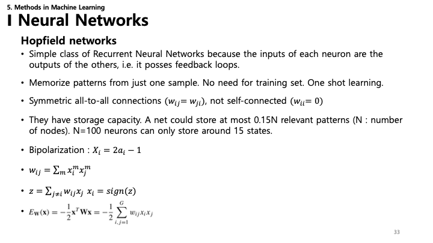

*   **Hopfield Networks**: A simple class of Recurrent Neural Networks with feedback loops.
    *   **Associative Memory**: Can memorize patterns from just one sample (One-shot learning).
    *   **Structure**: Symmetric all-to-all connections ($w_{ij} = w_{ji}$) with no self-connections ($w_{ii} = 0$).
*   **Capacity**: A network with $N$ nodes can store approximately $0.15N$ patterns. (e.g., 100 neurons $\approx$ 15 patterns).
*   **Math**:
    *   Bipolarization: $X_i = 2a_i - 1$
    *   Weight update: $w_{ij} = \sum_m x_i^m x_j^m$
    *   Update rule: $z = \sum_{j \neq i} w_{ij} x_j$, $x_i = \text{sign}(z)$
    *   **Energy Function**: $E_W(\mathbf{x}) = -\frac{1}{2}\mathbf{x}^T \mathbf{W} \mathbf{x} = -\frac{1}{2} \sum_{i,j=1} w_{ij}x_i x_j$

---

### 34. Hopfield Networks: Recovery

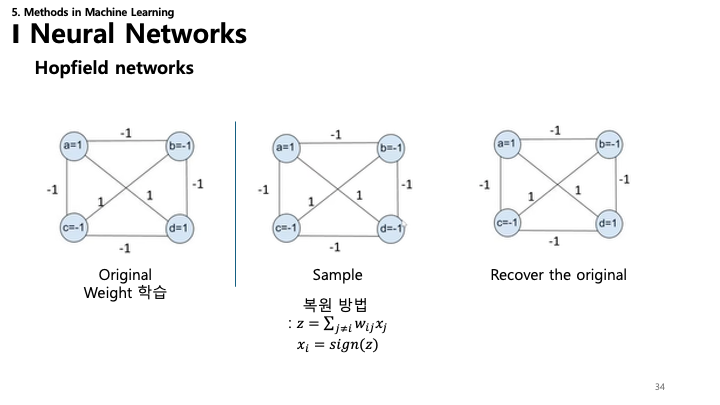

This slide demonstrates the recovery process:
*   **Original**: A stable state learned by the network.
*   **Sample**: A corrupted or partial version of the pattern.
*   **Recovery**: The network iterates using the update rule $x_i = \text{sign}(\sum w_{ij}x_j)$ to minimize the energy, eventually settling back into the original stable state (attractor).

---

### 35. Hopfield Networks: Example

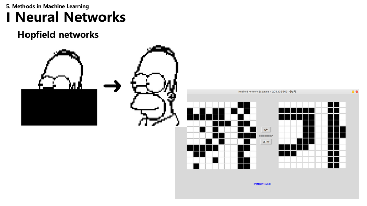

*   An visual example showing how a Hopfield network can recover a complete image (e.g., Homer Simpson or a Hangul character '가') from a partially obscured or noisy input.
*   It functions as a content-addressable memory system.

---

### 36. Boltzmann Machines

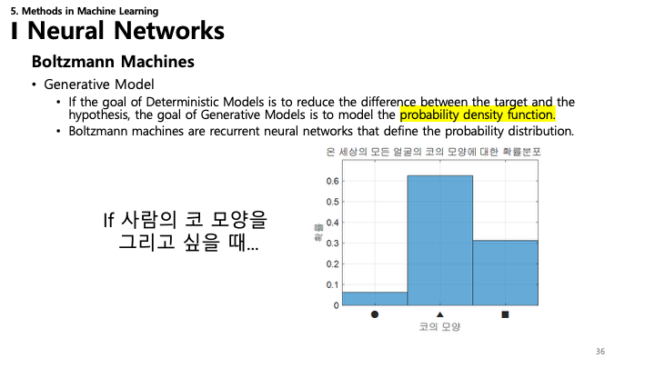

*   **Generative Model**: Unlike deterministic models that predict a target $y$, generative models aim to model the probability density function of the data.
*   **Structure**: A stochastic recurrent neural network that defines a probability distribution over the states of the system.
*   Example: Modeling the probability distribution of nose shapes to generate new, realistic nose images.

---

### 37. Restricted Boltzmann Machines (RBM)

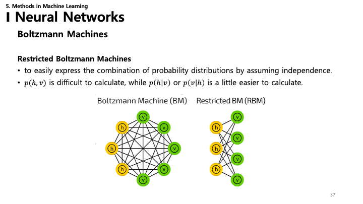

*   **RBM**: A variant of Boltzmann Machines designed to be easier to train.
*   **Restriction**: There are no intra-layer connections (no visible-visible or hidden-hidden connections). Connections exist only between the visible layer ($v$) and hidden layer ($h$).
*   **Independence**: This structure implies that given the visible nodes, the hidden nodes are independent (and vice versa), simplifying the calculation of conditional probabilities $p(h|v)$ and $p(v|h)$.

---

### 38. RBM: Math

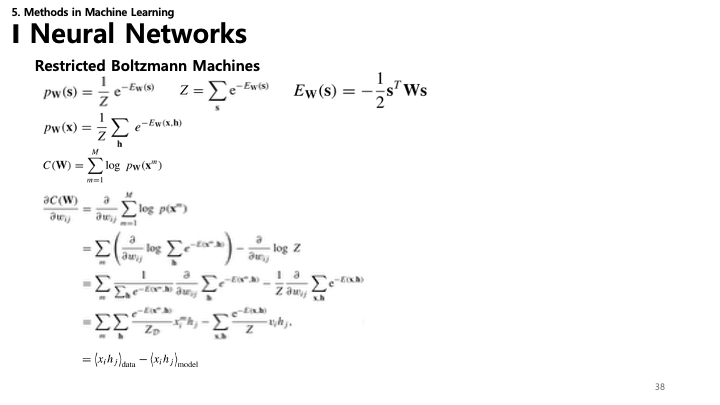

*   **Energy Function**: $E_W(\mathbf{s}) = -\frac{1}{2}\mathbf{s}^T \mathbf{W} \mathbf{s}$ (simplified form).
*   **Probability**: $p_W(\mathbf{s}) = \frac{1}{Z} e^{-E_W(\mathbf{s})}$, where $Z = \sum_s e^{-E_W(\mathbf{s})}$ is the partition function.
*   **Gradient Calculation**:
    *   The gradient of the log-likelihood involves two terms:
    *   $\frac{\partial C(\mathbf{W})}{\partial w_{ij}} = \langle x_i h_j \rangle_{\text{data}} - \langle x_i h_j \rangle_{\text{model}}$
    *   The first term is easy to compute from data (positive phase), but the second term (negative phase) requires samples from the model, which is hard.

---

### 39. Gibbs Sampling

*   **Sampling**: Since calculating the model expectation $\langle x_i h_j \rangle_{\text{model}}$ is hard, we approximate it using **Gibbs Sampling**.
*   **Process**: Iteratively update variables by drawing samples from their conditional distribution.
*   **Thermalization**: It takes a long time (many steps) for the chain to reach equilibrium (the true distribution).
*   To speed this up, **Contrastive Divergence (CD)** was proposed.

---

### 40. Contrastive Divergence (CD)

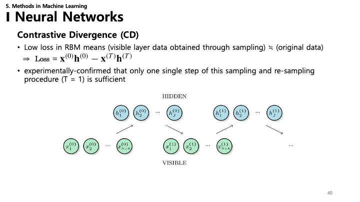

*   **Contrastive Divergence**: An efficient approximation algorithm for training RBMs.
*   **Idea**: Instead of waiting for the chain to converge, run the Gibbs chain for only $k$ steps (often $k=1$, denoted CD-1).
*   **Update Rule**: $\text{Loss} \approx \mathbf{x}^{(0)}\mathbf{h}^{(0)} - \mathbf{x}^{(k)}\mathbf{h}^{(k)}$
*   Experimentally, even a single step ($T=1$) is often sufficient to learn good features.

---

### 41. Graphical Models

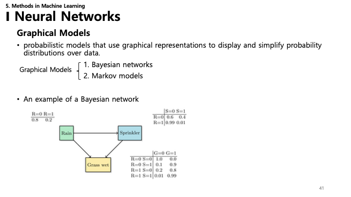

*   **Graphical Models**: Probabilistic models that use graphs to represent and simplify probability distributions over data.
*   **Types**:
    1.  **Bayesian Networks**: Directed Acyclic Graphs (DAGs).
    2.  **Markov Models**: Undirected graphs (Markov Random Fields).
*   **Bayesian Network Example**: The "Rain-Sprinkler-Grass Wet" model demonstrates causal relationships and conditional probabilities.

---

### 42. Bayesian Networks

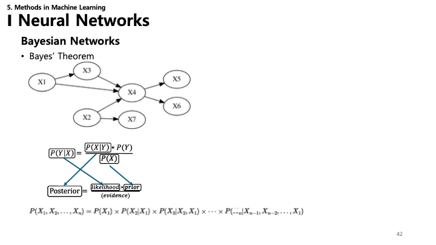

*   **Factorization**: The joint probability distribution factorizes into the product of conditional probabilities based on the graph structure.
    *   $P(X_1, ..., X_n) = \prod_{i} P(X_i | \text{parents}(X_i))$
*   **Bayes' Theorem**: The foundation for inference (updating probabilities based on evidence).
    *   $P(Y|X) = \frac{P(X|Y) P(Y)}{P(X)}$
    *   **Posterior** = (Likelihood $\times$ Prior) / Evidence

---

### 43. Hidden Markov Models (HMM)

*   **Markov Assumption**: The current state depends *only* on the previous state, not the entire history.
    *   $P(X_{t+1} | X_t, ..., X_1) = P(X_{t+1} | X_t)$
*   **Structure**: A sequence of unobserved (hidden) states that generate observed events.
*   Example: Predicting tomorrow's weather (Hidden) based on today's weather, or inferring the weather from observed activities (like carrying an umbrella).

---

### 44. HMM: Transition & Emission

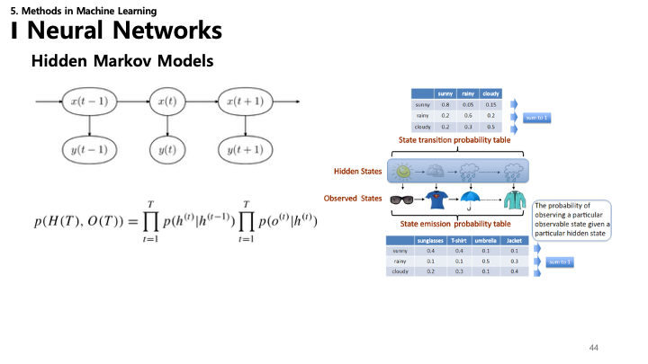

HMMs are characterized by two probability tables:
*   **State Transition Probability**: The probability of moving from one hidden state to another (e.g., Sunny $\rightarrow$ Rainy).
*   **Emission Probability**: The probability of observing an output given a hidden state (e.g., Observing "Umbrella" given "Rainy").
*   **Joint Probability**:
    *   $p(H, O) = \prod_{t=1}^T p(h^{(t)} | h^{(t-1)}) \prod_{t=1}^T p(o^{(t)} | h^{(t)})$

---

### 45. Kernel Methods

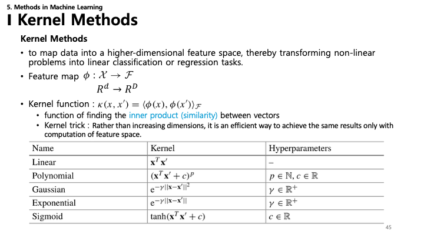

*   **Goal**: To transform non-linear problems into linear ones by mapping data into a higher-dimensional feature space.
*   **Feature Map**: $\phi: \mathcal{X} \rightarrow \mathcal{F}$ ($R^d \rightarrow R^D$).
*   **Kernel Function**: $\kappa(x, x') = \langle \phi(x), \phi(x') \rangle_{\mathcal{F}}$
    *   It computes the similarity (inner product) directly without explicitly calculating the high-dimensional coordinates.
*   **Common Kernels**:
    *   **Linear**: $x^T x'$
    *   **Polynomial**: $(x^T x' + c)^P$
    *   **Gaussian (RBF)**: $e^{-\gamma ||x - x'||^2}$
    *   **Sigmoid**: $\tanh(x^T x' + c)$

---

### 46. Kernel Methods: Visuals

*   **2D to 2D**: A coordinate transformation (e.g., polar coordinates) can separate concentric circles linearly.
*   **2D to 3D**: Mapping 2D data ($X_1, X_2$) to 3D ($X_1^2, X_2^2, \sqrt{2}X_1X_2$) creates a parabolic surface where data can be separated by a plane.

---

### 47. Kernel Density Estimation (KDE)

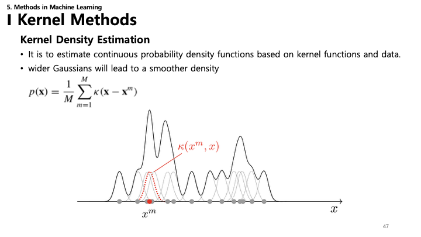

*   **KDE**: A non-parametric way to estimate the probability density function (PDF) of a random variable.
*   **Method**: Place a kernel (e.g., a Gaussian distribution) centered at each data point and sum them up.
    *   $p(\mathbf{x}) = \frac{1}{M} \sum_{m=1}^M \kappa(\mathbf{x} - \mathbf{x}^m)$
*   **Smoothing**: A wider kernel (larger variance) leads to a smoother density estimate.

---

### 48. K-Nearest Neighbor (KNN)

*   **KNN**: A simple, instance-based learning algorithm.
*   **Logic**: Classify a new point based on the majority class of its $k$ nearest neighbors.
*   **Distance Metrics**:
    *   **Euclidean**: $\sqrt{\sum (x_i - x_i')^2}$
    *   **Squared**: $\sum (x_i - x_i')^2$
    *   **Cosine**: $\frac{\mathbf{x}^T \mathbf{x}'}{||\mathbf{x}|| ||\mathbf{x}'||}$ (Angle-based similarity)
    *   **Hamming**: Number of differing bits (for binary data).

---

### 49. Support Vector Machines (SVM)

*   **SVM**: Focuses on finding the optimal boundary between classes.
*   **Support Vectors**: The data points that lie closest to the decision boundary. They essentially "support" or define the boundary.
*   **Margin**: The distance between the decision boundary and the support vectors. SVM aims to maximize this margin ($d_1 + d_2$).

---

### 50. SVM: Margin

*   Visual explanation of the margin components ($d_1$ and $d_2$).
*   Maximizing the margin leads to better generalization. A larger margin implies the model is more confident and robust to noise.

---

### 51. SVM: Constraints

*   **Hyperplane**: $w^T x + b = 0$
*   **Canonical Hyperplanes**: We scale $w$ and $b$ such that the value at the support vectors is $+1$ or $-1$.
    *   $w_0 + w_1 X_{i1} + w_2 X_{i2} \geq +M/2$ for $y_i = +1$
    *   $w_0 + w_1 X_{i1} + w_2 X_{i2} \leq -M/2$ for $y_i = -1$
*   **Combined Constraint**: $y_i (\mathbf{w} \cdot \mathbf{x}_i + w_0) \geq M/2 - \xi_i$ (where $\xi_i$ allows for some error, i.e., Soft Margin).

---

### 52. SVM: Optimization Goal

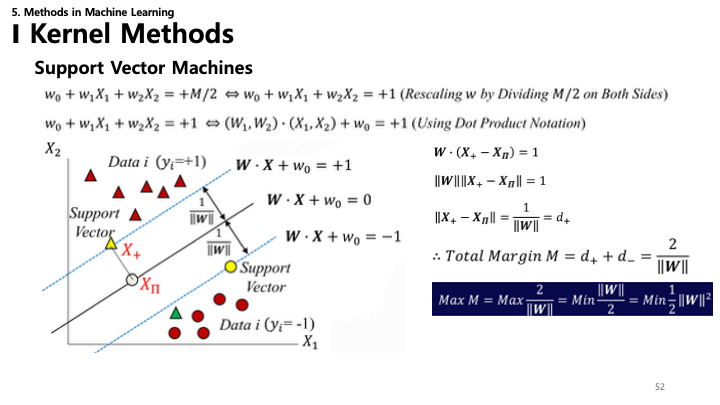

*   The margin width is given by $\frac{2}{||w||}$.
*   **Optimization**: To maximize the margin ($M$), we need to **minimize** the norm of the weight vector $||w||$ (or equivalently, minimize $\frac{1}{2}||w||^2$).
    *   $\text{Max } M = \text{Min } \frac{1}{2} ||w||^2$

---

### 53. SVM: Hinge Loss

*   **Hinge Loss**: The loss function used for SVM training.
    *   $\text{loss} = \max\{0, 1 - (y' \times y)\}$
*   **Zero Loss Condition**: If samples are correctly classified and outside the margin ($y' \times y \geq 1$), the loss is zero.
*   **Penalty**: If samples are inside the margin or misclassified ($y' \times y < 1$), the loss increases linearly.

---

### 54. SVM: Lagrangian & Dual Problem

*   We solve the constrained optimization problem using **Lagrange Multipliers** ($\alpha$).
    *   $\mathcal{L}(\mathbf{w}, b, \mathbf{\alpha}) = \frac{1}{2}||\mathbf{w}||^2 - \sum_{m=1}^M \alpha_m (y^m (\mathbf{w}^T \mathbf{x}^m + b) - 1)$
*   **Dual Formulation**:
    *   $\mathcal{L}_{\text{dual}}(\mathbf{\alpha}) = \sum \alpha_m - \frac{1}{2} \sum \alpha_m \alpha_{m'} y^m y^{m'} (\mathbf{x}^m)^T \mathbf{x}^{m'}$
*   **Decision Function**: $f(\mathbf{x}) = \sum \alpha_m y^m (\mathbf{x}^m)^T \mathbf{x} + b$
    *   Notice the solution depends only on the dot product $(\mathbf{x}^m)^T \mathbf{x}$, enabling the Kernel Trick.

---

### 55. Kernel Methods Limitations

*   The slide illustrates projections into higher dimensions (e.g., $R^2 \rightarrow R^3$).
*   It poses the question "Shortcoming..?" (단점..?), possibly hinting at the computational cost of high-dimensional mapping or the risk of overfitting if the kernel is too complex.

---

### 56. Kernel Trick Summary

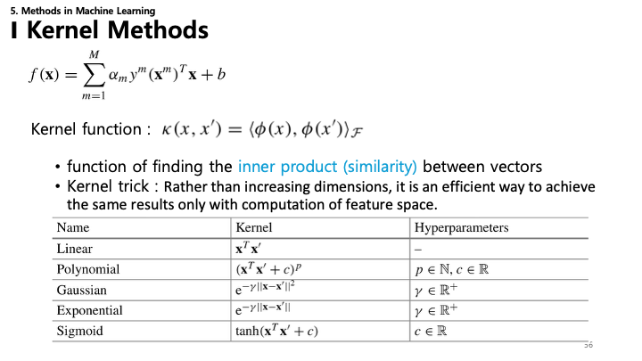

*   **Representer Theorem form**: $f(\mathbf{x}) = \sum \alpha_m y^m \kappa(\mathbf{x}^m, \mathbf{x}) + b$
*   **Kernel Trick**: A computationally efficient way to achieve the results of high-dimensional mapping without actually computing the feature vectors.
*   Table of kernels again: Linear, Polynomial, Gaussian, Exponential, Sigmoid.

---

### 57. Gaussian Processes (GP)

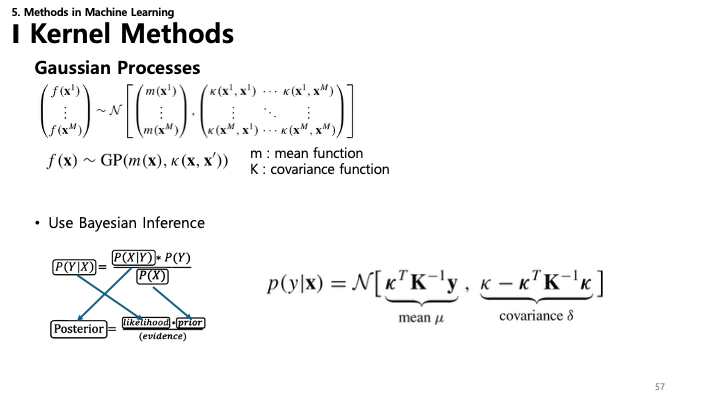

*   **Gaussian Process**: A non-parametric model where any finite set of variables has a joint Gaussian distribution.
    *   $f(\mathbf{x}) \sim GP(m(\mathbf{x}), \kappa(\mathbf{x}, \mathbf{x}'))$
    *   Defined by a mean function $m$ and a covariance function (kernel) $\kappa$.
*   **Inference**: Uses Bayesian inference to update the posterior distribution $p(y|\mathbf{x})$ given new data.
    *   The result is a Gaussian distribution with updated mean and covariance.

---

### 58. Gaussian Processes: Visualization

*   Visualizes the GP regression.
*   **Dotted line**: The mean prediction.
*   **Shaded region**: The confidence interval (uncertainty) which typically narrows near observed data points and widens where there is no data.
*   This ability to quantify uncertainty is a key advantage of Gaussian Processes.
