이 포스트는 Maria Schuld와 Francesco Petruccione의 저서 *"Machine Learning with Quantum Computers"* (2nd Edition)의 **Chapter 2. Machine Learning** 내용을 요약한 것입니다.

---

### 1. 개요 (Introduction)

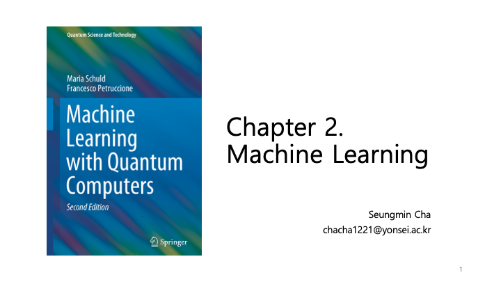

2장에서는 양자 머신러닝을 이해하기 위한 기초로서 머신러닝의 전반적인 개념을 다룹니다. 학습 문제의 유형, 학습의 필수 요소, 그리고 다양한 머신러닝 기법들을 소개합니다.

---

### 2. 목차 (Contents)

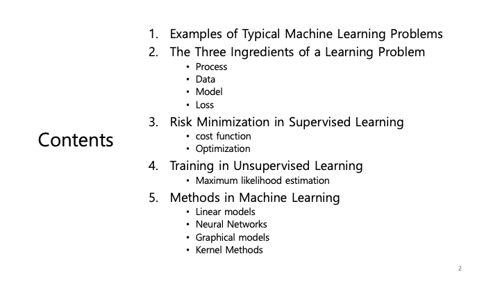

이 장은 다음과 같은 주요 섹션으로 구성됩니다:
1.  **머신러닝 문제의 예 (Examples of Typical Machine Learning Problems)**: 다양한 문제 유형 이해.
2.  **학습 문제의 3요소 (The Three Ingredients of a Learning Problem)**: 프로세스(Process), 데이터(Data), 모델(Model), 손실(Loss).
3.  **지도 학습의 위험 최소화 (Risk Minimization in Supervised Learning)**: 비용 함수와 최적화.
4.  **비지도 학습의 훈련 (Training in Unsupervised Learning)**: 최대 우도 추정(MLE).
5.  **머신러닝 기법들 (Methods in Machine Learning)**: 선형 모델, 신경망, 그래피컬 모델, 커널 방법.

---

### 3. 머신러닝 문제의 예

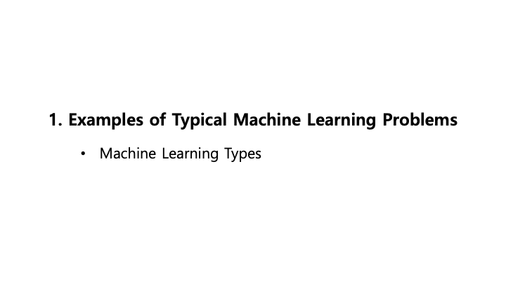

머신러닝 분야는 데이터의 특성과 학습 목표에 따라 크게 분류할 수 있습니다.

---

### 4. 머신러닝의 종류

*   **지도 학습 (Supervised Learning, X-Y)**: 레이블이 지정된 데이터(입력 X, 출력 Y)로부터 학습합니다. (예: 회귀, 분류)
*   **비지도 학습 (Unsupervised Learning, X-X)**: 레이블이 없는 데이터에서 패턴을 찾습니다. (예: 군집 분석, 주성분 분석(PCA), 연관 규칙 학습)
*   **강화 학습 (Reinforcement Learning)**: 에이전트가 시행착오를 통해 보상이나 처벌을 받으며 최적의 전략을 학습합니다. (예: 알파고, 자율주행차)

---

### 5. 학습 문제의 3요소

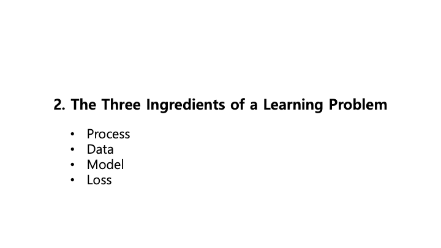

모든 머신러닝 문제는 다음의 핵심 요소들로 설명할 수 있습니다:
*   **프로세스 (Process)**: 데이터를 생성하는 과정 또는 모델링하려는 현상.
*   **데이터 (Data)**: 프로세스로부터 수집된 관측값.
*   **모델 (Model)**: 프로세스를 근사하기 위해 사용하는 수학적 구조.
*   **손실 (Loss)**: 모델이 데이터를 얼마나 잘 예측하거나 적합하는지 측정하는 함수.

---

### 6. 프로세스 (Process)

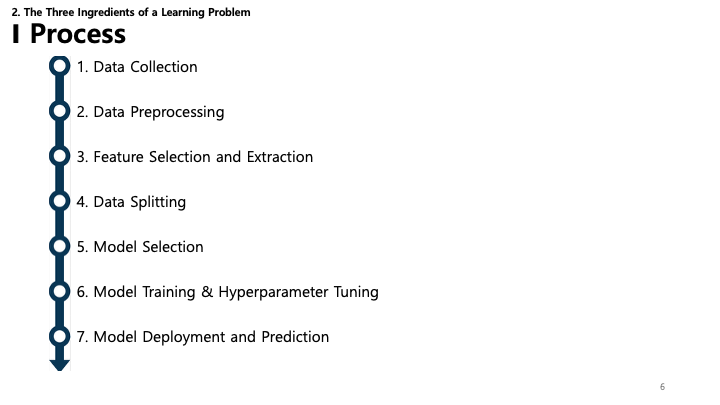

머신러닝 프로세스는 일련의 단계로 이루어집니다:
1.  **데이터 수집 (Data Collection)**: 원시 데이터 확보.
2.  **데이터 전처리 (Data Preprocessing)**: 데이터 정제 및 포맷팅.
3.  **특성 선택 및 추출 (Feature Selection and Extraction)**: 가장 관련성 높은 변수 식별.
4.  **데이터 분할 (Data Splitting)**: 훈련용과 테스트용 데이터로 분리.
5.  **모델 선택 (Model Selection)**: 적절한 알고리즘 선정.
6.  **모델 훈련 및 하이퍼파라미터 튜닝 (Model Training & Hyperparameter Tuning)**: 모델 학습 및 설정 최적화.
7.  **모델 배포 및 예측 (Model Deployment and Prediction)**: 실제 환경에서 모델 사용.

---

### 7. 데이터: 전처리 - 특성 스케일링

스케일링은 모든 특성이 결과에 동등하게 기여하도록 보장합니다.
*   **Z-Score 스케일링 (표준화)**: 데이터의 평균이 0, 분산이 1이 되도록 변환합니다.
*   **Min-Max 스케일링 (정규화)**: 데이터를 고정된 범위(보통 [0, 1])로 조정합니다.
*   **Max-Abs 스케일링**: 절대값의 최대치를 기준으로 스케일링합니다.
*   **Robust 스케일링**: 중앙값(Median)과 사분위수 범위(IQR)를 사용하여 이상치(Outlier)에 강건하게 만듭니다.

---

### 8. 데이터: 전처리 - 차원 축소

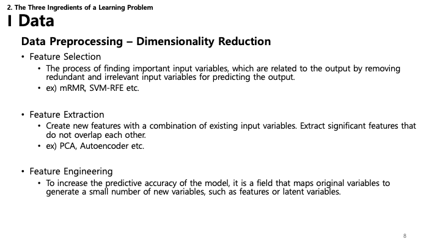

입력 변수의 수를 줄이면 모델 성능을 높이고 계산량을 줄일 수 있습니다.
*   **특성 선택 (Feature Selection)**: 관련 있는 특성의 부분 집합을 선택 (예: mRMR, SVM-RFE).
*   **특성 추출 (Feature Extraction)**: 기존 특성으로부터 새로운 특성 생성 (예: PCA, Autoencoder).
*   **특성 공학 (Feature Engineering)**: 도메인 지식을 활용하여 머신러닝 알고리즘이 더 잘 작동하도록 특성을 생성.

---

### 9. 데이터: 전처리 - 원-핫 인코딩

*   **원-핫 인코딩 (One-Hot Encoding)**: 범주형(categorical) 변수를 0과 1로 이루어진 이진 행렬로 변환하여 머신러닝 알고리즘이 처리할 수 있게 합니다.
*   그 외 Target Encoding, Ordered Target Encoding 등의 방법이 있습니다.

---

### 10. 모델: 결정론적 vs 확률론적

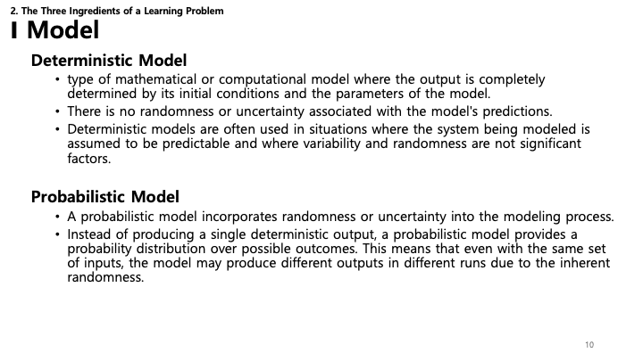

불확실성을 다루는 방식에 따라 모델을 분류할 수 있습니다:
*   **결정론적 모델 (Deterministic Model)**: 초기 조건과 파라미터에 의해 출력이 완전히 결정됩니다. 무작위성이 없습니다 (예: $F=ma$와 같은 물리 법칙).
*   **확률론적 모델 (Probabilistic Model)**: 무작위성을 포함합니다. 단일 출력 대신 가능한 결과에 대한 확률 분포를 제공합니다. 노이즈가 많은 데이터나 내재적 불확실성을 다룰 때 중요합니다.

---

### 11. 모델: 결정론적 vs 통계적

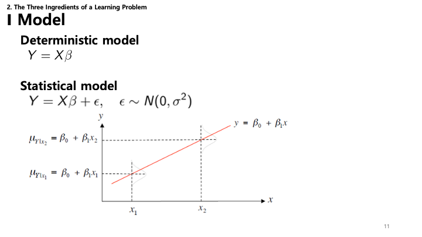

*   **결정론적 모델**: $Y = X\beta$ 와 같은 정확한 관계를 가정합니다. 입력 $X$와 파라미터 $\beta$를 알면 $Y$를 정확히 알 수 있다고 봅니다.
*   **통계적 모델**: 세상이 노이즈로 차 있음을 인정합니다. 관계를 $Y = X\beta + \epsilon$ 로 모델링하며, 여기서 $\epsilon$은 오차항(보통 정규분포 $\epsilon \sim N(0, \sigma^2)$ 가정)입니다. 실제 데이터의 변동성을 고려합니다.

---

### 12. 손실 (Loss): 분류 (Classification)

분류 문제(출력이 범주인 경우)의 성능 평가:
*   **오차 행렬 (Confusion Matrix)**: 모델의 성능(True Positives, False Positives 등)을 나타내는 표.
*   **지표 (Metrics)**: 오차 행렬에서 파생된 **정확도(Accuracy)**, **특이도(Specificity)**, **재현율(Recall)**, **정밀도(Precision)**, **F1 점수**.
*   **손실 함수 (Loss Functions)**:
    *   **Hinge Loss**: "최대 마진" 분류에 사용되며, 서포트 벡터 머신(SVM)에서 주로 쓰입니다.
    *   **Logistic Loss**: 로지스틱 회귀에서 사용.
    *   **Cross-entropy Loss**: 출력이 0과 1 사이의 확률 값인 분류 모델의 성능을 측정.

---

### 13. 손실 (Loss): 회귀 (Regression)

회귀 문제(연속적인 값을 예측)의 일반적인 손실 함수:
*   **MAE (Mean Absolute Error)**: 예측값과 실제값 차이의 절대값 평균.
*   **MSE (Mean Squared Error)**: 차이의 제곱 평균. 큰 오차에 더 큰 페널티를 부여.
*   **RMSE (Root Mean Squared Error)**: MSE의 제곱근. 오차의 단위를 타겟 변수와 같게 만듦.
*   **MAPE (Mean Absolute Percentage Error)**: 예측 정확도를 백분율로 측정.

---

### 14. 지도 학습의 위험 최소화

지도 학습의 핵심 목표는 **위험 최소화(Risk Minimization)**입니다. 두 가지 주요 개념이 있습니다:
*   **비용 함수 (Cost Function)**: 예측값과 실제값 사이의 오차를 수치화하는 수학 공식.
*   **최적화 (Optimization)**: 비용 함수를 최소화하기 위해 모델 파라미터를 조정하는 과정.

---

### 15. 비용 함수와 정규화

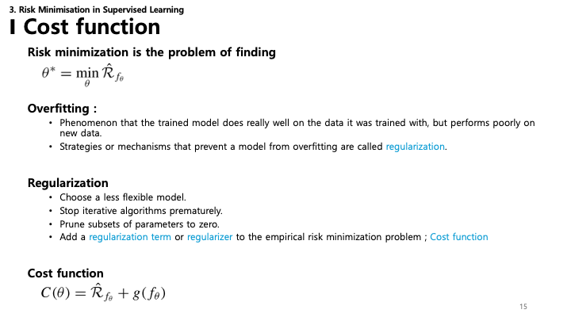

*   **위험 최소화 문제**: 경험적 위험(Empirical Risk) $\hat{R}_{f_\theta}$를 최소화하는 최적의 파라미터 $\theta^*$를 찾는 것입니다.
*   **과적합 (Overfitting)**: 모델이 훈련 데이터를 *너무* 잘 학습하여 노이즈나 이상치까지 반영하게 되어, 새로운 데이터에 대한 성능이 떨어지는 현상.
*   **정규화 (Regularization)**: 과적합을 방지하는 기법.
    *   덜 유연한 모델 선택.
    *   조기 종료 (Early Stopping).
    *   파라미터 가지치기 (0으로 설정).
    *   **비용 함수**에 **정규화 항(Regularization term)** 추가.
*   **최종 비용 함수**: $C(\theta) = \hat{R}_{f_\theta} + g(f_\theta)$ (여기서 $\hat{R}$은 위험(오차), $g$는 정규화 항).

---

### 16. 과적합(Overfitting) vs 과소적합(Underfitting)

회귀와 결정 트리를 예로 들어 과소적합과 과적합을 시각화합니다:
*   **모델 A (과소적합)**: 모델이 데이터의 패턴을 담기에 너무 단순함(직선). 편향(Bias)이 높음.
*   **모델 B**: 노이즈를 쫓지 않고 데이터의 트렌드를 잘 반영함.
*   **모델 C (과적합)**: 모델이 너무 복잡하여 훈련 데이터의 노이즈까지 학습함. 일반화 성능이 떨어짐.

---

### 17. 비용 함수 예시: 정규화

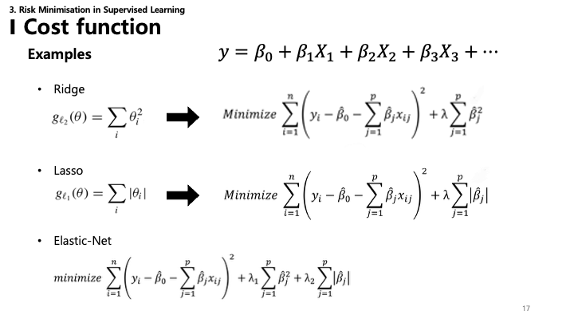

일반적인 정규화 기법은 비용 함수에 페널티 항을 추가합니다:
*   **릿지 회귀 (Ridge Regression, $\ell_2$)**: 계수의 제곱합을 추가.
    *   $g_{\ell_2}(\theta) = \sum \theta_i^2$
*   **라쏘 회귀 (Lasso Regression, $\ell_1$)**: 계수의 절대값 합을 추가. 일부 계수를 0으로 만들어 변수 선택(Feature Selection) 효과가 있음.
    *   $g_{\ell_1}(\theta) = \sum |\theta_i|$
*   **엘라스틱 넷 (Elastic-Net)**: $\ell_1$과 $\ell_2$ 페널티를 결합.
    *   $\lambda_1 \sum |\theta_i| + \lambda_2 \sum \theta_i^2$

---

### 18. VC 차원 (Vapnik-Chervonenkis Dimension)

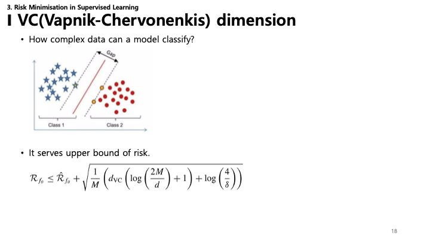

**VC 차원**은 통계적 분류 알고리즘의 용량(복잡도)을 측정합니다.
*   **개념**: "이 모델이 얼마나 복잡한 데이터셋을 분류할 수 있는가?"
*   **위험 한계 (Risk Bound)**: 테스트 오차(위험)에 대한 이론적 상한선을 제공합니다.
    *   $\mathcal{R}_{f_\theta} \leq \hat{\mathcal{R}}_{f_\theta} + \sqrt{\frac{1}{M} \left( d_{VC} \left( \log \left( \frac{2M}{d} \right) + 1 \right) + \log \left( \frac{4}{\delta} \right) \right)}$
    *   이 식은 VC 차원($d_{VC}$)이 커질수록(모델이 복잡할수록) 훈련 오차($\hat{\mathcal{R}}$)와 실제 위험($\mathcal{R}$) 사이의 간격이 커져 과적합 가능성이 높아짐을 보여줍니다.

---

### 19. 최적화: 경사 하강법 (Gradient Descent)

비용 함수를 최소화하는 파라미터를 찾기 위한 최적화 알고리즘입니다.
*   **경사 하강법 (GD)**: 전체 데이터셋을 사용하여 기울기를 계산하고 파라미터를 업데이트합니다.
    *   $\theta^{(t+1)} = \theta^{(t)} - \eta \nabla C(\theta^{(t)})$
    *   **장점**: 안정적인 수렴.
    *   **단점**: 대규모 데이터셋에서 느림; 지역 최솟값(Local Minima)에 빠질 수 있음.
*   **확률적 경사 하강법 (SGD)**: 한 번에 하나의 랜덤 데이터 포인트를 사용하여 파라미터를 업데이트합니다.
    *   **장점**: 빠름; 지역 최솟값을 탈출할 가능성이 높음.
    *   **단점**: 수렴 경로가 불안정(노이즈가 심함).

---

### 20. 미니 배치 경사 하강법 (Mini-batch Gradient Descent)

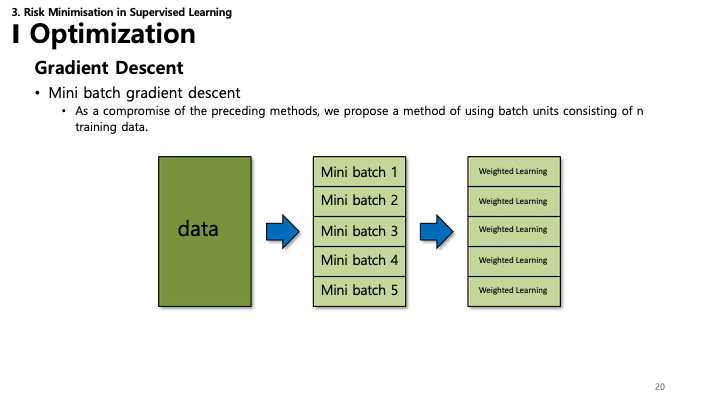

*   **미니 배치 경사 하강법**: Batch GD와 SGD의 절충안.
    *   데이터를 작은 그룹(배치, 크기 $n$)으로 나누어 처리합니다.
    *   SGD보다 수렴이 안정적이며, 행렬 연산을 활용해 Batch GD보다 계산 효율이 좋습니다.

---

### 21. 비지도 학습의 훈련

*   **최대 우도 추정 (Maximum Likelihood Estimation, MLE)**: 비지도 학습 모델을 훈련하는 데 자주 사용되는 방법입니다.

---

### 22. 최대 우도 추정 (수식)

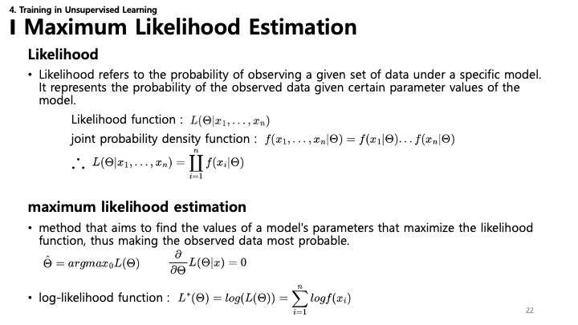

**우도(Likelihood)**는 특정 모델 하에서 주어진 데이터가 관측될 확률을 의미합니다.
*   **우도 함수**: $L(\Theta|x_1, ..., x_n)$
*   **결합 확률 밀도**: $f(x_1, ..., x_n|\Theta) = f(x_1|\Theta)...f(x_n|\Theta)$ (독립 가정 시)
*   **MLE의 목표**: 이 우도 함수를 최대화하는(즉, 관측된 데이터를 가장 잘 설명하는) 파라미터 $\hat{\Theta}$를 찾는 것.
    *   $\hat{\Theta} = argmax_\Theta L(\Theta)$
    *   실제로는 곱셈을 덧셈으로 바꿔 미분을 쉽게 하기 위해 **로그 우도(Log-likelihood)**를 최대화합니다:
    *   $L^*(\Theta) = \log(L(\Theta)) = \sum \log f(x_i)$

---

### 23. 최대 우도 추정 (시각화)

MLE를 시각화한 그래프입니다. 데이터 포인트(주황색 점)에 가장 잘 맞는 분포(가우시안 등)를 찾으려 합니다.
*   파란색 곡선은 데이터와 잘 맞지 않는(우도가 낮은) 파라미터를 가진 모델입니다.
*   주황색 곡선은 데이터를 더 잘 설명합니다(우도가 높음). MLE는 데이터를 "가장 잘" 설명하는 곡선을 찾습니다.

---

### 24. 머신러닝 기법들

일반적인 기법들:
*   **선형 모델 (Linear Models)**: 단순하고 해석 가능한 모델 (예: 선형 회귀, 로지스틱 회귀).
*   **신경망 (Neural Networks)**: 생물학적 뉴런에서 영감을 받은 강력한 모델, 복잡한 패턴 학습 가능.
*   **그래피컬 모델 (Graphical Models)**: 확률 변수 간의 조건부 의존성을 그래프로 표현 (예: 베이지안 네트워크).
*   **커널 방법 (Kernel Methods)**: 커널 함수를 사용해 고차원 특징 공간에서 작동하는 알고리즘 (예: SVM).

---

### 25. 선형 모델 (Linear Models)

*   **시그모이드 함수 (Sigmoid Function)**: 선형 분류(예: 로지스틱 회귀)와 신경망의 핵심 요소.
    *   $\sigma(x) = \frac{1}{1 + e^{-x}}$
    *   실수 입력을 0과 1 사이의 값으로 매핑하여, 연속적인 값을 확률(이진 출력)로 변환합니다.

---

### 26. 선형 모델: 최소 제곱법 & SVD

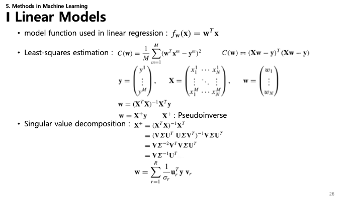

*   **선형 회귀 모델**: $f_w(x) = w^Tx$
*   **최소 제곱법 (Least-squares Estimation)**: 예측값과 실제값 차이의 제곱합을 최소화하여 최적의 가중치 $w$를 찾습니다.
    *   $C(w) = \frac{1}{M} \sum (w^Tx^m - y^m)^2$
    *   **해석적 해**: 공식 $w_{opt} = (X^TX)^{-1}X^Ty$를 통해 직접 계산 가능.
*   **특이값 분해 (SVD)**: 선형 최소 제곱 문제를 풀 때 유사역행렬($X^+$)을 계산하는 데 자주 사용되는 행렬 분해 방법으로, 수치적으로 안정적인 해를 제공합니다.

---

### 27. 선형 모델: MSE

*   **평균 제곱 오차 (MSE)**: 회귀 문제의 표준 비용 함수.
    *   $MSE = \frac{1}{n} \sum (y - \hat{y})^2$
    *   추정값($\hat{y}$)과 실제값($y$) 차이의 제곱 평균을 측정합니다.

---

### 28. 신경망: 퍼셉트론 & MLP

*   **퍼셉트론 (Perceptron)**: 가장 단순한 인공 뉴런. 여러 입력($x$)에 가중치($w$)를 곱해 합산한 후, 활성화 함수를 통과시켜 출력을 만듭니다.
*   **다층 퍼셉트론 (MLP)**: 여러 층의 퍼셉트론(입력, 은닉, 출력층)으로 구성된 비순환 피드포워드 신경망.
    *   $f(x) = \phi_L(W_L ... \phi_2(W_2 \phi_1(W_1 x))...)$
    *   활성화 함수와 다층 구조 덕분에 비선형 관계를 학습할 수 있습니다.

---

### 29. 신경망: 활성화 함수

활성화 함수는 네트워크에 비선형성을 도입하여 복잡한 패턴을 학습하게 합니다.
*   **Sigmoid**: $\sigma(x) = \frac{1}{1+e^{-x}}$. 출력 범위 (0, 1). 계단 함수를 부드럽게 만든 형태.
*   **ReLU (Rectified Linear Unit)**: $\phi(a) = \max(0, a)$. 출력 범위 [0, $\infty$). 기울기 소실(Vanishing Gradient) 문제를 해결하고 계산 효율이 좋음.
*   **Tanh (Hyperbolic Tangent)**: $\phi(a) = \tanh(a)$. 출력 범위 (-1, 1). 0을 중심으로 함.

---

### 30. 신경망: 역전파 (Backpropagation)

*   **역전파**: 신경망 훈련에 쓰이는 알고리즘.
    *   손실 함수의 기울기($E$)를 네트워크의 각 가중치($w$)에 대해 효율적으로 계산합니다.
    *   **연쇄 법칙 (Chain Rule)**: 역전파의 핵심 수학 원리. 합성 함수의 미분은 구성 함수들의 미분 곱으로 계산할 수 있습니다.
    *   $\frac{\partial E}{\partial w} = \frac{\partial E}{\partial y} \cdot \frac{\partial y}{\partial h} \cdot \frac{\partial h}{\partial w}$
    *   오차를 최소화하도록 가중치 업데이트: $w^{new} = w - \eta \frac{\partial E}{\partial w}$

---

### 31. 순환 신경망 (RNN)

*   **RNN**: 퍼셉트론과 논리 게이트의 장점을 결합.
    *   시계열(Sequence) 데이터 처리에 유용.
*   **1차 시스템 (First Order System)**:
    *   현재 시간의 상태는 이전 시간의 상태와 현재 입력과 관련이 있다고 가정.
    *   $s^{(t)} = (x^{(t)}_1, ..., x^{(t)}_N, y^{(t)}_1, ..., y^{(t)}_D, h^{(t)}_1, ..., h^{(t)}_J)^T$
    *   $s^{(t+1)} = \varphi(Ws^{(t)})$
*   **한계**:
    *   기울기 폭발 또는 소실 문제.
    *   해결책: Gradient Clipping, **LSTM (Long Short-Term Memory)**.

---

### 32. RNN 응용

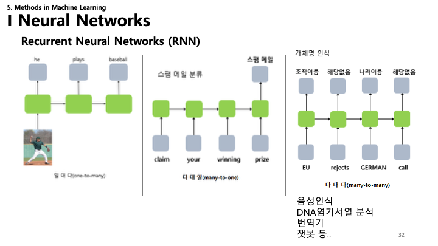

RNN은 다양한 "Many-to-Many" 또는 "Many-to-One" 작업에 활용됩니다:
*   **One-to-Many**: 이미지 캡셔닝.
*   **Many-to-One**: 감성 분석 (예: 스팸 분류).
*   **Many-to-Many**: 기계 번역 (영-한), 개체명 인식 (NER), DNA 서열 분석, 챗봇.

---

### 33. 홉필드 네트워크 (Hopfield Networks)

*   **홉필드 네트워크**: 피드백 루프가 있는 단순한 형태의 순환 신경망.
    *   **연상 메모리 (Associative Memory)**: 단 하나의 샘플만으로 패턴을 기억할 수 있음 (One-shot learning).
    *   **구조**: 대칭적 완전 연결 ($w_{ij} = w_{ji}$), 자기 연결 없음 ($w_{ii} = 0$).
*   **용량**: $N$개의 노드를 가진 네트워크는 약 $0.15N$개의 패턴을 저장 가능 (예: 뉴런 100개 $\approx$ 패턴 15개).
*   **수식**:
    *   이진화(Bipolarization): $X_i = 2a_i - 1$
    *   가중치 업데이트: $w_{ij} = \sum_m x_i^m x_j^m$
    *   업데이트 규칙: $z = \sum_{j \neq i} w_{ij} x_j$, $x_i = \text{sign}(z)$
    *   **에너지 함수**: $E_W(\mathbf{x}) = -\frac{1}{2}\mathbf{x}^T \mathbf{W} \mathbf{x} = -\frac{1}{2} \sum_{i,j=1} w_{ij}x_i x_j$

---

### 34. 홉필드 네트워크: 복원 (Recovery)

복원 과정을 보여주는 슬라이드:
*   **Original**: 네트워크가 학습한 안정된 상태.
*   **Sample**: 손상되거나 일부분만 있는 패턴.
*   **Recovery**: 네트워크는 에너지를 최소화하는 방향으로 업데이트 규칙 $x_i = \text{sign}(\sum w_{ij}x_j)$을 반복하여, 결과적으로 원래의 안정된 상태(Attractor)로 수렴합니다.

---

### 35. 홉필드 네트워크: 예시

*   홉필드 네트워크가 부분적으로 가려지거나 노이즈가 섞인 입력으로부터 전체 이미지(예: 호머 심슨, 문자 '가')를 복원하는 시각적 예시.
*   내용 기반 주소 지정 메모리(Content-Addressed Memory) 시스템으로 작동합니다.

---

### 36. 볼츠만 머신 (Boltzmann Machines)

*   **생성 모델 (Generative Model)**: 타겟 $y$를 예측하는 결정론적 모델과 달리, 데이터의 확률 밀도 함수를 모델링합니다.
*   **구조**: 시스템 상태에 대한 확률 분포를 정의하는 확률적 순환 신경망.
*   예: 코 모양의 확률 분포를 모델링하여 새롭고 현실적인 코 이미지를 생성.

---

### 37. 제한된 볼츠만 머신 (RBM)

*   **RBM**: 학습하기 쉽도록 설계된 볼츠만 머신의 변형.
*   **제한 (Restriction)**: 같은 층 내의 연결이 없습니다 (가시-가시 또는 은닉-은닉 연결 없음). 연결은 가시층($v$)과 은닉층($h$) 사이에만 존재합니다.
*   **독립성**: 이 구조 덕분에 가시 노드가 주어졌을 때 은닉 노드들은 서로 독립적(반대의 경우도 성립)이 되어, 조건부 확률 $p(h|v)$ 및 $p(v|h)$ 계산이 단순해집니다.

---

### 38. RBM: 수식

*   **에너지 함수**: $E_W(\mathbf{s}) = -\frac{1}{2}\mathbf{s}^T \mathbf{W} \mathbf{s}$ (단순화된 형태).
*   **확률**: $p_W(\mathbf{s}) = \frac{1}{Z} e^{-E_W(\mathbf{s})}$, 여기서 $Z = \sum_s e^{-E_W(\mathbf{s})}$는 분배 함수(Partition Function).
*   **기울기 계산**:
    *   로그 우도의 기울기에는 두 항이 포함됩니다:
    *   $\frac{\partial C(\mathbf{W})}{\partial w_{ij}} = \langle x_i h_j \rangle_{\text{data}} - \langle x_i h_j \rangle_{\text{model}}$
    *   첫 번째 항(Positive Phase)은 데이터로부터 쉽게 계산되지만, 두 번째 항(Negative Phase)은 모델 자체에서의 샘플링이 필요하여 계산이 어렵습니다.

---

### 39. 깁스 샘플링 (Gibbs Sampling)

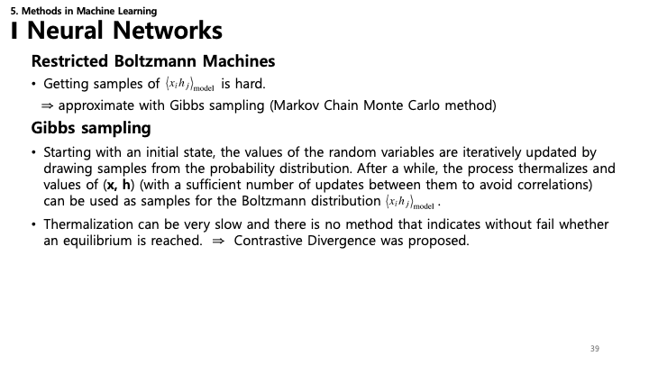

*   **샘플링**: 모델 기댓값 $\langle x_i h_j \rangle_{\text{model}}$ 계산이 어렵기 때문에 **깁스 샘플링**으로 근사합니다.
*   **과정**: 변수들의 조건부 분포에서 샘플을 추출하여 반복적으로 값을 업데이트합니다.
*   **평형 도달 (Thermalization)**: 체인이 평형 상태(진정한 분포)에 도달하려면 오랜 시간(많은 단계)이 걸립니다.
*   속도를 높이기 위해 **Contrastive Divergence (CD)**가 제안되었습니다.

---

### 40. Contrastive Divergence (CD)

*   **Contrastive Divergence**: RBM 훈련을 위한 효율적인 근사 알고리즘.
*   **아이디어**: 체인이 수렴할 때까지 기다리는 대신, 깁스 체인을 $k$ 단계만 실행합니다 (주로 $k=1$, CD-1이라 함).
*   **업데이트 규칙**: $\text{Loss} \approx \mathbf{x}^{(0)}\mathbf{h}^{(0)} - \mathbf{x}^{(k)}\mathbf{h}^{(k)}$
*   실험적으로 단 한 번의 단계($T=1$)만으로도 좋은 특징을 학습하기에 충분한 경우가 많습니다.

---

### 41. 그래피컬 모델 (Graphical Models)

*   **그래피컬 모델**: 데이터에 대한 확률 분포를 그래프로 표현하고 단순화하는 확률론적 모델.
*   **종류**:
    1.  **Bayesian Networks**: 방향성 비순환 그래프 (DAG).
    2.  **Markov Models**: 무방향성 그래프 (Markov Random Fields).
*   **베이지안 네트워크 예시**: "비-스프링클러-잔디 젖음" 모델은 인과 관계와 조건부 확률을 보여줍니다.

---

### 42. 베이지안 네트워크

*   **분해 (Factorization)**: 결합 확률 분포는 그래프 구조에 따라 조건부 확률들의 곱으로 분해됩니다.
    *   $P(X_1, ..., X_n) = \prod_{i} P(X_i | \text{parents}(X_i))$
*   **베이즈 정리**: 추론(증거에 기반한 확률 업데이트)의 기초.
    *   $P(Y|X) = \frac{P(X|Y) P(Y)}{P(X)}$
    *   **사후 확률 (Posterior)** = (우도 $\times$ 사전 확률) / 증거

---

### 43. 은닉 마르코프 모델 (HMM)

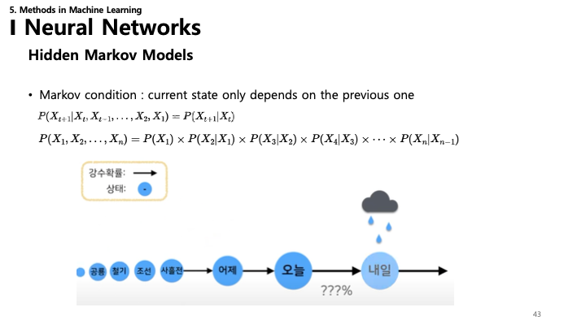

*   **마르코프 가정**: 현재 상태는 오직 바로 이전 상태에만 의존하며, 전체 과거와는 무관하다는 가정.
    *   $P(X_{t+1} | X_t, ..., X_1) = P(X_{t+1} | X_t)$
*   **구조**: 관측된 사건을 생성하는 보이지 않는(은닉된) 일련의 상태들.
*   예: 오늘의 날씨(은닉)를 보고 내일의 날씨 예측하기, 또는 관측된 행동(우산 쓰기)을 보고 날씨 추론하기.

---

### 44. HMM: 전이 & 방출

HMM은 두 가지 확률 테이블로 특징지어집니다:
*   **상태 전이 확률 (State Transition Probability)**: 한 은닉 상태에서 다른 상태로 이동할 확률 (예: 맑음 $\rightarrow$ 비).
*   **방출 확률 (Emission Probability)**: 은닉 상태가 주어졌을 때 특정 결과가 관측될 확률 (예: "비" 상태에서 "우산" 관측).
*   **결합 확률**:
    *   $p(H, O) = \prod_{t=1}^T p(h^{(t)} | h^{(t-1)}) \prod_{t=1}^T p(o^{(t)} | h^{(t)})$

---

### 45. 커널 방법 (Kernel Methods)

*   **목표**: 데이터를 고차원 특징 공간으로 매핑하여 비선형 문제를 선형 문제로 변환하는 것.
*   **특징 맵 (Feature Map)**: $\phi: \mathcal{X} \rightarrow \mathcal{F}$ ($R^d \rightarrow R^D$).
*   **커널 함수 (Kernel Function)**: $\kappa(x, x') = \langle \phi(x), \phi(x') \rangle_{\mathcal{F}}$
    *   고차원 좌표를 명시적으로 계산하지 않고도 유사도(내적)를 직접 계산합니다.
*   **일반적인 커널**:
    *   **Linear**: $x^T x'$
    *   **Polynomial**: $(x^T x' + c)^P$
    *   **Gaussian (RBF)**: $e^{-\gamma ||x - x'||^2}$
    *   **Sigmoid**: $\tanh(x^T x' + c)$

---

### 46. 커널 방법: 시각화

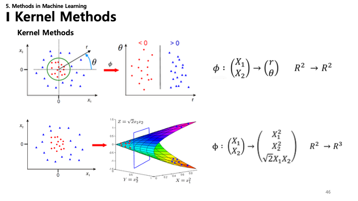

*   **2D to 2D**: 좌표 변환(예: 극좌표)으로 동심원 데이터를 선형적으로 분리 가능.
*   **2D to 3D**: 2D 데이터($X_1, X_2$)를 3D($X_1^2, X_2^2, \sqrt{2}X_1X_2$)로 매핑하면 포물면이 되어 평면으로 데이터 분리 가능.

---

### 47. 커널 밀도 추정 (KDE)

*   **KDE**: 확률 변수의 확률 밀도 함수(PDF)를 추정하는 비모수적 방법.
*   **방법**: 각 데이터 포인트에 커널(예: 가우시안 분포)을 중심에 두고 모두 합산합니다.
    *   $p(\mathbf{x}) = \frac{1}{M} \sum_{m=1}^M \kappa(\mathbf{x} - \mathbf{x}^m)$
*   **스무딩**: 커널이 넓을수록(분산이 클수록) 밀도 추정치가 더 부드러워집니다.

---

### 48. K-최근접 이웃 (KNN)

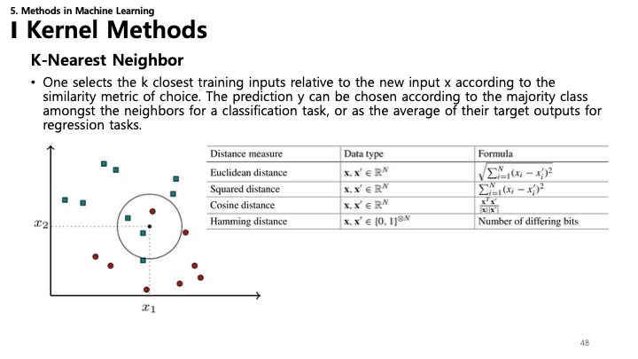

*   **KNN**: 단순한 인스턴스 기반 학습 알고리즘.
*   **논리**: 가장 가까운 $k$개의 이웃 중 다수결에 따라 새로운 포인트를 분류.
*   **거리 측정법**:
    *   **Euclidean**: $\sqrt{\sum (x_i - x_i')^2}$
    *   **Squared**: $\sum (x_i - x_i')^2$
    *   **Cosine**: $\frac{\mathbf{x}^T \mathbf{x}'}{||\mathbf{x}|| ||\mathbf{x}'||}$ (각도 기반 유사도)
    *   **Hamming**: 다른 비트의 개수 (이진 데이터용).

---

### 49. 서포트 벡터 머신 (SVM)

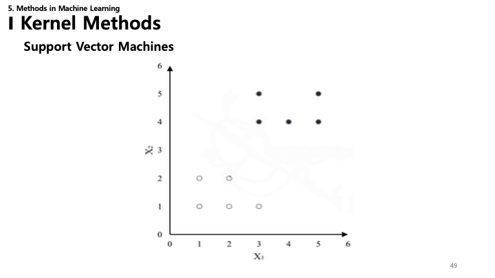

*   **SVM**: 클래스 간의 최적 경계선을 찾는 데 초점을 맞춥니다.
*   **서포트 벡터 (Support Vectors)**: 결정 경계에 가장 가까이 있는 데이터 포인트들. 이들이 경계를 "지지"하거나 정의합니다.
*   **마진 (Margin)**: 결정 경계와 서포트 벡터 사이의 거리. SVM은 이 마진($d_1 + d_2$)을 최대화하려고 합니다.

---

### 50. SVM: 마진

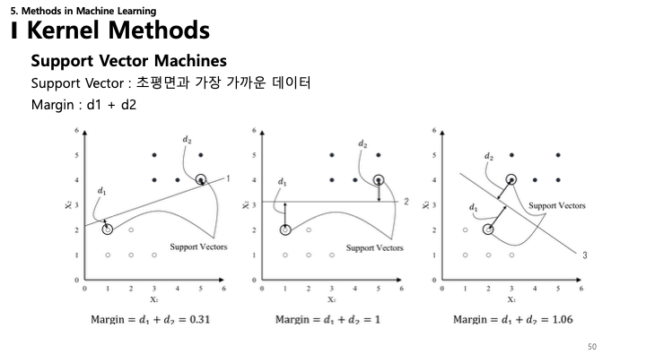

*   마진 구성 요소($d_1$, $d_2$) 시각적 설명.
*   마진을 최대화하면 일반화 성능이 좋아집니다. 마진이 클수록 모델이 더 확신을 가지며 노이즈에 강건하다는 뜻입니다.

---

### 51. SVM: 제약 조건

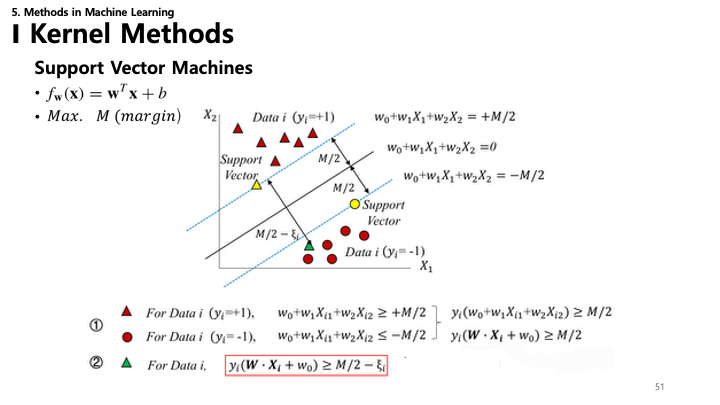

*   **초평면 (Hyperplane)**: $w^T x + b = 0$
*   **표준 초평면 (Canonical Hyperplanes)**: 서포트 벡터에서의 값이 $+1$ 또는 $-1$이 되도록 $w$와 $b$의 스케일을 조정합니다.
    *   $w_0 + w_1 X_{i1} + w_2 X_{i2} \geq +M/2$ ($y_i = +1$인 경우)
    *   $w_0 + w_1 X_{i1} + w_2 X_{i2} \leq -M/2$ ($y_i = -1$인 경우)
*   **통합 제약 조건**: $y_i (\mathbf{w} \cdot \mathbf{x}_i + w_0) \geq M/2 - \xi_i$ (여기서 $\xi_i$는 어느 정도의 오류 허용, 즉 Soft Margin을 의미).

---

### 52. SVM: 최적화 목표

*   마진의 폭은 $\frac{2}{||w||}$로 주어집니다.
*   **최적화**: 마진($M$)을 최대화하려면 가중치 벡터의 크기 $||w||$를 **최소화**해야 합니다 (또는 $\frac{1}{2}||w||^2$ 최소화).
    *   $\text{Max } M = \text{Min } \frac{1}{2} ||w||^2$

---

### 53. SVM: 힌지 손실 (Hinge Loss)

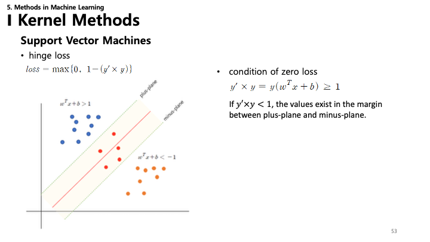

*   **Hinge Loss**: SVM 훈련에 사용되는 손실 함수.
    *   $\text{loss} = \max\{0, 1 - (y' \times y)\}$
*   **손실 0 조건**: 샘플이 올바르게 분류되고 마진 바깥에 있다면($y' \times y \geq 1$) 손실은 0입니다.
*   **페널티**: 샘플이 마진 안쪽에 있거나 오분류되면($y' \times y < 1$) 손실이 선형적으로 증가합니다.

---

### 54. SVM: 라그랑주 및 쌍대 문제

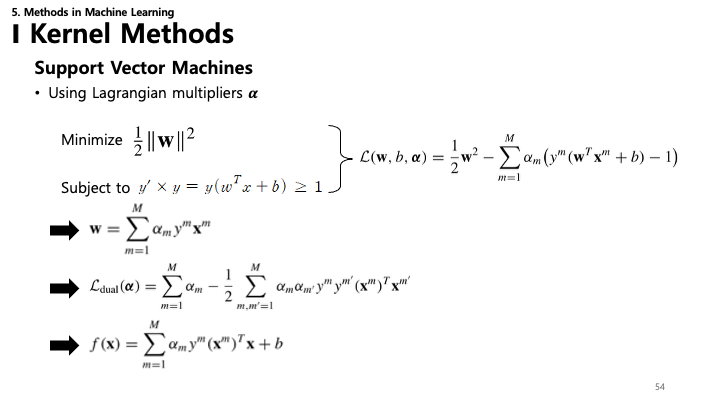

*   **라그랑주 승수**($\alpha$)를 사용하여 제약 조건이 있는 최적화 문제를 풉니다.
    *   $\mathcal{L}(\mathbf{w}, b, \mathbf{\alpha}) = \frac{1}{2}||\mathbf{w}||^2 - \sum_{m=1}^M \alpha_m (y^m (\mathbf{w}^T \mathbf{x}^m + b) - 1)$
*   **쌍대 공식 (Dual Formulation)**:
    *   $\mathcal{L}_{\text{dual}}(\mathbf{\alpha}) = \sum \alpha_m - \frac{1}{2} \sum \alpha_m \alpha_{m'} y^m y^{m'} (\mathbf{x}^m)^T \mathbf{x}^{m'}$
*   **결정 함수**: $f(\mathbf{x}) = \sum \alpha_m y^m (\mathbf{x}^m)^T \mathbf{x} + b$
    *   해(solution)가 오직 내적 $(\mathbf{x}^m)^T \mathbf{x}$에만 의존한다는 점에 주목하세요. 이는 커널 트릭을 가능하게 합니다.

---

### 55. 커널 방법의 한계

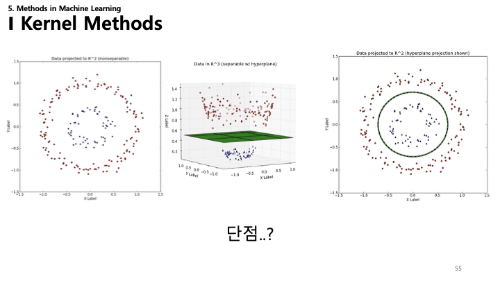

*   슬라이드는 고차원(예: $R^2 \rightarrow R^3$)으로의 투영을 보여줍니다.
*   "Shortcoming..?" (단점..?)이라는 질문은 고차원 매핑의 계산 비용이나 커널이 너무 복잡할 경우의 과적합 위험을 암시할 수 있습니다.

---

### 56. 커널 트릭 요약

*   **표현 정리 형태**: $f(\mathbf{x}) = \sum \alpha_m y^m \kappa(\mathbf{x}^m, \mathbf{x}) + b$
*   **커널 트릭**: 실제로 특징 벡터를 계산하지 않고도 고차원 매핑의 결과를 얻는 계산 효율적인 방법.
*   커널 표 재등장: Linear, Polynomial, Gaussian, Exponential, Sigmoid.

---

### 57. 가우시안 프로세스 (GP)

*   **가우시안 프로세스**: 유한한 변수 집합이 결합 정규 분포를 따른다고 가정하는 비모수적 모델.
    *   $f(\mathbf{x}) \sim GP(m(\mathbf{x}), \kappa(\mathbf{x}, \mathbf{x}'))$
    *   평균 함수 $m$과 공분산 함수(커널) $\kappa$로 정의됩니다.
*   **추론**: 새로운 데이터가 주어졌을 때 베이지안 추론을 사용하여 사후 분포 $p(y|\mathbf{x})$를 업데이트합니다.
    *   결과는 업데이트된 평균과 공분산을 가진 가우시안 분포입니다.

---

### 58. 가우시안 프로세스: 시각화

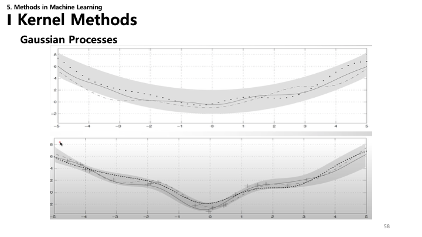

*   GP 회귀를 시각화했습니다.
*   **점선**: 예측된 평균.
*   **음영 영역**: 신뢰 구간(불확실성). 데이터 포인트 근처에서는 좁아지고 데이터가 없는 곳에서는 넓어집니다.
*   불확실성을 정량화할 수 있다는 점이 가우시안 프로세스의 핵심 장점입니다.
