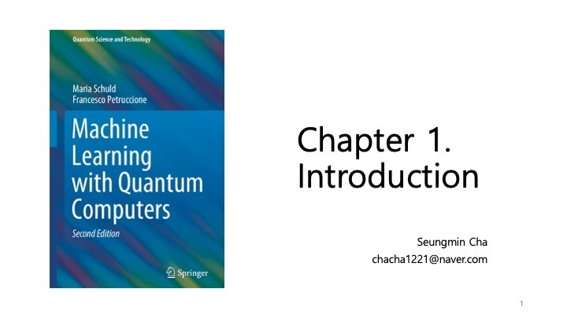
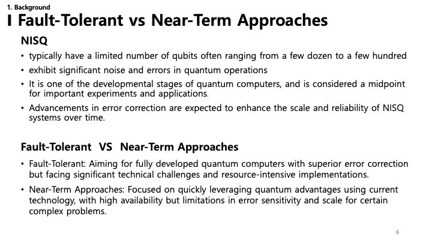
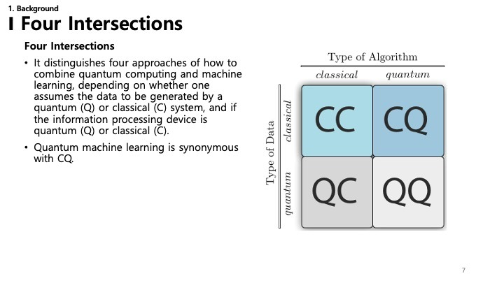
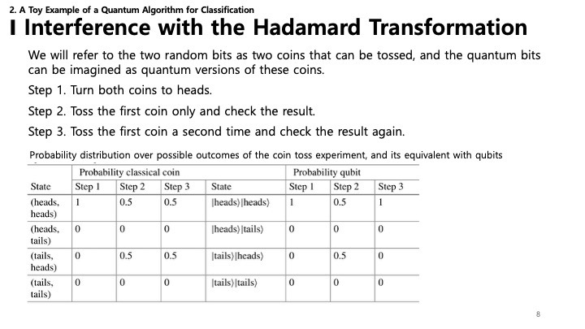
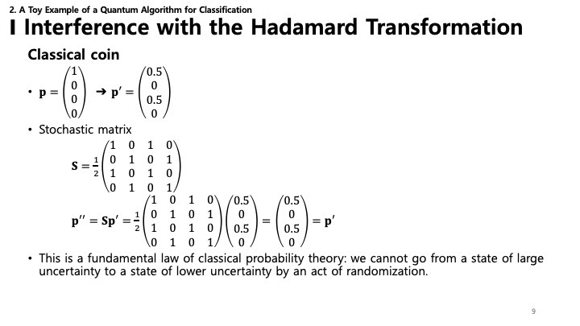

This post summarizes **Chapter 1. Introduction** of the book *"Machine Learning with Quantum Computers"* (2nd Edition) by Maria Schuld and Francesco Petruccione.

---

### 1. Introduction

This chapter introduces the fundamental concepts of Quantum Machine Learning (QML). Ideally, it sets the stage for understanding how quantum computing principles can be applied to machine learning tasks. As the field is rapidly evolving, this book aims to bridge the gap between computer science, physics, and statistics.

---

### 2. Contents

The introductory chapter focuses on two main areas:
1.  **Background**: Establishing the necessary context by defining what quantum computers are and how they relate to machine learning.
2.  **A Toy Example**: Providing a simple, illustrative example of a quantum algorithm designed for classification to make the abstract concepts more concrete.

---

### 3. Merging Two Disciplines

**Quantum Machine Learning (QML)** is not just a subfield of one discipline but a merger of **Quantum Computing** and **Machine Learning**.

*   **Machine Learning**: A field at the intersection of statistics, mathematics, and computer science. It deals with algorithms that allow computers to learn from data, identifying complex, nonlinear patterns to make predictions on unseen data.
*   **Quantum Computing**: Leveraging the laws of quantum mechanics—specifically superposition and entanglement—to perform computations in ways that classical computers cannot.
*   **The Intersection**: The goal of QML is to utilize the massive parallelism and unique capabilities of quantum processors to improve the efficiency and power of machine learning algorithms.

---

### 4. What is a Quantum Computer?

A **Quantum Computer** operates fundamentally differently from the classical devices we use every day.

*   **Quantum Theory**: It relies on the mathematical framework of quantum theory, which describes the behavior of microscopic systems like photons, electrons, and atoms.
*   **Fragility**: These systems are incredibly delicate. Maintaining **quantum coherence**—the state required for computation—is difficult because any interaction with the environment can cause "decoherence" or errors. This makes **error correction** a critical challenge.
*   **Circuit Model**: The standard language for describing quantum algorithms. It replaces classical bits (0 and 1) with **Qubits** and uses **Quantum Gates** to manipulate them, similar to logic gates in classical circuits but with the added power of quantum mechanics.

---

### 5. Fault-Tolerant vs. Near-Term Approaches

The development of quantum computers is viewed through two main phases:

*   **NISQ (Noisy Intermediate-Scale Quantum)**: This is "where we are today." NISQ devices have a limited number of qubits (intermediate scale) and are not yet fully error-corrected (noisy). However, they are still powerful enough to demonstrate advantages in specific tasks like chemistry simulations, optimization, and **machine learning**.
*   **Fault-Tolerant QC**: This is the long-term goal—a large-scale quantum computer that can correct its own errors. The "error correction threshold" is the boundary we need to cross to achieve this.

QML research is particularly active in the NISQ era, looking for algorithms that can be robust against noise and provide value even with today's imperfect hardware.

---

### 6. NISQ Details & Terminology

This slide delves deeper into the current state of NISQ devices.
*   **NISQ Characteristics**: Limited qubits (dozens to hundreds) and significant noise.
*   **Intermediate Stage**: It's a stepping stone. Important experiments are happening here, and advancements in error correction will gradually improve these systems.
*   **Fault-Tolerant**: The ultimate goal is a fully developed quantum computer with superior error correction, though this faces immense technical challenges.
*   **Near-Term**: Focuses on what we can do *now*, accepting high error sensitivity but looking for quantum advantage in specific complex problems.

---

### 7. Four Intersections

There are four ways to combine Quantum Computing (QC) and Machine Learning (ML), depending on the data source and the processing device:

*   **CC (Classical Data, Classical Device)**: Standard machine learning.
*   **CQ (Classical Data, Quantum Device)**: Using quantum algorithms to process classical datasets. This is a major area of QML interest.
*   **QC (Quantum Data, Classical Device)**: Using classical ML to analyze states or data generated by a quantum system.
*   **QQ (Quantum Data, Quantum Device)**: "True" quantum machine learning where both data and processing are quantum.

*Note: The slide mentions "Quantum machine learning is synonymous with CQ" - highlighting that most current practical interest lies in applying quantum power to classical problems.*

---

### 8. Toy Example: Interference with Hadamard

To understand how quantum algorithms work, consider a simplified analogy with coins.
*   **Classical Coins**: Tossing coins leads to probabilistic outcomes (Heads or Tails).
*   **The Experiment**:
    1.  Start with Heads.
    2.  Toss coin 1.
    3.  Toss coin 1 again.
*   **Result**: In the classical world, probabilities define the state. You just add probabilities.

---

### 9. Classical vs. Quantum Coin

*   **Classical**: Can be represented by stochastic matrices. The law of total probability applies. If you randomize a state, you generally increase uncertainty (entropy). You can't go from "uncertain" back to "certain" easily just by flipping again randomly.

---

### 10. Quantum Interference

*   **Quantum**: Here, we use the **Hadamard Transform**.
*   **Amplitudes vs. Probabilities**: Quantum states are described by complex amplitudes, not just positive probabilities.
*   **Interference**: The Hadamard matrix contains negative numbers ($-1$). When you apply it twice, positive and negative amplitudes can cancel each other out (**interference**).
*   **Result**: This allows a quantum system to return to a "certain" state (e.g., back to the initial state) even after operations that individually create uncertainty. This phenomenon—interference—is fundamental to how quantum algorithms achieve speedups.
