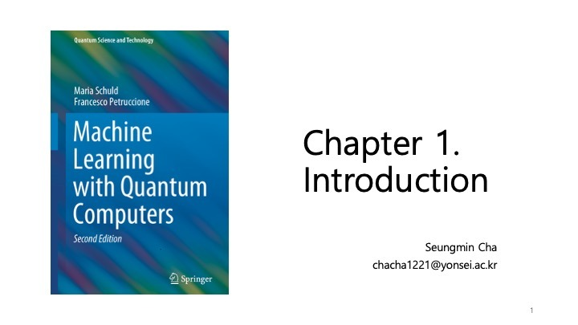
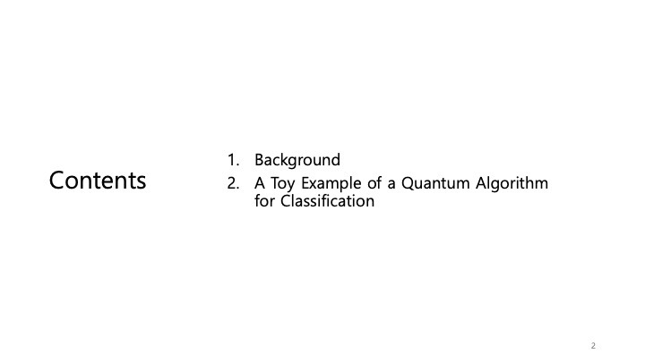
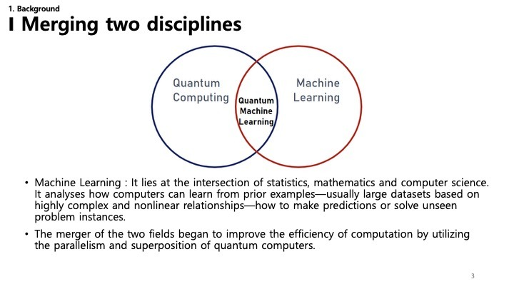
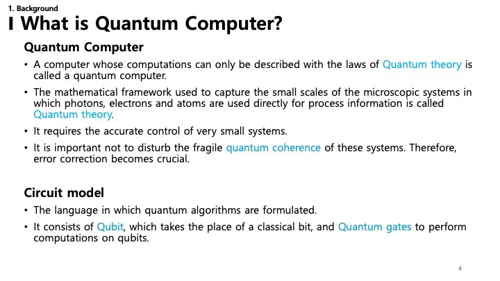
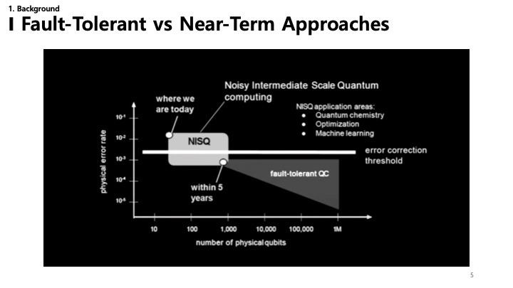
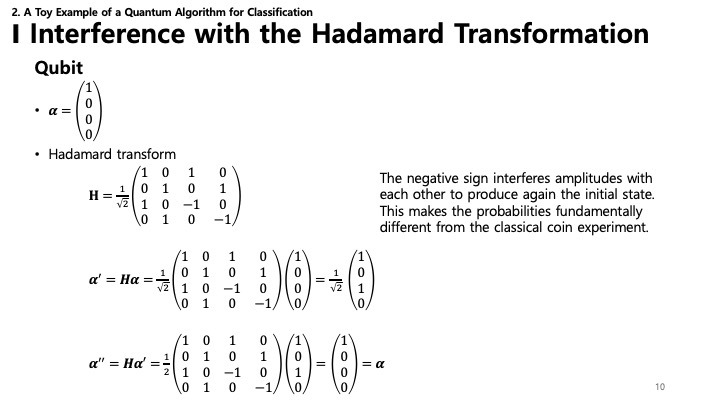

이 글은 Maria Schuld와 Francesco Petruccione의 저서 *"Machine Learning with Quantum Computers"* (2nd Edition)의 **Chapter 1. Introduction** 을 요약한 것입니다.

---

### 1. 소개 (Introduction)

이 장에서는 **양자 기계 학습(QML)** 의 기본 개념을 소개합니다. 이상적으로는 **양자 컴퓨팅** 원리가 **기계 학습** 작업에 어떻게 적용될 수 있는지 이해하기 위한 기초를 마련합니다. 이 분야는 빠르게 발전하고 있으므로, 이 책은 컴퓨터 과학, 물리학, 통계학 간의 간극을 메우는 것을 목표로 합니다.

---

### 2. 목차 (Contents)

서론 장에서는 두 가지 주요 영역에 중점을 둡니다.
1.  **배경 (Background)** : 양자 컴퓨터가 무엇이고 기계 학습과 어떤 관련이 있는지 정의하여 필요한 맥락을 수립합니다.
2.  **장난감 예제 (A Toy Example)** : 추상적인 개념을 더 구체화하기 위해 분류를 위해 설계된 양자 알고리즘의 간단하고 예시적인 예를 제공합니다.

---

### 3. 두 학문의 융합 (Merging Two Disciplines)

**양자 기계 학습(QML)** 은 단순히 한 분야의 하위 분야가 아니라 **양자 컴퓨팅** 과 **기계 학습** 의 융합입니다.

*   **기계 학습** : 데이터에서 학습하여 복잡하고 비선형적인 패턴을 식별하고 보이지 않는 데이터에 대한 예측을 수행하는 알고리즘을 다루는 통계학, 수학, 컴퓨터 과학의 교차점입니다.
*   **양자 컴퓨팅** : 고전 컴퓨터가 할 수 없는 방식으로 계산을 수행하기 위해 양자 역학의 법칙(특히 중첩과 얽힘)을 활용합니다.
*   **교차점** : QML의 목표는 양자 프로세서의 대규모 병렬 처리와 고유한 기능을 활용하여 기계 학습 알고리즘의 효율성과 성능을 향상시키는 것입니다.

---

### 4. 양자 컴퓨터란 무엇인가? (What is a Quantum Computer?)

**양자 컴퓨터** 는 우리가 매일 사용하는 고전적인 장치와 근본적으로 다르게 작동합니다.

*   **양자 이론** : 광자, 전자, 원자와 같은 미시적 시스템의 행동을 설명하는 양자 이론의 수학적 프레임워크에 의존합니다.
*   **취약성** : 이러한 시스템은 믿을 수 없을 정도로 섬세합니다. 계산에 필요한 상태인 **양자 결맞음(Quantum Coherence)** 을 유지하는 것은 어렵습니다. 환경과의 상호 작용이 "결어긋남(decoherence)"이나 오류를 유발할 수 있기 때문입니다. 이로 인해 **오류 수정** 이 중요한 과제가 됩니다.
*   **회로 모델** : 양자 알고리즘을 설명하기 위한 표준 언어입니다. 고전적인 비트(0과 1)를 **큐비트(Qubits)** 로 대체하고 **양자 게이트(Quantum Gates)** 를 사용하여 조작합니다. 이는 고전 회로의 논리 게이트와 유사하지만 양자 역학의 추가적인 힘을 가지고 있습니다.

---

### 5. 결함 허용 vs. NISQ 접근법 (Fault-Tolerant vs. Near-Term Approaches)

양자 컴퓨터의 개발은 두 가지 주요 단계를 통해 볼 수 있습니다.

*   **NISQ (Noisy Intermediate-Scale Quantum)** : 이것이 "우리가 있는 현재"입니다. NISQ 장치는 제한된 수의 큐비트(중간 규모)를 가지고 있으며 아직 완전히 오류가 수정되지 않았습니다(Noisy). 그러나 화학 시뮬레이션, 최적화, **기계 학습** 과 같은 특정 작업에서 이점을 입증하기에는 여전히 강력합니다.
*   **결함 허용 QC (Fault-Tolerant QC)** : 이것은 장기적인 목표입니다. 자신의 오류를 수정할 수 있는 대규모 양자 컴퓨터입니다. "오류 수정 임계값"은 이를 달성하기 위해 넘어야 할 경계입니다.

QML 연구는 NISQ 시대에 특히 활발하며, 노이즈에 강하고 오늘날의 불완전한 하드웨어에서도 가치를 제공할 수 있는 알고리즘을 찾고 있습니다.

---

### 6. NISQ 상세 및 용어 (NISQ Details & Terminology)

이 슬라이드는 현재 NISQ 장치의 상태를 더 깊이 파고듭니다.
*   **NISQ 특징** : 제한된 큐비트(수십에서 수백 개)와 상당한 노이즈.
*   **중간 단계** : 이것은 디딤돌입니다. 여기서 중요한 실험이 진행되고 있으며 오류 수정의 발전은 점차 이러한 시스템을 개선할 것입니다.
*   **결함 허용** : 궁극적인 목표는 우수한 오류 수정을 갖춘 완전히 개발된 양자 컴퓨터이지만, 이는 엄청난 기술적 과제에 직면해 있습니다.
*   **단기(Near-Term)** : 높은 오류 민감도를 수용하지만 특정 복잡한 문제에서 양자 이점을 찾는 등 *지금* 우리가 할 수 있는 것에 초점을 맞춥니다.

---

### 7. 네 가지 교차점 (Four Intersections)

데이터 소스와 처리 장치에 따라 양자 컴퓨팅(QC)과 기계 학습(ML)을 결합하는 네 가지 방법이 있습니다.

*   **CC (Classical Data, Classical Device)** : 표준 기계 학습.
*   **CQ (Classical Data, Quantum Device)** : 고전 데이터 세트를 처리하기 위해 양자 알고리즘을 사용합니다. 이것은 QML 관심의 주요 영역입니다.
*   **QC (Quantum Data, Classical Device)** : 양자 시스템에 의해 생성된 상태나 데이터를 분석하기 위해 고전 ML을 사용합니다.
*   **QQ (Quantum Data, Quantum Device)** : 데이터와 처리가 모두 양자적인 "진정한" 양자 기계 학습입니다.

*참고: 슬라이드에서는 "양자 기계 학습은 CQ와 동의어"라고 언급하며, 현재의 실질적인 관심은 고전적인 문제에 양자 힘을 적용하는 데 있음을 강조합니다.*

---

### 8. 장난감 예제: 하다마드와 간섭 (Toy Example: Interference with Hadamard)

양자 알고리즘이 어떻게 작동하는지 이해하기 위해 동전을 사용한 간단한 비유를 고려해 봅시다.
*   **고전 동전** : 동전 던지기는 확률적인 결과(앞면 또는 뒷면)로 이어집니다.
*   **실험** :
    1.  앞면으로 시작합니다.
    2.  동전 1을 던집니다.
    3.  동전 1을 다시 던집니다.
*   **결과** : 고전 세계에서는 확률이 상태를 정의합니다. 확률을 더하기만 하면 됩니다.

---

### 9. 고전 동전 vs. 양자 동전 (Classical vs. Quantum Coin)

*   **고전** : 확률 행렬로 표현할 수 있습니다. 전체 확률의 법칙이 적용됩니다. 상태를 무작위화하면 일반적으로 불확실성(엔트로피)이 증가합니다. 무작위로 다시 던진다고 해서 "불확실"에서 "확실"로 쉽게 돌아갈 수는 없습니다.

---

### 10. 양자 간섭 (Quantum Interference)

*   **양자** : 여기서는 **하다마드 변환(Hadamard Transform)** 을 사용합니다.
*   **진폭 vs. 확률** : 양자 상태는 단순한 양수 확률이 아니라 복소수 진폭으로 설명됩니다.
*   **간섭** : 하다마드 행렬에는 음수($-1$)가 포함되어 있습니다. 두 번 적용하면 양수와 음수 진폭이 서로 상쇄될 수 있습니다(**간섭**).
*   **결과** : 이를 통해 양자 시스템은 개별적으로 불확실성을 생성하는 연산 후에도 "확실한" 상태(예: 초기 상태로 되돌아감)로 돌아갈 수 있습니다. 이 현상인 간섭은 양자 알고리즘이 속도 향상을 달성하는 기본 원리입니다.
