This post summarizes **Chapter 2. Machine Learning** of the book *"Machine Learning with Quantum Computers"* (2nd Edition) by Maria Schuld and Francesco Petruccione.

---

### 1. Introduction

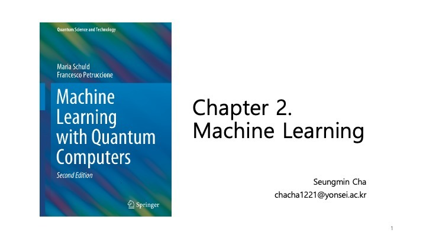

Chapter 2 provides a comprehensive overview of machine learning concepts that form the basis for understanding Quantum Machine Learning. It covers the types of learning problems, the essential ingredients of learning, and various methods used in the field.

---

### 2. Contents

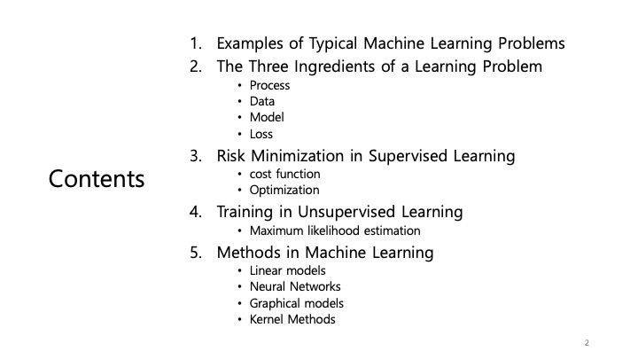

The chapter is structured into several key sections:
1.  **Examples of Typical Machine Learning Problems**: Understanding different problem types.
2.  **The Three Ingredients of a Learning Problem**: Process, Data, Model, and Loss.
3.  **Risk Minimization in Supervised Learning**: Cost functions and optimization.
4.  **Training in Unsupervised Learning**: Maximum likelihood estimation.
5.  **Methods in Machine Learning**: Linear models, Neural Networks, Graphical models, Kernel Methods.

---

### 3. Examples of Typical Machine Learning Problems

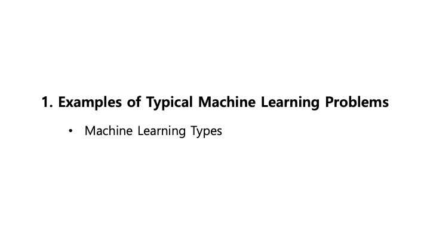

The field of machine learning can be broadly categorized based on the nature of the data and the learning objective.

---

### 4. Machine Learning Types

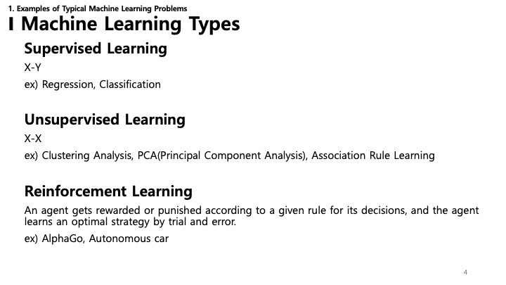

*   **Supervised Learning (X-Y)**: The algorithm learns from labeled data (input X, output Y). Examples include Regression and Classification.
*   **Unsupervised Learning (X-X)**: The algorithm finds patterns in unlabeled data. Examples include Clustering Analysis, Principal Component Analysis (PCA), and Association Rule Learning.
*   **Reinforcement Learning**: An agent learns an optimal strategy through trial and error by receiving rewards or punishments based on its decisions. Examples are AlphaGo and autonomous cars.

---

### 5. The Three Ingredients of a Learning Problem

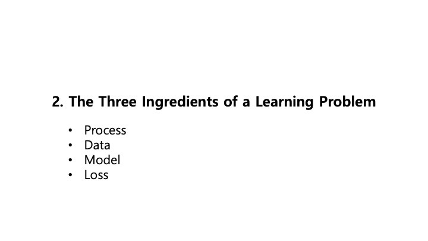

Any machine learning problem can be described using these core components:
*   **Process**: The data-generating process or the underlying phenomenon we want to model.
*   **Data**: The observations we have collected from the process.
*   **Model**: The mathematical structure we use to approximate the process.
*   **Loss**: A function that measures how well the model predicts or fits the data.

---

### 6. Process

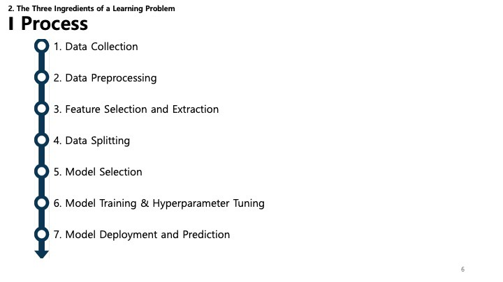

The machine learning process involves a series of steps:
1.  **Data Collection**: Gathering raw data.
2.  **Data Preprocessing**: Cleaning and formatting the data.
3.  **Feature Selection and Extraction**: Identifying the most relevant variables.
4.  **Data Splitting**: Dividing data into training and testing sets.
5.  **Model Selection**: Choosing the appropriate algorithm.
6.  **Model Training & Hyperparameter Tuning**: Teaching the model and optimizing its settings.
7.  **Model Deployment and Prediction**: Using the model in a real-world environment.

---

### 7. Data: Preprocessing - Feature Scaling

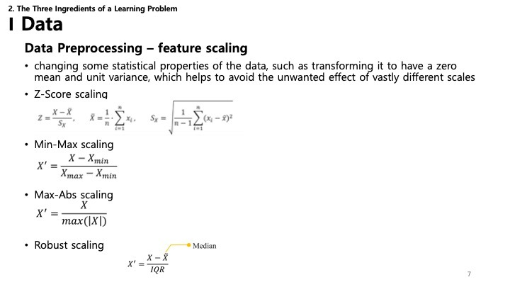

Scaling ensures that all features contribute equally to the result.
*   **Z-Score scaling (Standardization)**: Transforms data to have a mean of 0 and a variance of 1.
*   **Min-Max scaling (Normalization)**: Scales data to a fixed range, typically [0, 1].
*   **Max-Abs scaling**: Scales data based on the absolute maximum value.
*   **Robust scaling**: Uses the median and interquartile range (IQR) to be robust against outliers.

---

### 8. Data: Preprocessing - Dimensionality Reduction

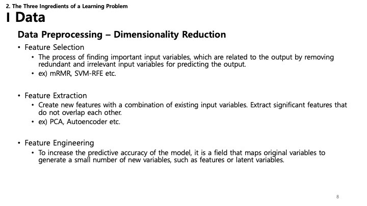

Reducing the number of input variables can improve model performance and reduce computation.
*   **Feature Selection**: Selecting a subset of relevant features (e.g., mRMR, SVM-RFE).
*   **Feature Extraction**: Creating new features from existing ones (e.g., PCA, Autoencoder).
*   **Feature Engineering**: Using domain knowledge to create features that make machine learning algorithms work better.

---

### 9. Data: Preprocessing - One-Hot Encoding

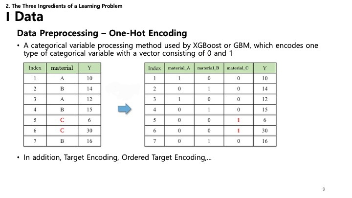

*   **One-Hot Encoding**: Converts categorical variables into a binary matrix format (0s and 1s), making them suitable for machine learning algorithms.
*   Other methods include Target Encoding and Ordered Target Encoding.

---

### 10. Model: Deterministic vs. Probabilistic

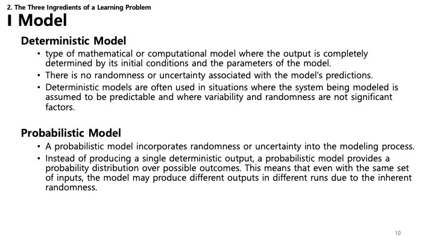

Models can be categorized by how they handle uncertainty:
*   **Deterministic Model**: The output is fully determined by the initial conditions and parameters. No randomness is involved (e.g., physical laws like $F=ma$).
*   **Probabilistic Model**: Incorporates randomness. Instead of a single output, it provides a probability distribution over possible outcomes. This is crucial when dealing with noisy data or inherent uncertainty.

---

### 11. Model: Deterministic vs. Statistical

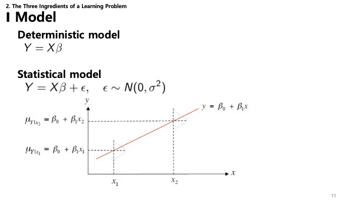

While the previous slide introduced the concept, this slide formally contrasts two types of models:
*   **Deterministic Model**: Assumes a precise relationship where $Y = X\beta$ . It essentially states that if you know the input $X$ and the parameters $\beta$, you can determine $Y$ exactly.
*   **Statistical Model**: Acknowledges that the world is noisy. It models the relationship as $Y = X\beta + \epsilon$ , where $\epsilon$ represents the error term (often assumed to be normally distributed, $\epsilon \sim N(0, \sigma^2)$ ). This accounts for the variability we see in real-world data.

---

### 12. Loss: Classification

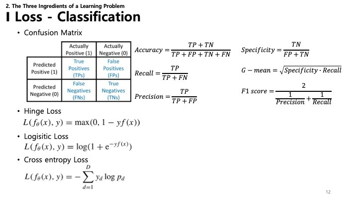

For classification problems (where the output is a category), we evaluate performance differently:
*   **Confusion Matrix**: A table that describes the performance of a classification model (True Positives, False Positives, etc.).
*   **Metrics**: Derived from the confusion matrix, including **Accuracy**, **Specificity**, **Recall**, **Precision**, and **F1 score**.
*   **Loss Functions**:
    *   **Hinge Loss**: Often used for "maximum-margin" classification, most notably for support vector machines (SVMs).
    *   **Logistic Loss**: Used in logistic regression.
    *   **Cross-entropy Loss**: Measures the performance of a classification model whose output is a probability value between 0 and 1.

---

### 13. Loss: Regression

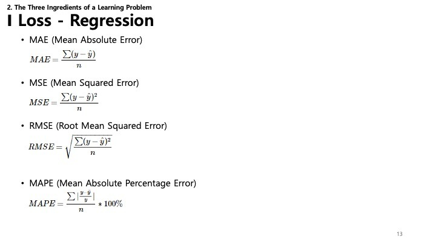

For regression problems (predicting a continuous value), common loss functions include:
*   **MAE (Mean Absolute Error)**: The average of the absolute differences between predictions and actual values.
*   **MSE (Mean Squared Error)**: The average of the squared differences. Penalizes larger errors more heavily.
*   **RMSE (Root Mean Squared Error)**: Square root of MSE, which makes the scale of errors the same as the target variable.
*   **MAPE (Mean Absolute Percentage Error)**: Measures prediction accuracy as a percentage.

---

### 14. Risk Minimization in Supervised Learning

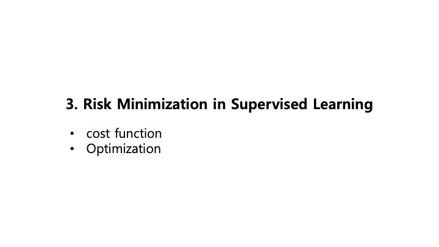

The core goal of supervised learning is **Risk Minimization**. This involves two key concepts:
*   **Cost Function**: A mathematical formula that quantifies the error between predicted and actual values.
*   **Optimization**: The process of adjusting the model parameters to minimize the cost function.

---

### 15. Cost Function & Regularization

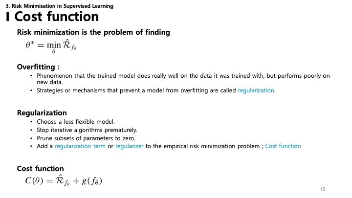

*   **Risk Minimization Problem**: We want to find the optimal parameters $\theta^*$ that minimize the empirical risk $\hat{R}_{f_\theta}$.
*   **Overfitting**: This occurs when a model learns the training data *too* well, including its noise and outliers, resulting in poor performance on new, unseen data.
*   **Regularization**: Techniques used to prevent overfitting.
    *   Choosing a less flexible model.
    *   Stopping training early.
    *   Pruning parameters (setting them to zero).
    *   Adding a **regularization term** to the **cost function**.
*   **Final Cost Function**: $C(\theta) = \hat{R}_{f_\theta} + g(f_\theta)$ , where $\hat{R}$ is the risk (error) and $g$ is the regularization term.

---

### 16. Cost Function Examples: Regularization

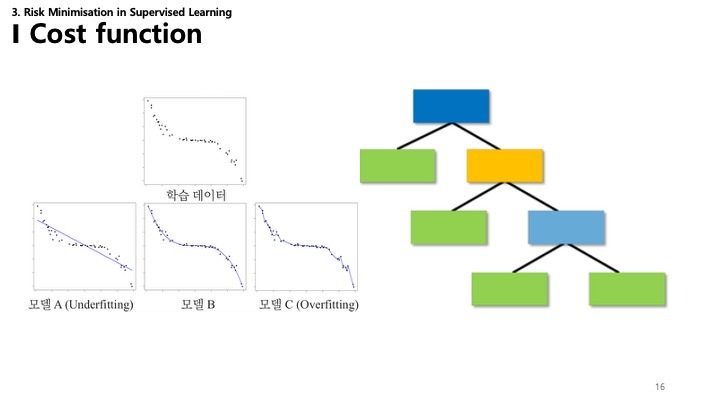

Common regularization techniques involve adding a penalty term to the cost function:
*   **Ridge Regression ($\ell_2$)**: Adds the sum of squared coefficients.
    *   $g_{\ell_2}(\theta) = \sum \theta_i^2$
*   **Lasso Regression ($\ell_1$)**: Adds the sum of the absolute values of coefficients. This can drive some coefficients to exactly zero, performing feature selection.
    *   $g_{\ell_1}(\theta) = \sum |\theta_i|$
*   **Elastic-Net**: Combines both $\ell_1$ and $\ell_2$ penalties.
    *   Adds $\lambda_1 \sum |\theta_i| + \lambda_2 \sum \theta_i^2$

---

### 17. Optimization: Gradient Descent

Optimization algorithms are used to find the parameters that minimize the cost function.
*   **Gradient Descent (GD)**: Uses the entire dataset to calculate the gradient and update parameters.
    *   $\theta^{(t+1)} = \theta^{(t)} - \eta \nabla C(\theta^{(t)})$
    *   **Pros**: Stable convergence.
    *   **Cons**: Slow on large datasets; can get stuck in local minima.
*   **Stochastic Gradient Descent (SGD)**: Updates parameters using a single random data point at a time.
    *   **Pros**: Faster; improved ability to escape local minima.
    *   **Cons**: Noisier convergence path (variable updates).

---

### 18. Mini-batch Gradient Descent

*   **Mini-batch Gradient Descent**: A compromise between Batch GD and SGD.
    *   It processes data in small groups (batches) of size $n$ .
    *   It offers more stable convergence than SGD and is more computationally efficient than Batch GD, effectively utilizing matrix operations.

---

### 19. Overfitting vs. Underfitting

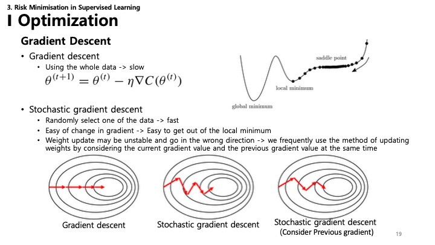

This slide visualizes the concepts of underfitting and overfitting using a regression example and a decision tree:
*   **Model A (Underfitting)**: The model is too simple (a straight line) to capture the underlying pattern of the data. It has high correlation bias.
*   **Model B**: The model fits the data well, capturing the trend without chasing every noise point.
*   **Model C (Overfitting)**: The model is too complex and fits the noise in the training data, leading to poor generalization.

---

### 20. VC (Vapnik-Chervonenkis) Dimension

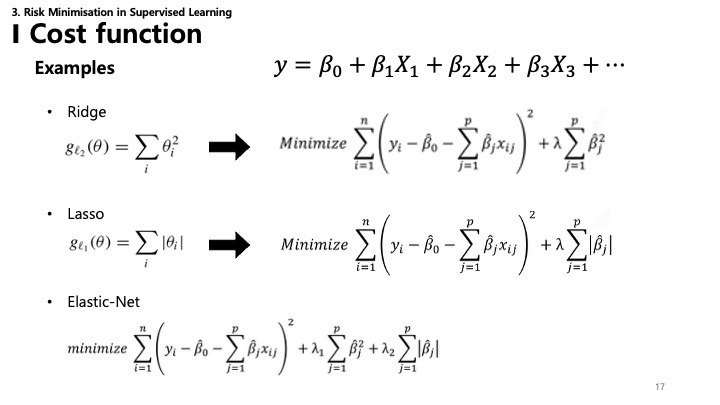

The **VC Dimension** measures the capacity (complexity) of a statistical classification algorithm.
*   **Concept**: It answers "How complex a dataset can this model classify?"
*   **Risk Bound**: It provides a theoretical upper bound on the test error (risk).
    *   $\mathcal{R}_{f_\theta} \leq \hat{\mathcal{R}}_{f_\theta} + \sqrt{\frac{1}{M} \left( d_{VC} \left( \log \left( \frac{2M}{d} \right) + 1 \right) + \log \left( \frac{4}{\delta} \right) \right)}$
    *   This formula shows that as the VC dimension ($d_{VC}$) increases (model becomes more complex), the gap between training error ($\hat{\mathcal{R}}$) and true risk ($\mathcal{R}$) can widen, increasing the chance of overfitting.
