This post summarizes **Chapter 3. Quantum Computing** of the book *"Machine Learning with Quantum Computers"* (2nd Edition) by Maria Schuld and Francesco Petruccione.

---

### 1. Introduction

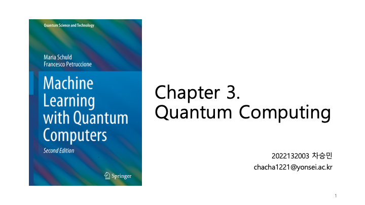

This chapter lays the foundation for understanding Quantum Computing, covering the necessary linear algebra, postulates, and basic building blocks like Qubits and Gates.

---

### 2. Table of Contents

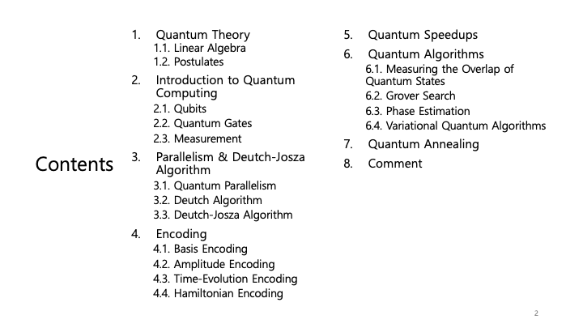

The chapter is structured as follows:
1.  **Quantum Theory**: Linear Algebra basics and Postulates.
2.  **Introduction to Quantum Computing**: Qubits, Gates, and Measurement.
3.  **Parallelism & Deutsch-Jozsa Algorithm**.
4.  **Encoding**: Basis, Amplitude, Time-Evolution, and Hamiltonian encoding.
5.  **Quantum Speedups**.
6.  **Quantum Algorithms**: Grover Search, Phase Estimation, VQAs.
7.  **Quantum Annealing**.

---

### 3. Quantum Theory

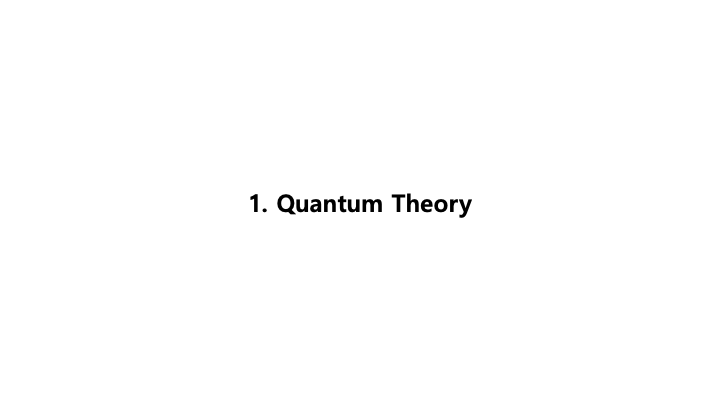

We begin by reviewing the mathematical framework of Quantum Mechanics.

---

### 4. Linear Algebra: Expectation & Density Matrix

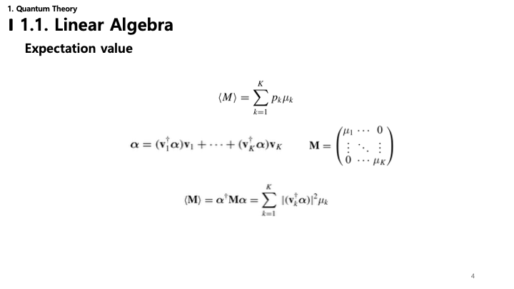

*   **Expectation Value**: The average value of a measurement.
    *   $\langle M \rangle = \sum p_k \mu_k$
    *   $\langle M \rangle = \alpha^\dagger \mathbf{M} \alpha = \sum |\langle v_k | \alpha \rangle|^2 \mu_k$
*   **Density Matrix**: A more general way to describe the state of a quantum system, especially for mixed states.

---

### 5. Unitary Evolutions

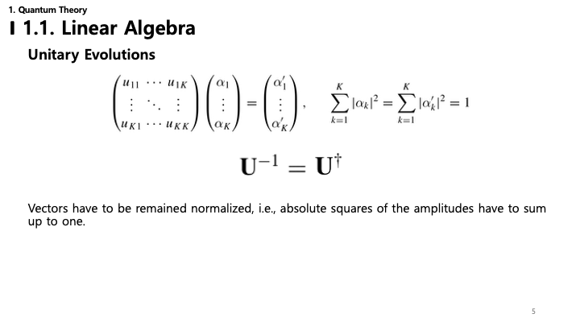

*   **Unitary Matrix**: A matrix $U$ whose inverse is its conjugate transpose ($U^{-1} = U^\dagger$).
*   Time evolution in isolated quantum systems is always unitary, ensuring that probabilities (sum of squared amplitudes) are conserved (sum to 1).

---

### 6. Pure vs Mixed States & Partial Trace

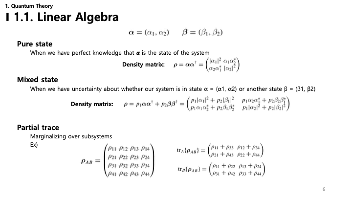

*   **Pure State**: A state where we have perfect knowledge of the system ($\alpha$).
    *   $\rho = \alpha \alpha^\dagger$
*   **Mixed State**: A statistical ensemble of pure states where we have uncertainty about which state the system is in.
    *   $\rho = \sum p_i \alpha_i \alpha_i^\dagger$
*   **Partial Trace**: A method to obtain the reduced density matrix of a subsystem ($\rho_A = \text{tr}_B(\rho_{AB})$) by averaging out the degrees of freedom of the other subsystem ($B$).

---

### 7. Postulates of Quantum Mechanics

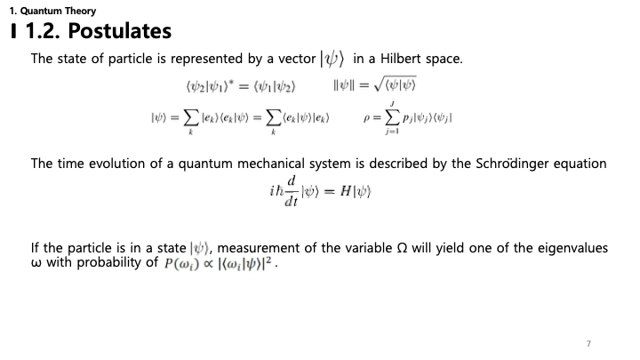

1.  **State Space**: The state of a particle is represented by a vector $|\psi\rangle$ in a Hilbert space.
2.  **Evolution**: Time evolution is described by the Schrödinger equation ($i\hbar \frac{d}{dt}|\psi\rangle = H|\psi\rangle$).
3.  **Measurement**: Measurement of an observable $\Omega$ yields one of its eigenvalues $\omega$ with probability $P(\omega_i) \propto |\langle \omega_i | \psi \rangle|^2$.

---

### 8. Intro to Quantum Computing

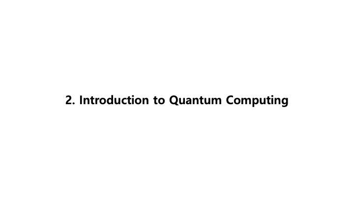

Moving from theory to computation: Qubits and Gates.

---

### 9. Qubits

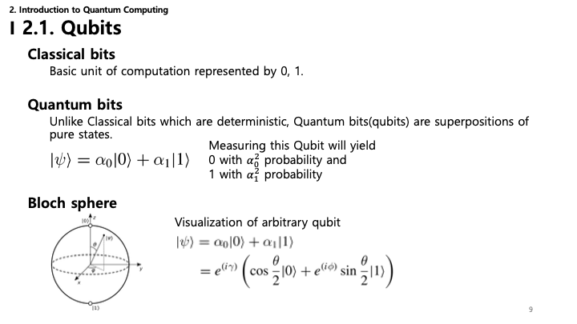

*   **Classical Bits**: Deterministic, 0 or 1.
*   **Quantum Bits (Qubits)**: Can exist in a superposition of states.
    *   $|\psi\rangle = \alpha_0 |0\rangle + \alpha_1 |1\rangle$
    *   Measurement yields 0 with probability $|\alpha_0|^2$ and 1 with probability $|\alpha_1|^2$.

---

### 10. Bloch Sphere

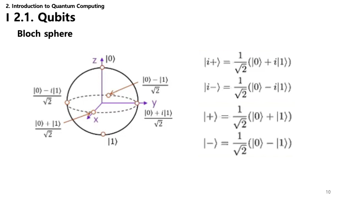

*   **Bloch Sphere**: A geometric representation of a single qubit state.
*   **Important States**:
    *   $|0\rangle$ (North Pole), $|1\rangle$ (South Pole)
    *   $|+\rangle = \frac{1}{\sqrt{2}}(|0\rangle + |1\rangle)$ (on X-axis)
    *   $|-\rangle = \frac{1}{\sqrt{2}}(|0\rangle - |1\rangle)$
    *   $|i+\rangle = \frac{1}{\sqrt{2}}(|0\rangle + i|1\rangle)$ (on Y-axis)

---

### 11. Quantum Gates Overview

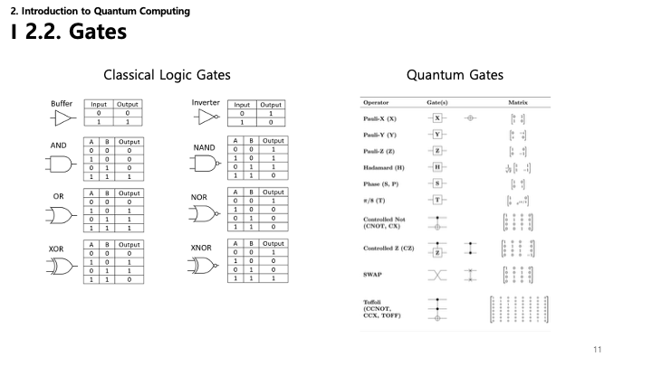

*   **Quantum Gates**: Unlike classical logic gates (AND, OR, etc.) which are irreversible, quantum gates are unitary operators and are reversible.
*   Common gates include Pauli (X, Y, Z), Hadamard (H), Phase (S, T), and controlled gates (CNOT, CCNOT).

---

### 12. Classification of Gates

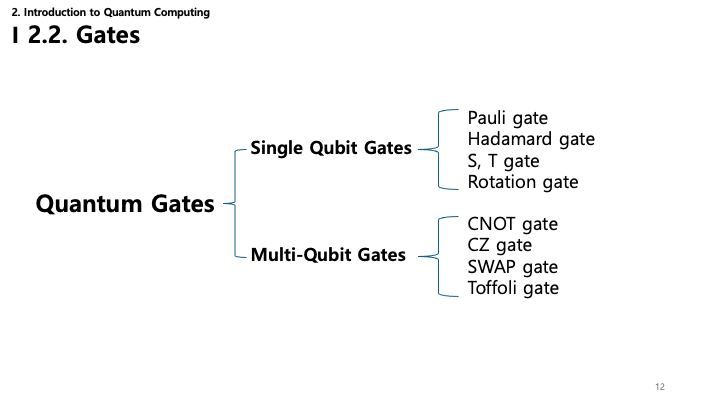

*   **Single Qubit Gates**: Act on one qubit (e.g., Pauli, Hadamard, S, T, Rotation).
*   **Multi-Qubit Gates**: Act on two or more qubits, creating entanglement (e.g., CNOT, SWAP, Toffoli).

---

### 13. Pauli Gates

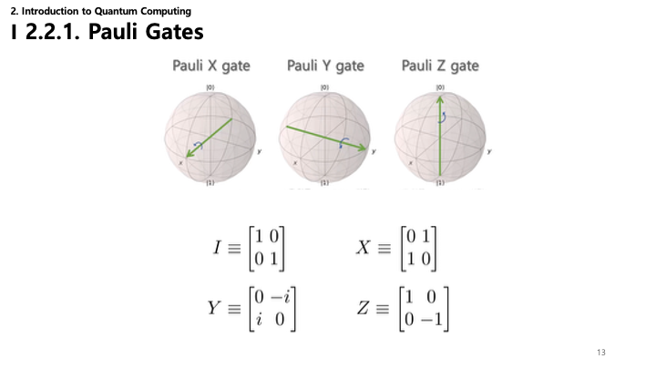

*   **Pauli-X (Bit Flip)**: Rotates $\pi$ around X-axis. Like a classical NOT gate.
    *   $X = \begin{bmatrix} 0 & 1 \\ 1 & 0 \end{bmatrix}$
*   **Pauli-Y**: Rotates $\pi$ around Y-axis.
    *   $Y = \begin{bmatrix} 0 & -i \\ i & 0 \end{bmatrix}$
*   **Pauli-Z (Phase Flip)**: Rotates $\pi$ around Z-axis. Adds a relative phase.
    *   $Z = \begin{bmatrix} 1 & 0 \\ 0 & -1 \end{bmatrix}$

---

### 14. Hadamard Gate

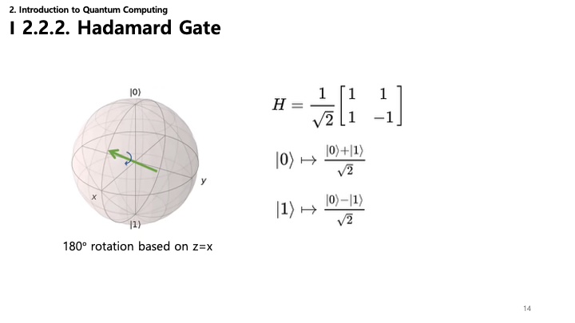

*   **Hadamard (H)**: Creates superposition. It maps basis states to superposition states.
    *   $H = \frac{1}{\sqrt{2}} \begin{bmatrix} 1 & 1 \\ 1 & -1 \end{bmatrix}$
    *   $|0\rangle \rightarrow |+\rangle = \frac{|0\rangle + |1\rangle}{\sqrt{2}}$
    *   $|1\rangle \rightarrow |-\rangle = \frac{|0\rangle - |1\rangle}{\sqrt{2}}$
    *   Visually, it's a $180^\circ$ rotation around the diagonal $X+Z$ axis.

---

### 15. S and T Gates

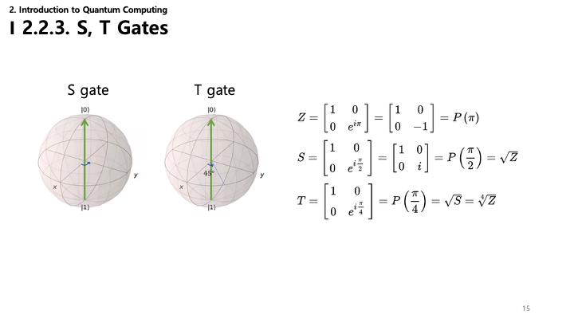

*   **S Gate**: A $\pi/2$ rotation around the Z-axis. ($S = \sqrt{Z}$)
    *   $S = \begin{bmatrix} 1 & 0 \\ 0 & i \end{bmatrix}$
*   **T Gate**: A $\pi/4$ rotation around the Z-axis. ($T = \sqrt{S} = \sqrt[4]{Z}$)
    *   $T = \begin{bmatrix} 1 & 0 \\ 0 & e^{i\pi/4} \end{bmatrix}$

---

### 16. Rotation Gates

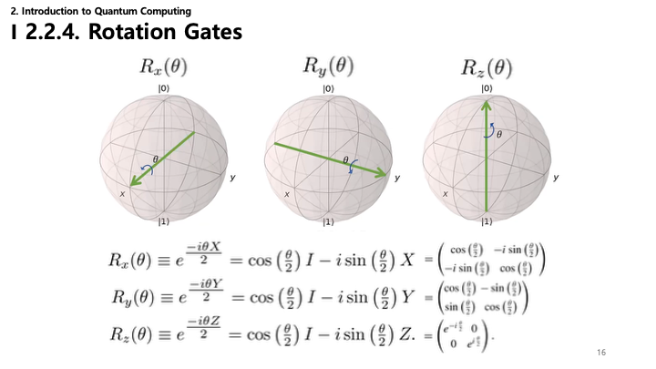

*   **Rotation Operators**: Arbitrary rotations around the X, Y, or Z axes by an angle $\theta$.
    *   $R_x(\theta) = e^{-i\theta X/2} = \cos(\frac{\theta}{2})I - i\sin(\frac{\theta}{2})X$
    *   $R_y(\theta) = e^{-i\theta Y/2} = \cos(\frac{\theta}{2})I - i\sin(\frac{\theta}{2})Y$
    *   $R_z(\theta) = e^{-i\theta Z/2} = \cos(\frac{\theta}{2})I - i\sin(\frac{\theta}{2})Z$

---

### 17. CNOT Gate

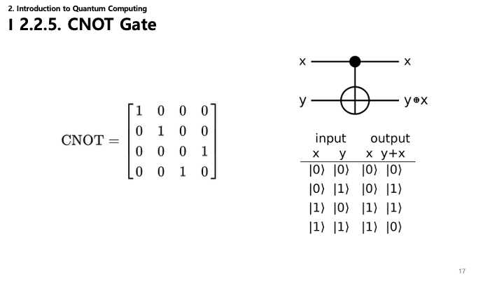

*   **Controlled-NOT (CNOT)**: A two-qubit gate.
*   **Logic**: If the **Control** qubit is $|1\rangle$, it flips the target qubit (applies X). If Control is $|0\rangle$, it does nothing.
*   **Entanglement**: CNOT is the primary gate used to generate entangled states (Bell states).

---

### 18. SWAP Gate

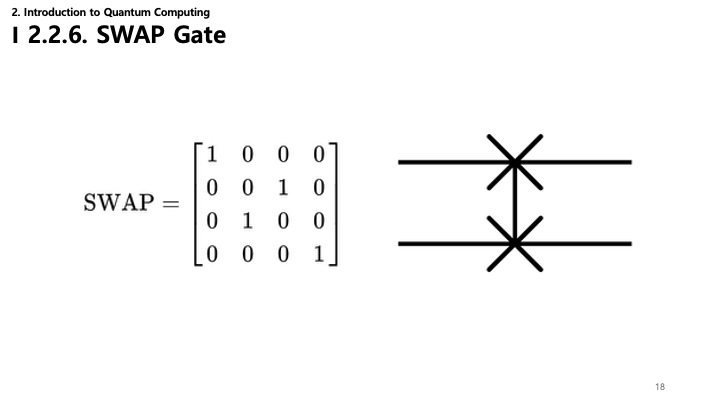

*   **SWAP**: Exchanges the states of two qubits.
    *   $|a, b\rangle \rightarrow |b, a\rangle$
*   It can be constructed using three CNOT gates.

---

### 19. Toffoli Gate (CCNOT)

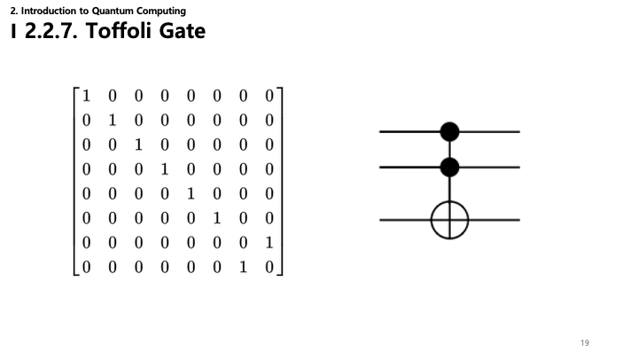

*   **Toffoli Gate**: A 3-qubit gate (Controlled-Controlled-NOT).
*   **Logic**: Flips the target bit if and only if **both** control bits are set to $|1\rangle$.
*   **Universality**: It is universal for classical reversible computation.

---

### 20. Phase Kickback

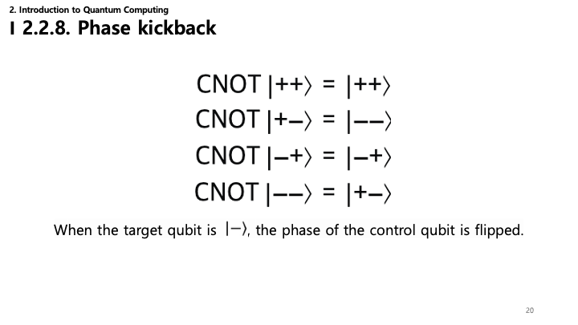

*   **Phase Kickback**: A purely quantum phenomenon.
*   When a controlled gate operates on an eigenvector of the target operation, the eigenvalue's phase is "kicked back" to the control qubit.
*   Example: CNOT with target in $|-\rangle$ state flips the phase of the control qubit.
    *   $\text{CNOT} |+, -\rangle = |-, -\rangle$

---

### 21. Bell States and Entanglement

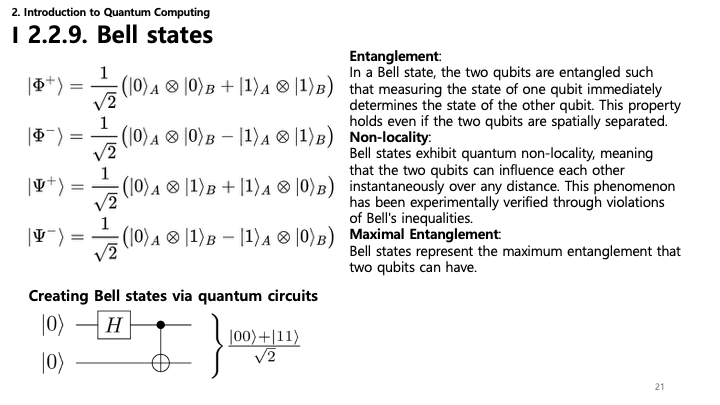

*   **Bell States**: The four maximally entangled two-qubit states.
    *   $|\Phi^+\rangle = \frac{1}{\sqrt{2}}(|00\rangle + |11\rangle)$
    *   $|\Phi^-\rangle = \frac{1}{\sqrt{2}}(|00\rangle - |11\rangle)$
    *   $|\Psi^+\rangle = \frac{1}{\sqrt{2}}(|01\rangle + |10\rangle)$
    *   $|\Psi^-\rangle = \frac{1}{\sqrt{2}}(|01\rangle - |10\rangle)$
*   **Non-locality**: Measurements on entangled qubits are correlated instantly, regardless of distance, violating classical local realism.

---

### 22. Measurement and Expectation

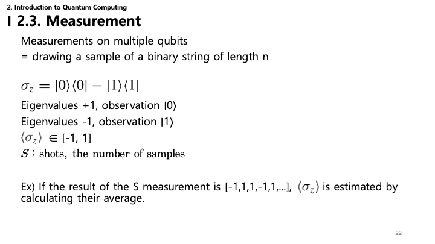

*   Measuring multiple qubits draws a sample binary string.
*   **Expectation Value ($\langle \sigma_z \rangle$)**:
    *   Estimated by averaging the results of many "shots" (samples).
    *   $+1$ for $|0\rangle$, $-1$ for $|1\rangle$.

---

### 23. Measurement Uncertainty (Wald Interval)

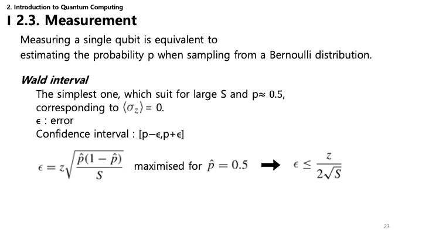

*   Since we estimate probabilities from finite samples, there is uncertainty.
*   **Wald Interval**: A simple confidence interval for the probability $p$.
    *   Error $\epsilon \approx \frac{z}{2\sqrt{S}}$ (maximized at $p=0.5$).

---

### 24. Required Samples for Precision

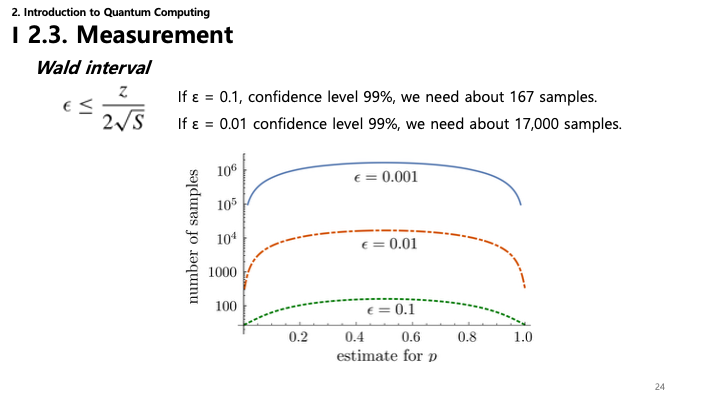

*   To achieve a certain precision $\epsilon$ with high confidence, the number of required shots $S$ scales quadratically with $1/\epsilon$.
    *   For $\epsilon=0.01$, you need about 17,000 samples.

---

### 25. Wilson Score Interval

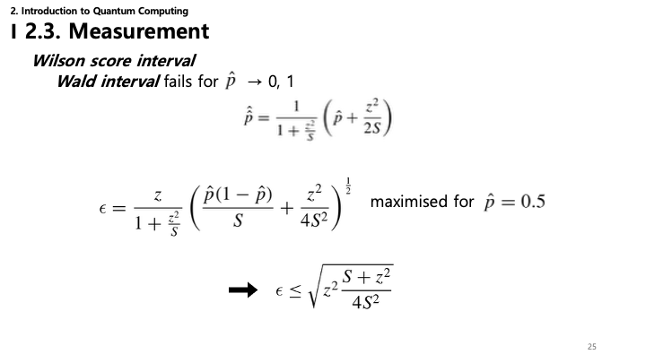

*   **Wilson Score Interval**: A more robust confidence interval, especially when $p$ is close to 0 or 1, where the Wald interval fails.

---

### 26. Parallelism & Deutsch-Jozsa

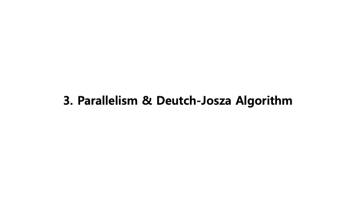

Introduction to how quantum computers can process information in parallel.

---

### 27. Quantum Parallelism

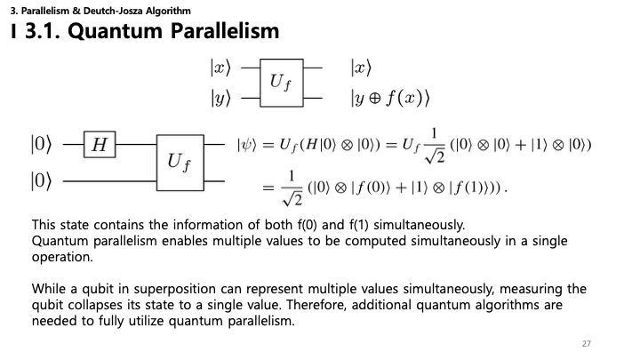

*   **Concept**: By evaluating a function $U_f$ on a superposition of inputs, we create a superposition of all possible outputs.
    *   $|\psi\rangle = \frac{1}{\sqrt{2}}(|0\rangle|f(0)\rangle + |1\rangle|f(1)\rangle)$
*   However, a single measurement only yields one result. We need algorithms to extract global properties (constructive interference).

---

### 28. Deutsch Algorithm

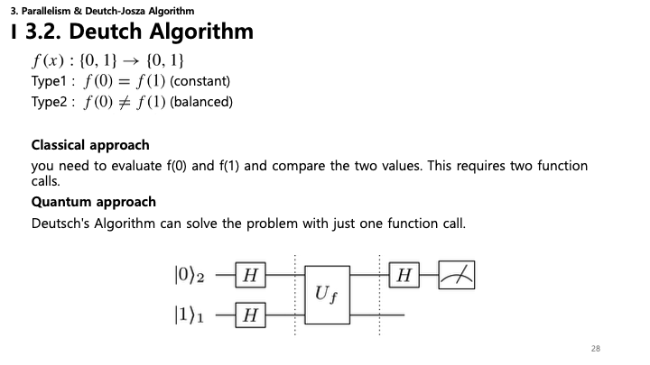

*   **Problem**: Given $f: \{0,1\} \rightarrow \{0,1\}$, determine if $f$ is **Constant** ($f(0)=f(1)$) or **Balanced** ($f(0) \neq f(1)$).
*   **Advantage**: Classical computers need 2 queries. The Deutsch Algorithm needs only **1 query**.

---

### 29. Deutsch Algorithm Step 1

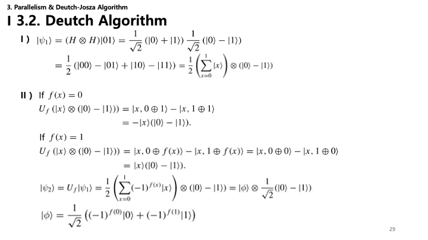

*   We start with $|0\rangle|1\rangle$ and apply Hadamard gates to create the state $|+\rangle|-\rangle$.
*   We apply the oracle $U_f$. Using the phase kickback mechanism (since target is $|-\rangle$), the function value $f(x)$ gets encoded into the phase of the first qubit.

---

### 30. Deutsch Algorithm Conclusion

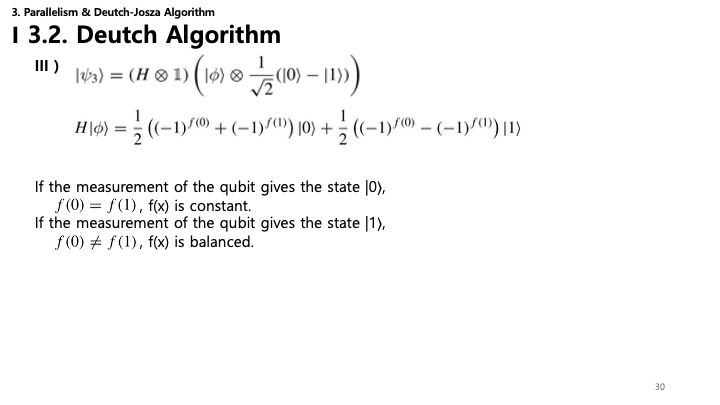

*   After applying the oracle and another Hadamard gate:
    *   If $f$ is constant, we measure $|0\rangle$.
    *   If $f$ is balanced, we measure $|1\rangle$.
    *   If $f$ is balanced, we measure $|1\rangle$.
*   This determines the property of $f$ with certainty in a single step.

---

### 31. Deutsch-Jozsa Algorithm

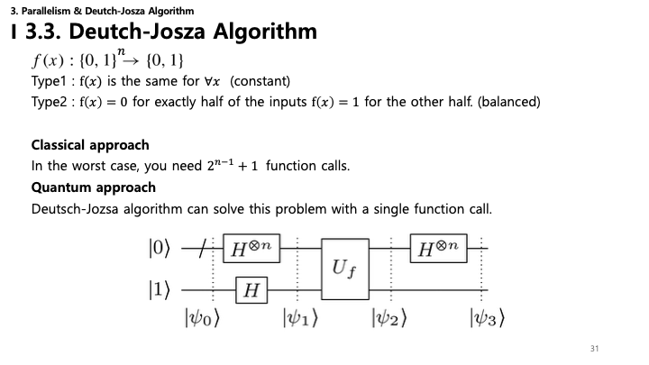

*   **Generalization**: Extends Deutsch's algorithm to $n$ qubits.
*   **Problem**: Function $f: \{0,1\}^n \rightarrow \{0,1\}$.
    *   **Constant**: Output is same for all inputs.
    *   **Balanced**: Output is 0 for half the inputs and 1 for the other half.
*   **Advantage**: Exponential speedup. Classical worst-case: $2^{n-1}+1$ calls. Quantum: **1 call**.

---

### 32. Deutsch-Jozsa Algorithm Derivation (1)

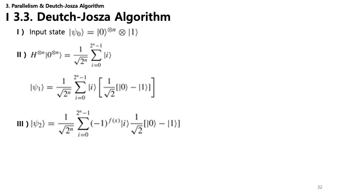

*   **Step I**: Initialize state $|\psi_0\rangle = |0\rangle^{\otimes n} \otimes |1\rangle$.
*   **Step II**: Apply Hadamard gates to all qubits to create superposition.
    *   $|\psi_1\rangle = \frac{1}{\sqrt{2^n}} \sum_{x=0}^{2^n-1} |x\rangle \left[ \frac{|0\rangle - |1\rangle}{\sqrt{2}} \right]$
*   **Step III**: Apply Oracle $U_f$.
    *   $|\psi_2\rangle = \frac{1}{\sqrt{2^n}} \sum |x\rangle (-1)^{f(x)} \frac{|0\rangle - |1\rangle}{\sqrt{2}}$

---

### 33. Deutsch-Jozsa Algorithm Derivation (2)

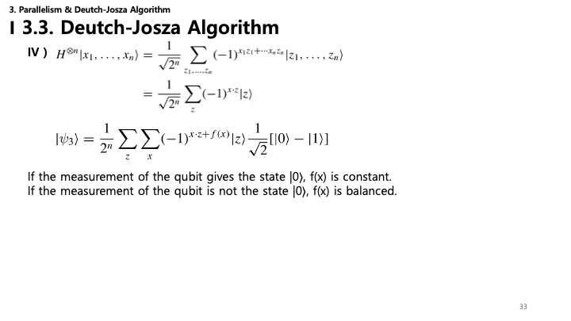

*   **Step IV**: Apply Hadamard gates again.
*   **Conclusion**:
    *   If we measure the state $|0\rangle^{\otimes n}$ (all zeros), the function is **Constant** (constructive interference at $|0\rangle$).
    *   If we measure any other state, the function is **Balanced** (destructive interference at $|0\rangle$).

---

### 34. Encoding Strategies

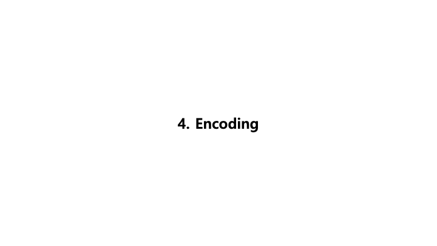

How to represent classical data in a quantum system.

---

### 35. Basis Encoding

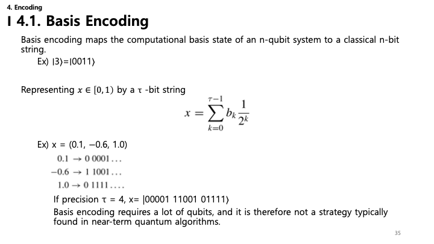

*   **Basis Encoding**: Maps a classical $n$-bit string directly to a computational basis state of $n$ qubits.
    *   Example: $x=0.1$ (binary $0.00...$) $\rightarrow |00...\rangle$.
*   **Pros**: Simple to understand.
*   **Cons**: Inefficient. Requires $n$ qubits for an $n$-bit number. Not typically used in near-term algorithms.

---

### 36. Amplitude Encoding

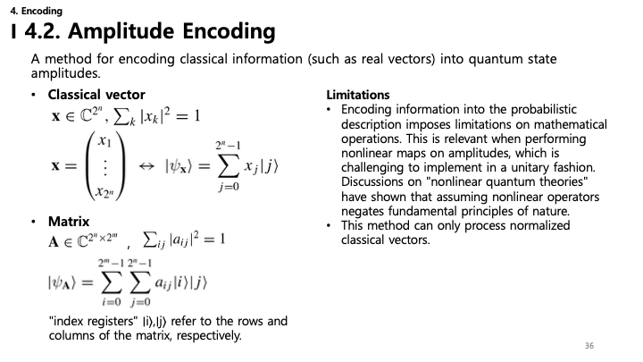

*   **Amplitude Encoding**: Encodes classical vector $x$ into the amplitudes of a quantum state $|\psi_x\rangle = \sum x_i |i\rangle$.
*   **Efficiency**: Can represent $2^n$ continuous values using only $n$ qubits (logarithmic space complexity).
*   **Cons**: Requires normalized vectors ($\sum |x_i|^2=1$). Prepare state can be deep (complex). Difficult to manipulate amplitudes non-linearly.

---

### 37. Time-Evolution Encoding

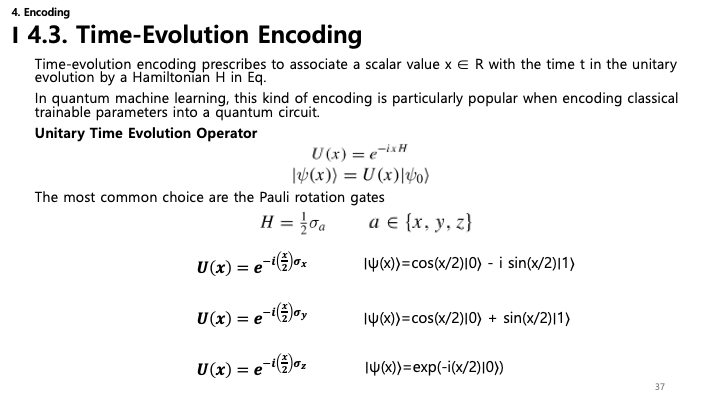

*   **Time-Evolution Encoding**: Encodes a real value $x$ into the time parameter $t$ of a unitary evolution operator $U(x) = e^{-ixH}$.
*   Commonly used with Pauli rotation gates (e.g., $R_x(x) = e^{-ixX/2}$).
*   Popular in Quantum Machine Learning (QML) for Parameterized Quantum Circuits (PQC).

---

### 38. Hamiltonian Encoding

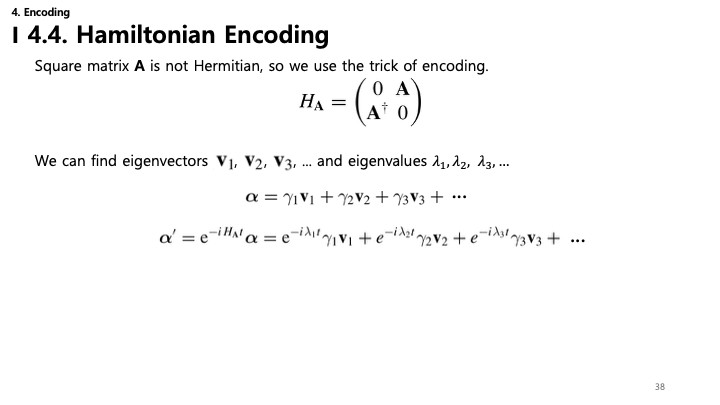

*   **Hamiltonian Encoding**: Used to encode a non-Hermitian matrix $A$ into a larger Hermitian matrix $H_A = \begin{pmatrix} 0 & A \\ A^\dagger & 0 \end{pmatrix}$.
*   Allows processing of arbitrary matrices using quantum simulation techniques ($U = e^{-iH_At}$).

---

### 39. Encoding Summary

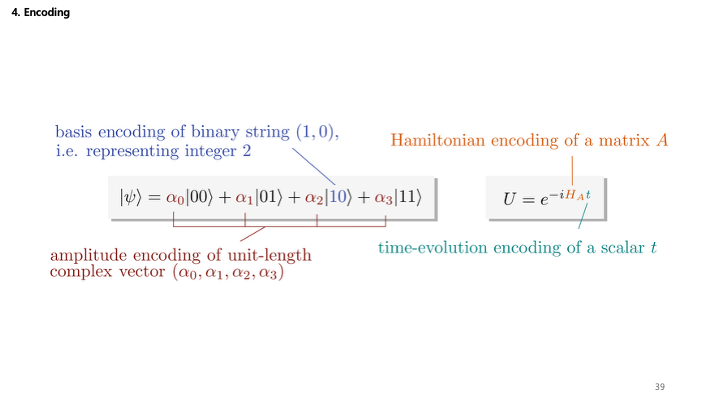

*   Visual comparison of different encoding strategies:
    *   **Basis**: Binary string $\rightarrow$ Basis state.
    *   **Amplitude**: Vector $\rightarrow$ State amplitudes.
    *   **Hamiltonian**: Matrix $\rightarrow$ Unitary exponent.
    *   **Time-Evolution**: Scalar $\rightarrow$ Rotation angle/time.

---

### 40. Quantum Speedups

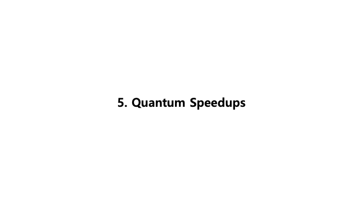

Understanding the types and origins of quantum advantages.

---

### 41. Big-O Notation

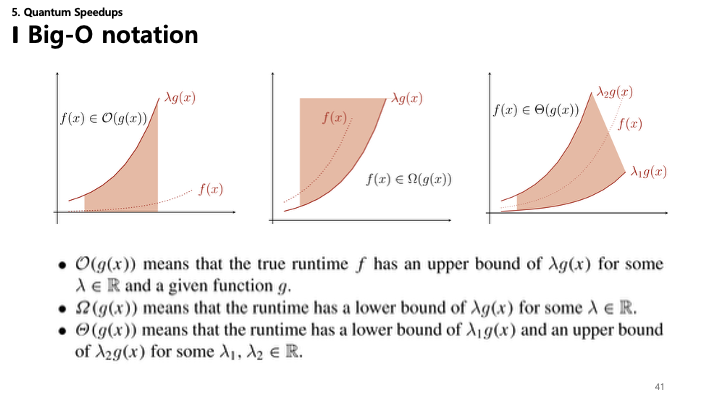

*   **$\mathcal{O}(g(x))$**: Upper bound. Algorithm is at most this slow.
*   **$\Omega(g(x))$**: Lower bound. Algorithm is at least this fast.
*   **$\Theta(g(x))$**: Tight bound.

---

### 42. Quantum Algorithms Impl.

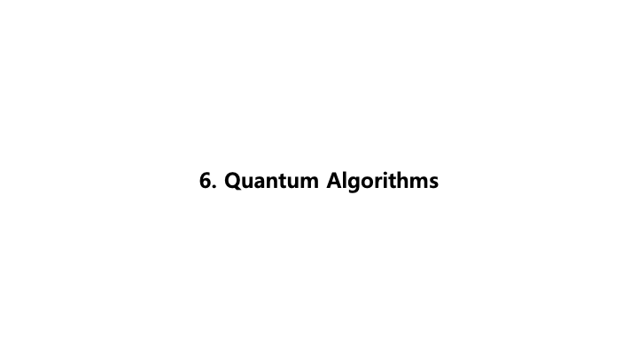

We look at specific subroutines and algorithms used in QML.

---

### 43. Measuring Overlap

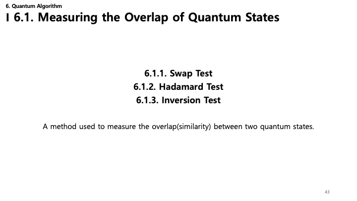

*   **Goal**: Measure the overlap (similarity) between two quantum states $|\langle a | b \rangle|^2$ or $\langle a | b \rangle$.
*   **Methods**: Swap Test, Hadamard Test, Inversion Test.

---

### 44. Swap Test (Part 1)

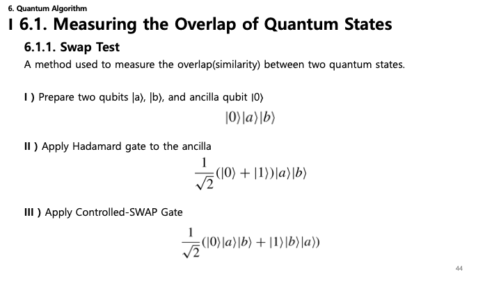

*   **Setup**: Two states $|a\rangle, |b\rangle$ and an ancilla qubit in $|0\rangle$.
*   **Circuit**: Hadamard on ancilla $\rightarrow$ Controlled-SWAP (Fredkin) $\rightarrow$ Hadamard on ancilla.

---

### 45. Swap Test (Part 2)

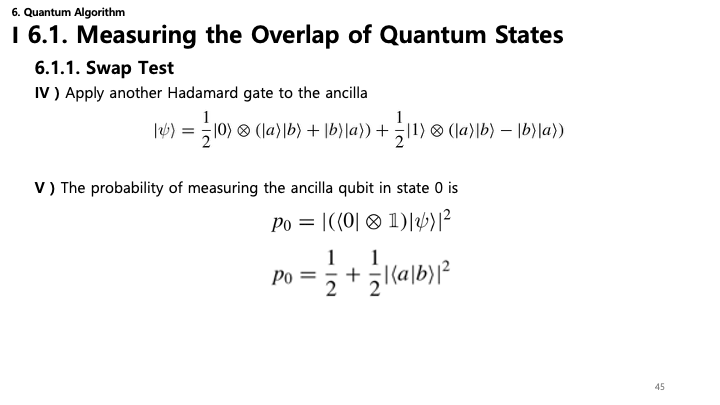

*   **Result**: The probability of measuring the ancilla in state $|0\rangle$ is:
    *   $P(0) = \frac{1}{2} + \frac{1}{2} |\langle a | b \rangle|^2$
*   If states are identical ($|\langle a | b \rangle|=1$), $P(0)=1$.
*   If states are orthogonal ($|\langle a | b \rangle|=0$), $P(0)=0.5$.

---

### 46. Hadamard Test (Real Part)

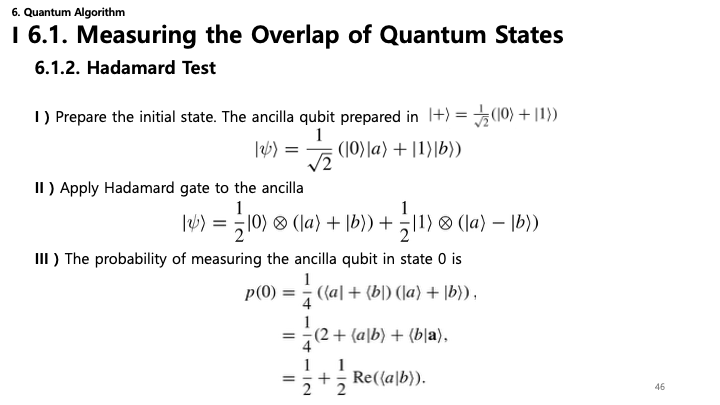

*   **Goal**: Estimate $\text{Re}(\langle a | b \rangle)$.
*   **Setup**: Ancilla in $|+\rangle$. Controlled-unitary operations.
*   $P(0) = \frac{1}{2} + \frac{1}{2} \text{Re}(\langle a | b \rangle)$.

---

### 47. Hadamard Test (Imaginary Part)

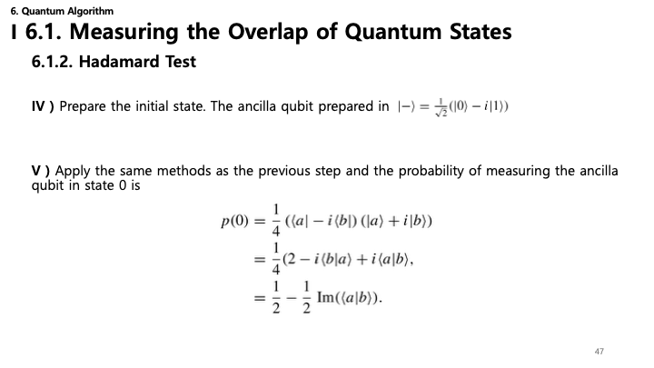

*   **Goal**: Estimate $\text{Im}(\langle a | b \rangle)$.
*   **Setup**: Initialize ancilla in $|-\rangle = \frac{|0\rangle - i|1\rangle}{\sqrt{2}}$.
*   $P(0) = \frac{1}{2} - \frac{1}{2} \text{Im}(\langle a | b \rangle)$.

---

### 48. Inversion Test

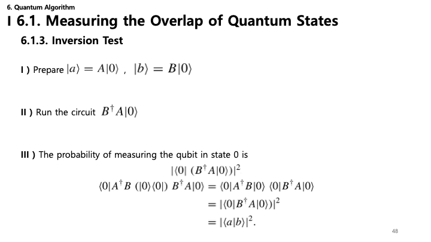

*   **Method**: Prepare $|a\rangle = A|0\rangle, |b\rangle = B|0\rangle$.
*   Run circuit $B^\dagger A |0\rangle$ and measure probability of $|0\rangle$.
*   **Result**: $P(0) = |\langle 0 | B^\dagger A | 0 \rangle|^2 = |\langle b | a \rangle|^2$.

---

### 49. Grover Search

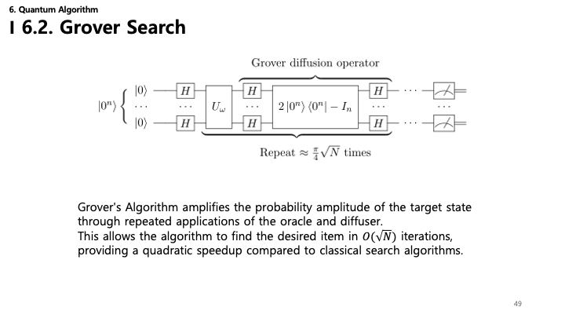

*   **Goal**: Find a marked item $\omega$ in an unsorted database of size $N$.
*   **Speedup**: Quadratic speedup. $\mathcal{O}(\sqrt{N})$ vs Classical $\mathcal{O}(N)$.
*   **Components**: Oracle $U_\omega$ (marks solution) and Diffuser $U_s$ (amplifies probability).

---

### 50. Grover Search Steps

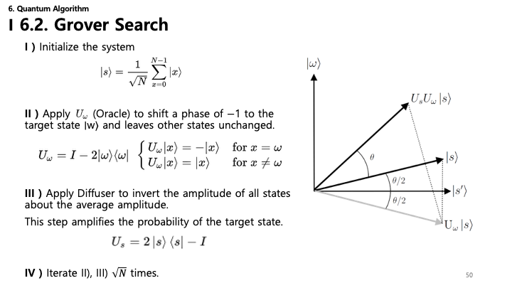

1.  **Initialize**: Uniform superposition $|s\rangle$.
2.  **Oracle**: Flip phase of target $|w\rangle$.
3.  **Diffuser**: Invert amplitudes about the mean.
4.  **Repeat**: $\approx \frac{\pi}{4}\sqrt{N}$ times.
*   Geometrically, this rotates the state vector towards the target state $|\omega\rangle$.

---

### 51. Grover Search Visualization

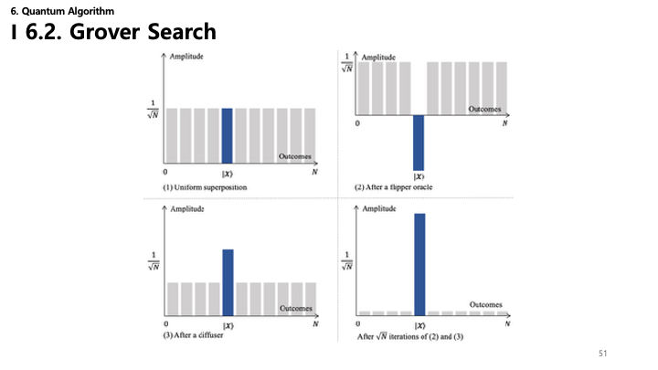

*   **Process**:
    1.  **Uniform Superposition**: All amplitudes equal.
    2.  **Oracle**: Target state amplitude becomes negative.
    3.  **Diffuser**: Inversion about mean amplifies target positive amplitude.
    4.  **Repeat**: Amplitude grows until near 1.

---

### 52. Phase Estimation (QFT)

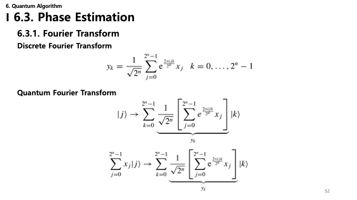

*   **Quantum Fourier Transform (QFT)**: The quantum analogue of the Discrete Fourier Transform (DFT).
*   Maps computational basis states to Fourier basis states.

---

### 53. Phase Estimation (Estimating Phases)

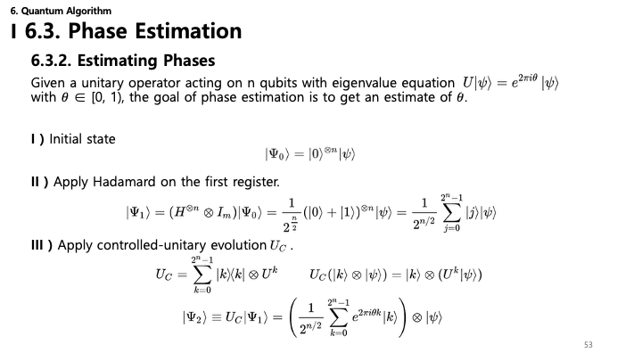

*   **Goal**: Given unitary $U$ and eigenvector $|\psi\rangle$ with $U|\psi\rangle = e^{2\pi i \theta}|\psi\rangle$, estimate phase $\theta$.
*   **Circuit**:
    1.  Prepare ancilla qubits in superposition.
    2.  Apply Controlled-$U^{2^k}$ gates.
    3.  Encodes phase into the relative phases of ancilla qubits.

---

### 54. Phase Estimation (Inverse QFT)

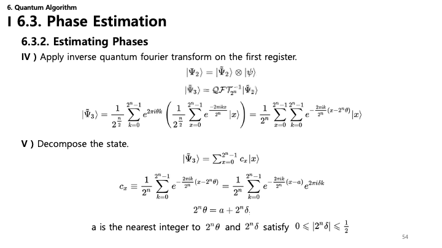

*   **Step IV**: Apply Inverse QFT ($QFT^{-1}$) to the first register.
*   **Measurement**: This reveals the phase $\theta$ in the computational basis.
*   Core subroutine for Shor's Algorithm and HHL.

---

### 55. Variational Quantum Algorithms (VQA)

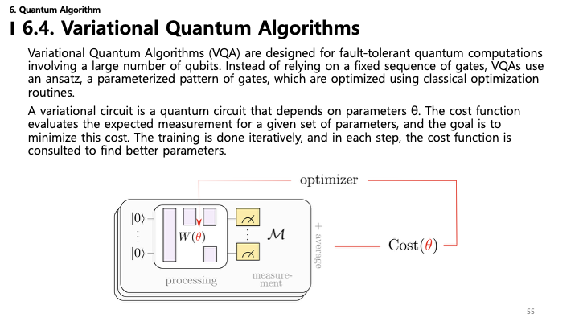

*   **VQA**: Hybrid quantum-classical algorithms suitable for NISQ (Noisy Intermediate-Scale Quantum) devices.
*   **Mechanism**:
    *   **Ansatz**: A parameterized quantum circuit $W(\theta)$ with trainable parameters $\theta$.
    *   **Cost Function**: Measured on quantum computer $C(\theta)$.
    *   **Optimizer**: Classical computer updates $\theta$ to minimize $C(\theta)$ (e.g., Gradient Descent).

---

### 56. Variational Quantum Eigensolver (VQE)

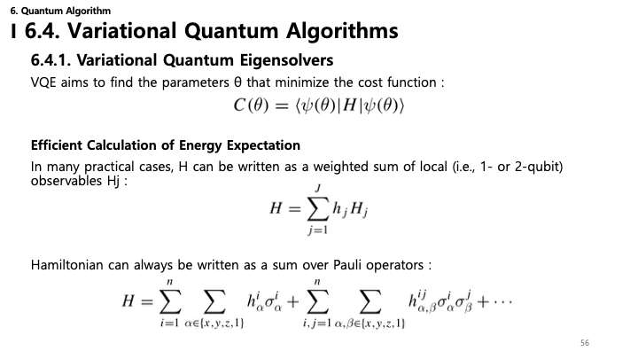

*   **VQE**: Finds the ground state energy (minimum eigenvalue) of a Hamiltonian $H$.
*   **Objective**: Minimize $C(\theta) = \langle \psi(\theta) | H | \psi(\theta) \rangle$.
*   $H$ is decomposed into a sum of Pauli strings $H = \sum h_j H_j$.

---

### 57. VQE Energy Calculation

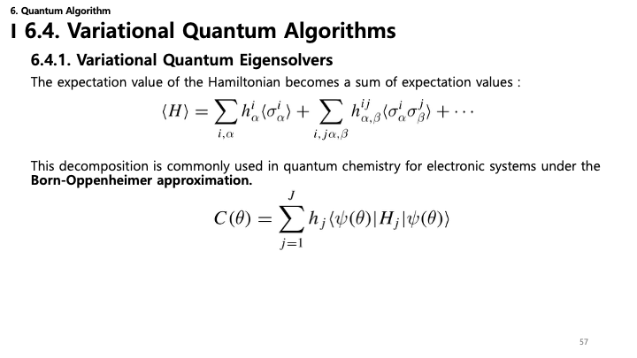

*   The expectation value corresponds to the energy of the system.
*   Widely used in **Quantum Chemistry** to simulate molecular energies (electronic structure).

---

### 58. QAOA

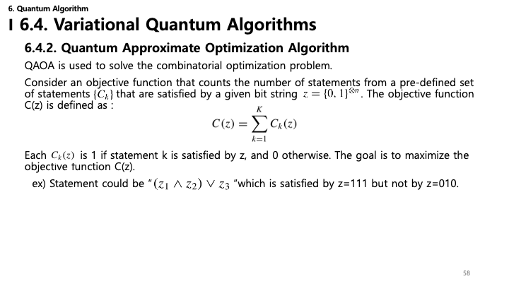

*   **Quantum Approximate Optimization Algorithm (QAOA)**:
*   A VQA designed to solve combinatorial optimization problems (e.g., MaxCut).
*   Objective function counts satisfied clauses $C(z) = \sum C_k(z)$.

---

### 59. Quantum Annealing

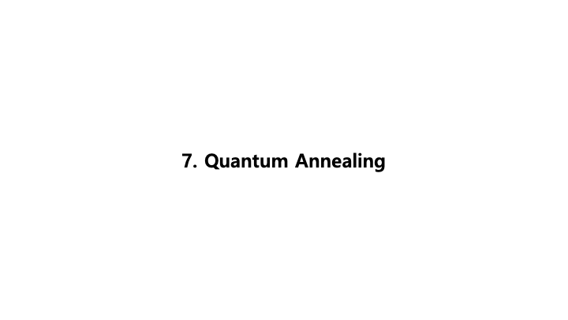

An optimization technique using quantum fluctuations.

---

### 60. Quantum vs Thermal Annealing

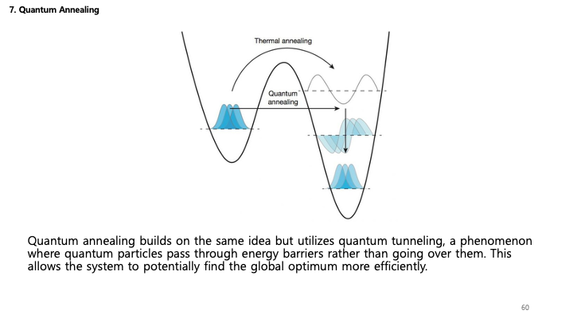

*   **Thermal Annealing**: Uses thermal fluctuations to jump over energy barriers (can get stuck in local minima).
*   **Quantum Annealing**: Uses **Quantum Tunneling** to pass *through* energy barriers. Potentially finds global optimum more efficiently.

---

### 61. Future Topics

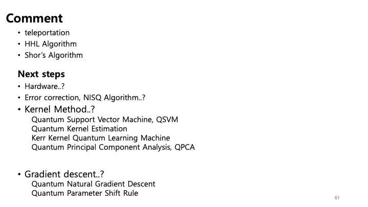

*   **Algorithms**: Teleportation, HHL (Linear Systems), Shor's (Factoring).
*   **Machine Learning**: Kernel Methods (QSVM), Quantum PCA, Quantum Gradient Descent.

---

### 62. Kernel Methods

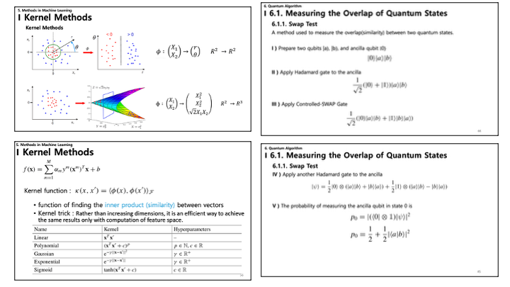

*   **Kernel Trick**: Maps data to a higher-dimensional feature space where it might be linearly separable.
*   $K(x, x') = \langle \phi(x), \phi(x') \rangle$.

---

### 63. Quantum Kernel Estimation

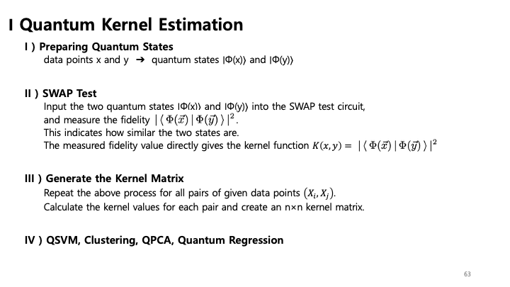

*   Quantum computers can estimate kernels that are hard to compute classically.
*   **Method**:
    1.  Encode data $x, y$ into states $|\Phi(x)\rangle, |\Phi(y)\rangle$.
    2.  Use **Swap Test** to measure overlap $|\langle \Phi(x) | \Phi(y) \rangle|^2$.
    3.  This value is the kernel entry $K(x, y)$.
    4.  Use in Support Vector Machine (QSVM).

---

### 64. Reference

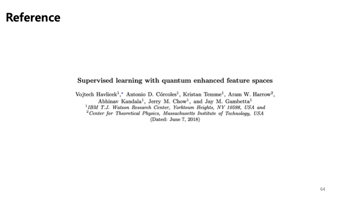

*   **Paper**: *Supervised learning with quantum enhanced feature spaces* (Havlicek et al., Nature 2019).
*   Foundational paper for Quantum Kernel Methods.

