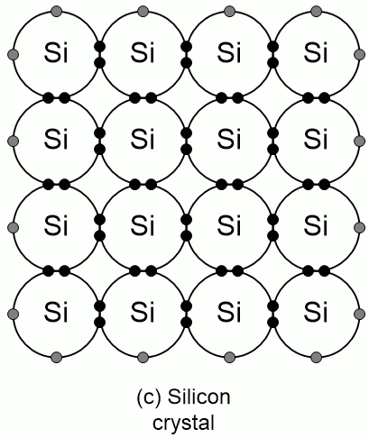
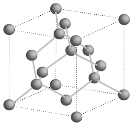
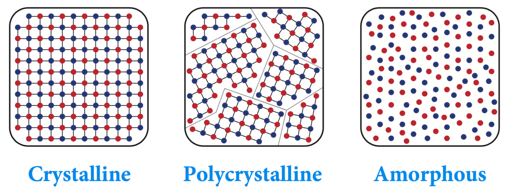
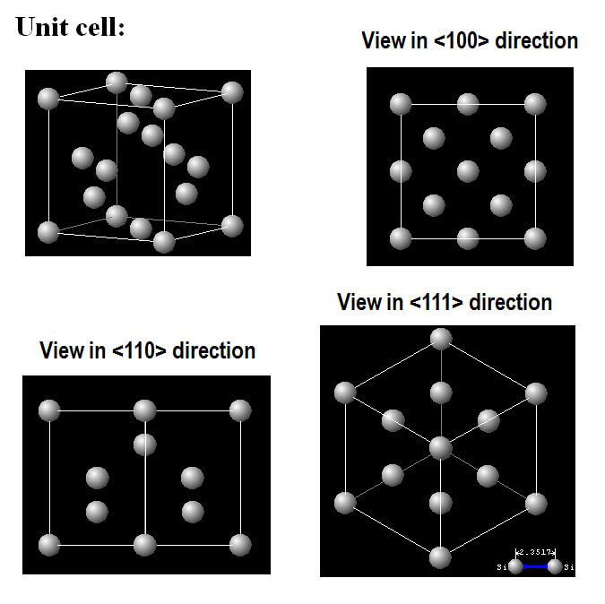
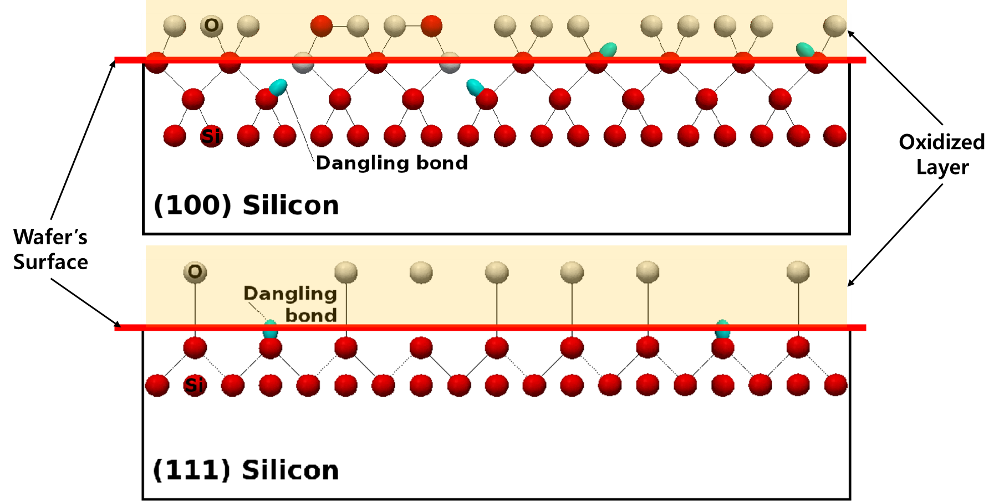

이 글은 지능형반도체융합전공 재료 수업에서 발표한 내용을 정리한 것입니다. 실리콘의 결정 구조가 어떻게 형성되는지, 그리고 반도체 공정에서 결정 방향이 왜 중요한지를 다룹니다.

---

### 공유 결합에서 Diamond Cubic 구조로

실리콘(Si)은 **14족 원소**로, 최외각 전자(valence electron)가 4개입니다. 각 실리콘 원자는 인접한 4개의 원자와 전자를 공유하는 **공유 결합(Covalent Bonding)** 을 형성합니다.

  

    
    
2D 공유 결합 — 각 Si 원자가 4개의 이웃과 전자 공유

  

  

    
    
Diamond Cubic 단위 셀 — 3D 정사면체 배열

  

이 결합을 3차원으로 확장하면 **Diamond Cubic 구조**가 만들어집니다. Diamond Cubic은 FCC(Face-Centered Cubic) 구조 두 개가 체대각선 방향으로 $\frac{1}{4}$만큼 어긋나게 겹친 형태로 이해할 수 있습니다. 단위 셀(unit cell) 안에 원자가 총 8개 포함됩니다.

| 구조 요소 | 내용 |
|-----------|------|
| 결합 방식 | sp³ 혼성 공유 결합 |
| 결합 각도 | 109.5° (정사면체형) |
| 단위 셀 원자 수 | 8개 |
| 배위수 (Coordination Number) | 4 |

실리콘이 이 구조를 취하는 이유는 sp³ 혼성 오비탈이 에너지적으로 가장 안정적인 정사면체 배열을 만들기 때문입니다.

---

### 왜 단결정(Single Crystal)을 사용하는가

반도체 소자 제조에는 단결정 실리콘 웨이퍼가 사용됩니다. 결정 구조에 따라 세 가지 유형을 구분할 수 있습니다.

| 구분 | 특징 |
|------|------|
| **단결정 (Single Crystal)** | 장범위 주기적 질서(long-range periodic order) — 결정 방향이 전체적으로 균일 |
| **다결정 (Polycrystalline)** | 여러 결정립(grain)이 존재하며 **결정립 경계(grain boundary)** 포함 |
| **비정질 (Amorphous)** | 주기적 원자 배열 없음 |

Miller Indices는 **결정질 재료에서만 정의**됩니다. 결정립 경계가 존재하는 다결정 실리콘에서는 캐리어 산란과 이동도 저하가 발생하기 때문에, 고성능 CMOS 소자에는 반드시 단결정 웨이퍼가 필요합니다.

---

### Miller Indices와 결정 방향

**Miller Indices**는 결정 내 특정 면(plane)의 방향을 나타내는 표기법입니다. 결정면이 각 축과 교차하는 절편(intercept)의 역수를 취한 뒤 정수로 정규화하여 표기합니다.

$$\text{Intercepts: } (a,\, b,\, c) \;\Rightarrow\; \text{Miller Indices: } \left(\frac{1}{a},\, \frac{1}{b},\, \frac{1}{c}\right) \text{을 정수화}$$

실리콘에서 주요하게 다루는 면은 세 가지입니다.

| 면 표기 | 특징 |
|---------|------|
| **(100)** | $\langle 100 \rangle$ 방향에 수직. 표면 dangling bond 밀도가 낮아 CMOS 공정 표준 |
| **(110)** | 육각형 대칭 패턴. 고이동도 채널 방향으로 활용 |
| **(111)** | 표면 원자 밀도가 가장 높음. Dangling bond 밀도도 높음 |

---

### Si(100) 웨이퍼가 표준인 이유

반도체 공정에서 대부분의 CMOS 소자는 **Si(100) 웨이퍼** 위에 제작됩니다. 이유는 표면 **dangling bond** 밀도와 관련이 있습니다.

- **Dangling bond**란 결정 표면에서 결합 파트너를 찾지 못한 전자를 의미합니다.
- Dangling bond는 인터페이스 트랩(interface trap)으로 작용하여 캐리어를 포획하고 전자 수송을 방해합니다.
- Si(111) 면은 단위 면적당 표면 원자 수가 많아 dangling bond 밀도가 더 높습니다.
- 반면 **Si(100)** 면은 dangling bond 밀도가 낮아 SiO₂/Si 인터페이스 품질이 우수합니다.

$$\text{Si(111): dangling bond 밀도 } > \text{ Si(100): dangling bond 밀도}$$

$$\therefore \text{ CMOS 소자} \Rightarrow \text{Si(100) 웨이퍼 사용}$$

이 특성 덕분에 Si(100)은 게이트 산화막(SiO₂)과의 인터페이스 결함 밀도($D_{it}$)가 가장 낮으며, 전자 이동도(electron mobility) 측면에서도 유리합니다.

---

### 요약

| 개념 | 핵심 내용 |
|------|-----------|
| **Diamond Cubic 구조** | 4개의 공유 결합 → sp³ 혼성 → 정사면체 배열 → 3D Diamond Cubic |
| **단결정 필요성** | 결정립 경계 없음 → 캐리어 산란 최소화 → 고이동도 유지 |
| **Miller Indices** | 결정면 방향의 수학적 표기법 — 절편의 역수를 정수화 |
| **Si(100) 선택 이유** | Dangling bond 밀도 최소 → 인터페이스 트랩 감소 → CMOS 공정 최적 |
